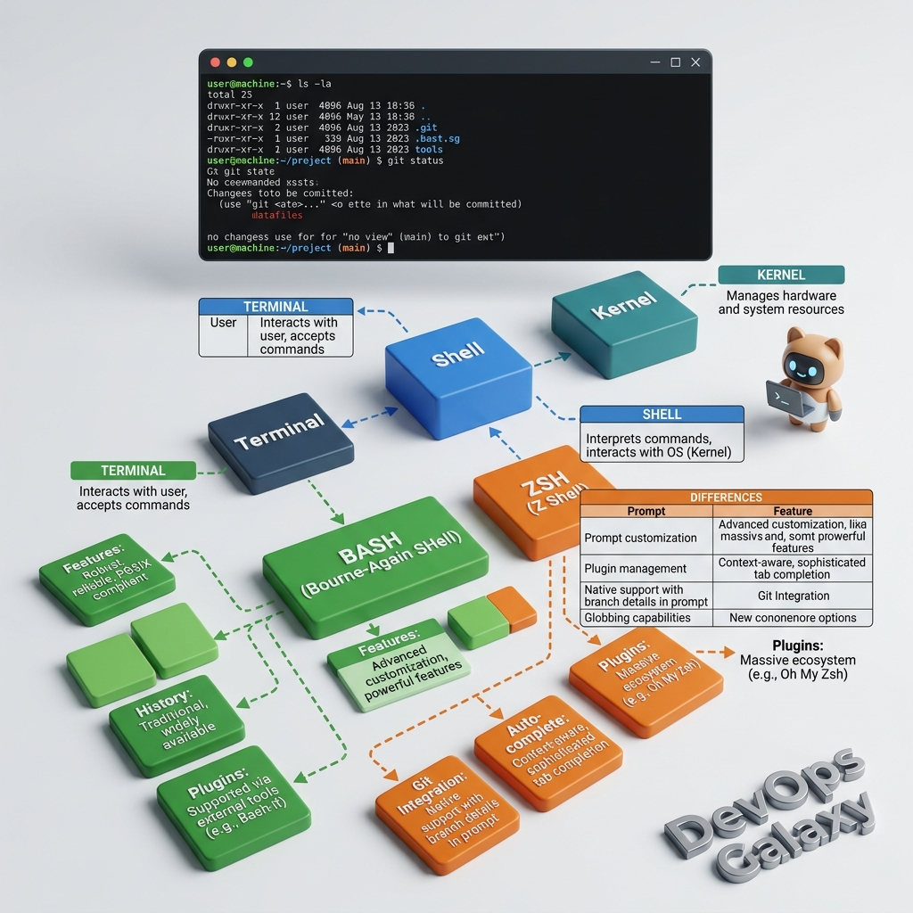

# Shell Core Differences: Bash vs. Zsh 🐚



## 1. What is a Shell?
A **Shell** is the primary "interpreter" that acts as an interface between the user and the operating system's **Kernel**. When you type a command into your terminal, the shell is the program that processes that command, communicates it to the Kernel for execution, and displays the output back to you.

- **User**: Inputs the command.
- **Shell**: Interprets the input and sends instructions to the Kernel.
- **Kernel**: Executes the instructions on the hardware level.

---

## 2. Bash vs. Zsh

### Bash (Bourne Again Shell)
Bash is the industry standard and the default shell for almost all Linux distributions and server environments.
- **Standard & Robust**: It is highly reliable and ensures that scripts behave predictably across different systems.
- **Configuration**: Its primary configuration file is located at `~/.bashrc`.

### Zsh (Z Shell)
Zsh is a modern, highly interactive alternative that has become the default shell on macOS and is widely favored by developers for local environments.
- **Advanced Auto-complete**: Offers intelligent suggestions for commands, flags, and file paths.
- **Visual Enhancements**: Supports rich colorization and themes (like *Oh My Zsh*) that can display real-time information such as active **Git branches**.
- **Configuration**: Its primary configuration file is located at `~/.zshrc`.

---

## 3. The Shebang Myth (Crucial DevOps Concept) 🚀

There is a common misconception among beginners that if your active terminal is **Zsh**, then any script you run must use a Zsh shebang to work. **This is false.**

### The Concept of the Sub-shell
When you execute a script that starts with a **Shebang** like:
```bash
#!/bin/bash
# OR
#!/usr/bin/env bash
```
The operating system reads this line and launches a **Sub-shell** specifically for that script. It doesn't matter if your interactive terminal is Zsh, Fish, or even PowerShell; the OS will spin up a Bash process to execute that specific script.

### Why This Matters in DevOps
This mechanism makes scripts **environment-independent**. As a DevOps engineer, you write scripts with a Bash shebang to ensure they run consistently on a remote Linux server, regardless of what shell the user who triggered the script is using.

---
> **[Check: DevOps Galaxy](devops-galaxy.me)** - Mastering the Terminal 🌌
