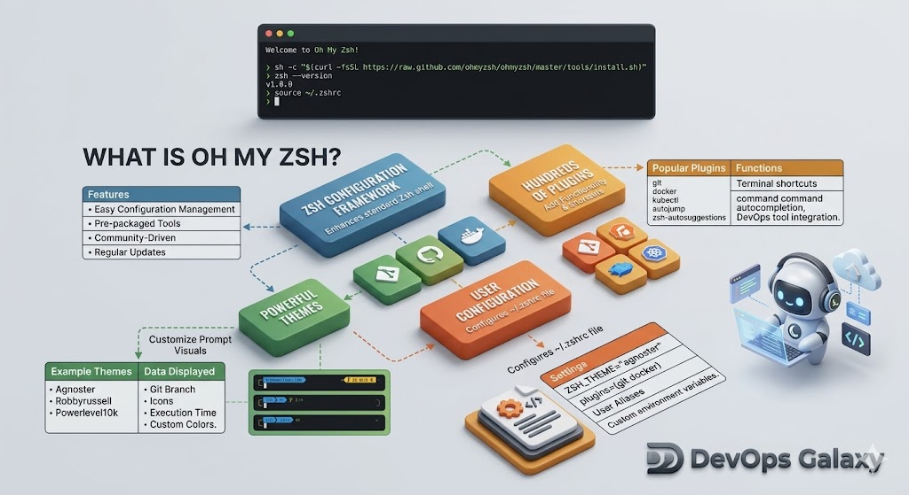

# Oh My Zsh: The DevOps Framework 🚀

## 1. Not Just a Plugin (Definition)
**Oh My Zsh** is an open-source, community-driven framework designed for managing your **Zsh** configuration. It is important to clarify that Oh My Zsh is **NOT a shell** itself; rather, it is a powerful configuration layer that sits on top of the Zsh shell to enhance its capabilities.

- **The Shell**: Zsh (the engine).
- **The Framework**: Oh My Zsh (the dashboard and upgrades).
- **The Ecosystem**: Thousands of contributors maintaining themes and plugins.

---

## 2. Themes (Visual Context)
One of the most immediate benefits of Oh My Zsh is how it transforms your terminal's User Interface (UI). Instead of a plain, static prompt, a good theme provides real-time context that is essential for development.

- **Dynamic Prompts**: Themes like `agnoster` or `robbyrussell` automatically display your current **Git branch** and the status of your repository (clean or dirty) directly in the command line prompt.
- **Visual Feedback**: Icons and colors help you quickly identify successful commands vs. errors, or your current working directory's path depth.

---

## 3. Plugins (The DevOps Superpower)
Plugins are where Oh My Zsh truly shines as a productivity tool. It comes bundled with hundreds of plugins tailored for modern DevOps workflows.

- **Efficiency**: Plugins for tools like `git`, `docker`, and `kubectl` provide hundreds of powerful **Aliases** (shortcuts) and advanced auto-completion features.
- **Time Saving**: Instead of typing long, repetitive commands, you can use short, intuitive aliases.

### Examples of Power Aliases:
| Tool | Full Command | Oh My Zsh Alias |
| :--- | :--- | :--- |
| **Git** | `git push` | `gp` |
| **Git** | `git commit -v` | `gc` |
| **Docker** | `docker compose up` | `dcu` |
| **Kubectl** | `kubectl get pods` | `kgp` |

By using these plugins, developers can save countless hours over the course of a project, reducing cognitive load and focusing on the code instead of the syntax.

---
> **[DevOps Galaxy](devops-galaxy.me)** - Mastering the Terminal 🌌
