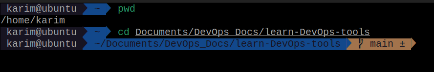
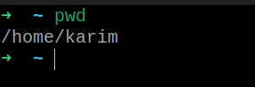
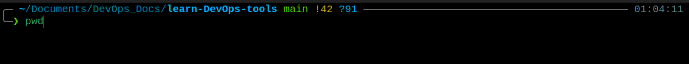
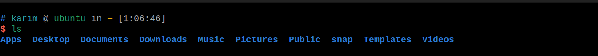
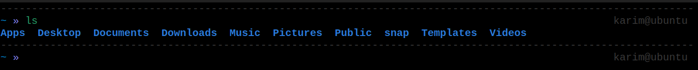

# Essential Zsh Plugins & Themes

## 1. Understanding ~/.zshrc
The `~/.zshrc` file is the control center of your terminal. It is where environment variables are configured, Oh My Zsh is loaded, themes are set, and plugins are activated.

## 2. Setting the Theme
Oh My Zsh comes with multiple themes. To change the theme, modify the `ZSH_THEME` variable. The `agnoster` theme is highly recommended for DevOps because it visually displays Git branch names and their status (clean or dirty).


> ZSH_THEME="agnoster" 




### Additional Themes:

> ZSH_THEME="robbyrussell"



> ZSH_THEME="powerlevel10k/powerlevel10k"



> ZSH_THEME="ys"



> ZSH_THEME="af-magic"



> ZSH_THEME="random"
you can let the computer select one randomly for you each time you open a new terminal window.


## 3. Essential DevOps Plugins
Plugins are activated by adding their names inside the `plugins=(...)` array. 
CRITICAL RULE: Elements must be separated by SPACES, not commas.

* `git`: Provides hundreds of useful aliases (e.g., `gp` for `git push`, `gst` for `git status`).
* `docker` & `docker-compose`: Adds autocomplete for container commands.
* `zsh-autosuggestions`: Suggests commands as you type based on your history.
* `zsh-syntax-highlighting`: Colors commands (green if valid, red if invalid) before execution.

```sh
plugins=(git docker docker-compose zsh-autosuggestions zsh-syntax-highlighting)
```

Note: Adding too many plugins will increase your terminal startup time.

## 4. Custom Aliases (The Final Word)
You can define your own shortcuts at the very bottom of the `~/.zshrc` file. Writing them at the end ensures they override any default aliases loaded earlier by the framework.

```zsh
alias gl='git log'
alias dps='docker ps'
```


## 5. Reloading the Configuration
To apply changes instantly without closing and reopening the terminal, reload the configuration file:
```zsh
source ~/.zshrc
```
and then you have better to restart the terminal again.

> **[Full Documentations](https://github.com/ohmyzsh/ohmyzsh)** - Oh My Zsh GitHub Repository Full Documentation.