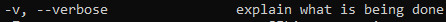
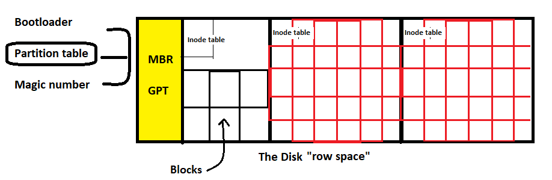

# 01: Basic Commands

## 1. Introduction
Mastering basic Linux commands is the foundation of system administration. This guide covers essential commands for navigation, file management, system information, and user switching.

## 2. System Information

### CPU & Memory
```bash
# Display system uptime and load
uptime
# Output: 10:00:00 up 1:00, 2 users, load average: 0.00, 0.01, 0.05
> 

# Human-readable uptime
uptime -p
# Output: up 1 hour, 54 minutes

# CPU architecture details
lscpu | grep 'Model name\|Socket(s)\|Core(s) per socket\|Thread(s) per core\|CPU MHz\|Architecture'
> 

# Memory usage
free -h
# Output:
#               total        used        free      shared  buff/cache   available
# Mem:           7.8G        2.1G        3.2G        150M        2.5G        5.3G
# Swap:          2.0G        0B          2.0G
```
> 

### Disk Usage
```bash
# Disk space usage (human-readable)
df -h
# Output:
# Filesystem      Size  Used Avail Use% Mounted on
# /dev/sda1       100G   30G   70G  30% /
> 

# Directory size
du -sh /var/log
# Output: 500M    /var/log
```

> [!TIP]
> **Load Average Explained:** The three numbers (e.g., `0.00, 0.01, 0.05`) represent CPU load over the last 1, 5, and 15 minutes. On a 4-core system, a load of 4.00 means 100% CPU utilization.

## 8. Summary
-   **System Info:** `uptime`, `whoami`, `id`.
-   **Navigation:** `pwd`, `cd`, `ls`.
-   **File Management:** `mkdir`, `touch`, `cp`, `mv`, `rm`.
-   **Viewing Files:** `cat`, `less`, `head`, `tail`.

---

## 9. 🏆 Master Example: Project Workspace Setup
**Scenario:** You are starting a new project called "omega". You need to create a structured workspace with directories for `src`, `docs`, `and` logs, and create an empty `README.md`.

```bash
# 1. Create project root and subdirectories in one go
mkdir -p omega/{src,docs,logs}

# 2. Go into the project
cd omega

# 3. Create an empty README file
touch README.md

# 4. Verify the structure tree
ls -R
# Output:
# .:
# docs  logs  README.md  src
#
# ./docs:
#
# ./logs:
#
# ./src:
```

> **Pro Tip:** The `{}` brace expansion in `mkdir` saves you from typing the command three times!

## 3. Navigation & File Operations

### Basic Navigation
```bash
# Print working directory
pwd

# List files (long format, human-readable, sorted by time)
ls -lthr

# Change directory
cd /path/to/directory

# Go to previous directory
cd -

# Display directory tree
tree -L 2 /path/to/directory  # Limit depth to 2 levels
```

### File & Directory Management
```bash
# Create empty file or update timestamp
touch file.txt

# Create nested directories
mkdir -p dir1/dir2/dir3

# Copy files/directories
cp file.txt backup.txt
cp -r /source /destination      # Recursive copy
cp -r -p /source /destination   # Preserve permissions

# Move/rename
mv oldname.txt newname.txt
mv -v file.txt /new/location/   # Verbose output

# Remove files
rm file.txt
rm -r directory/                # Recursive removal
rm -i file.txt                  # Interactive (confirm)
```

> 

### Advanced File Operations
```bash
# Copy data with block size (useful for creating disk images)
dd if=/dev/zero of=file.img bs=1M count=100

# Clear directory contents (keeps the directory)
rm -r /dir/*

# Display file content
cat file.txt
```

> [!CAUTION]
> **Dangerous Commands** - Always double-check before running:
> - `rm -rf /` (Deletes everything)
> - `rm -rf /*` (Same as above)
> - `dd if=/dev/sda of=/dev/sdb` (Overwrites entire disk)

## 4. User Management Commands

### Checking Current User
```bash
# Display current username
whoami
```

### Switching Users with `su`
```bash
# Switch to another user (keeps current environment)
su username

# Switch to another user (loads their environment)
su - username

# Switch to root (loads root environment)
su -
```

### Using `sudo` for Root Access
```bash
# Switch to root (preserves current directory)
sudo su

# Switch to root (goes to /root, loads root environment)
sudo su -

# Open root login shell (RECOMMENDED)
sudo -i
```

> [!IMPORTANT]
> **`sudo -i` vs `sudo su -`:**
> - `sudo -i` is the **recommended** approach
> - It avoids creating unnecessary process chains (`sudo → su → shell`)
> - Both require your current user password (not root's password)

For more details on sudo configuration, see [09_Gain_Superuser_Access.md](./09_Gain_Superuser_Access.md).

## 5. Command History

```bash
# Show command history
history

# Repeat last command
!!

# Repeat last command starting with 'ssh'
!ssh

# Search history interactively
Ctrl + R  # then type to search
```

## 6. Date & Time Commands

```bash
# Current date and time
date

# Specific format (YYYY-MM-DD)
date +%F
# Output: 2024-03-10

# Date arithmetic
date -d "3 days ago" +%F
date -d "next monday"

# Display calendar
cal
cal 2024        # Full year
cal 3 2024      # March 2024

# Time zone management
timedatectl                                    # Show current settings
timedatectl list-timezones                     # List available zones
timedatectl set-timezone America/New_York      # Set time zone
```

## 7. Text Processing Tools

```bash
# Translate characters (case conversion)
echo "hello world" | tr 'a-z' 'A-Z'
# Output: HELLO WORLD

# Display and save to file simultaneously
echo "Hello, Linux!" | tee output.txt
```

For advanced text processing, see [30_Text_Processing_Tools.md](./30_Text_Processing_Tools.md).

## 8. Command Shortcuts

| Shortcut | Action |
| :--- | :--- |
| `Alt + .` | Paste last argument from previous command |
| `Ctrl + L` | Clear screen (same as `clear`) |
| `Ctrl + C` | Terminate current command |
| `Ctrl + D` | Exit current shell/session |
| `Ctrl + R` | Search command history |

> 

## 9. Important System Files

| File | Purpose |
| :--- | :--- |
| `/etc/passwd` | User account details |
| `/etc/group` | Group account details |
| `/etc/shadow` | Encrypted passwords |
| `/etc/login.defs` | System login defaults |
| `/var/log/secure` (RHEL) or `/var/log/auth.log` (Debian) | Authentication logs |
| `/etc/ssh/sshd_config` | SSH server configuration |
| `/etc/rsyslog.conf` | System logging configuration |
| `/etc/systemd/journald.conf` | Systemd journal configuration |

For more on system configuration files, see [02_Linux_File_system_Hierarchy.md](./02_Linux_File_system_Hierarchy.md).

## 10. Special Device Files

| File | Purpose |
| :--- | :--- |
| `/dev/random` | High-quality random data (blocks if entropy low) |
| `/dev/urandom` | Pseudo-random data (doesn't block) |
| `/dev/zero` | Infinite stream of null bytes |
| `/dev/null` | Discards all data written to it |

**Example:**
```bash
# Create a 10MB file filled with zeros
dd if=/dev/zero of=testfile bs=1M count=10

# Discard command output
command > /dev/null 2>&1
```

## 11. Key Takeaways
-   Use `ls -lthr` to view files sorted by modification time
-   `sudo -i` is preferred over `sudo su -` for root access
-   Always use `-i` (interactive) flag with `rm` when learning
-   `cd -` quickly toggles between two directories
-   Load averages above the number of CPU cores indicate system stress
