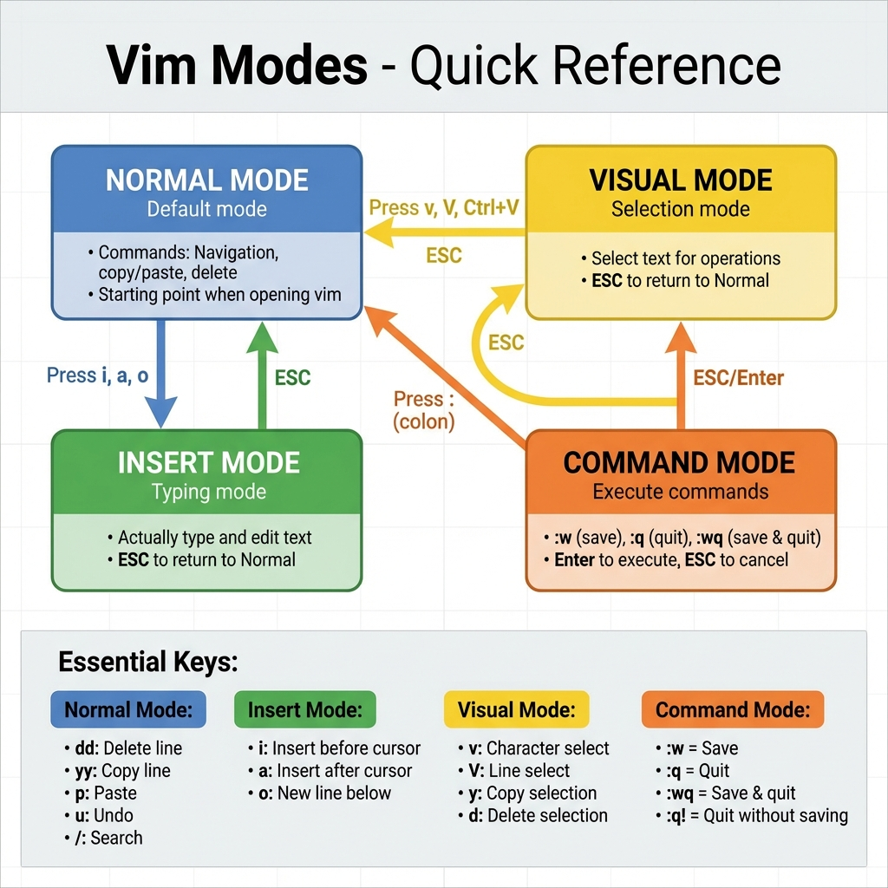

# 08: Dealing with Text Files

## 1. Introduction
Linux provides a suite of tools for reading, manipulating, and editing text files directly from the terminal.

## 2. Reading Text Files

### `cat` (Concatenate)
Reads a file and prints content to the screen.
```bash
cat /etc/os-release
```

### `more` & `less` (Paging)
Used for reading large files page-by-page.
-   **`more`**: Basic paging (percentages).
-   **`less`**: Advanced paging (scroll up/down, search). **Recommended**.

### `head` & `tail`
Read the beginning or end of a file.
```bash
head -n 5 file.txt   # First 5 lines
tail -n 5 file.txt   # Last 5 lines
tail -f access.log   # Follow file in real-time (great for logs)
```

## 3. Editing Text Files (Vim)
**Vim** (Vi IMproved) is a powerful command-line text editor.
> **Tip:** Run `vimtutor` in your terminal for an interactive tutorial.

### A. Modes
> 

1.  **Command Mode (Default):** For navigation and commands.
2.  **Insert Mode:** For typing text (Press `i`).
3.  **Visual Mode:** For selecting text (Press `v`).
4.  **Extended Command Mode:** For saving/exiting (Press `:`).

### B. Basic Navigation (Command Mode)
-   `gg`: Go to first line.
-   `G`: Go to last line.
-   `/pattern`: Search for a pattern.
-   `dd`: Delete (cut) current line.
-   `yy`: Yank (copy) current line.
-   `p`: Paste.
-   `u`: Undo.

## 6. Summary
-   **nano:** Simple, beginner friendy.
-   **vim:** Powerful, modal editing.
-   **Modes:** Command, Insert, Visual.

---

## 7. 🏆 Master Example: The Power of Vim Macros
**Scenario:** You have a file with 100 lines of messy data like `Item: apple`, `Item: banana`. You want to convert them all to JSON format `{"name": "apple"},`. Doing this manually is slow.

```bash
# 1. Open file
vim data.txt

# 2. Start recording macro 'q' into register 'a'
qa

# 3. Perform edits on ONE line:
# - Go to start (0)
# - Delete "Item: " (dw dw)
# - Insert {"name": " (i {"name": " Esc)
# - Append "}, (A "}, Esc)
# - Go to next line (j)

# 4. Stop recording
q

# 5. Replay macro 99 times
99@a
```

> **Result:** You edited 100 lines in split seconds. This is why SysAdmins love Vim.

### C. Saving and Exiting
-   **:w** - Save.
-   **:q** - Quit.
-   **:wq** - Save and Quit.
-   **:q!** - Quit without saving (force).

## 4. Key Takeaways
-   Use `cat` for short files, `less` for long files.
-   Use `tail -f` to monitor logs.
-   Mastering `vim` basics (i, :wq, dd) is essential for Linux administration.