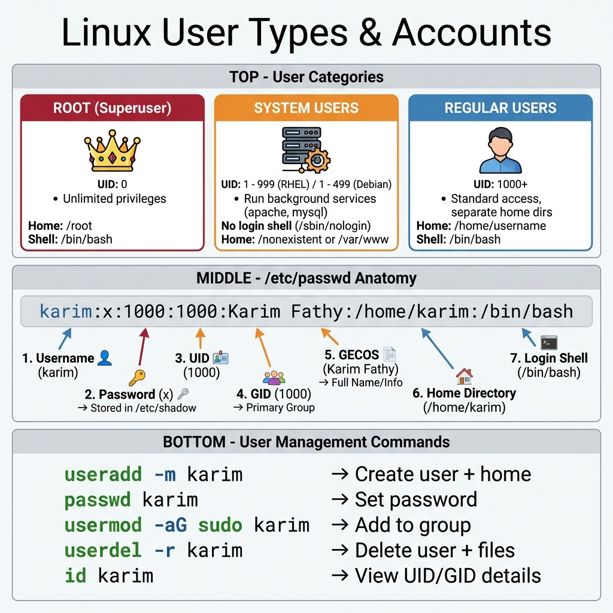
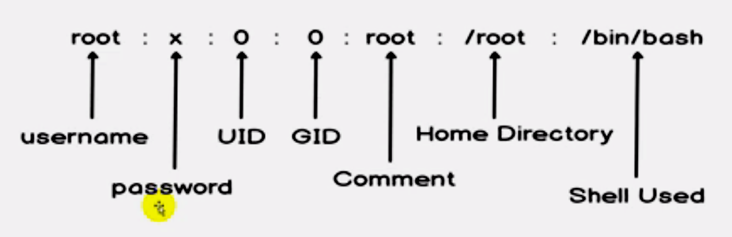
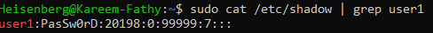
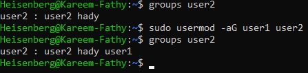
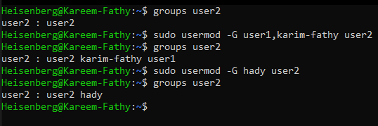
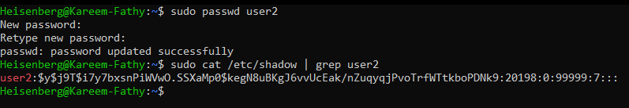

# 12: Managing Local Users in Linux

## 1. Introduction
Linux is a multi-user operating system. This means multiple users can access the system simultaneously. Managing users and their permissions is a core responsibility of a Linux administrator.

### User Types & Structure
> 

## 2. User Accounts in LinuxIDs (UID)
1.  **Root (Superuser):** UID `0`.
2.  **System/Service Users:** UID `1-999` (Run services like Apache, MySQL).
3.  **Regular Users:** UID `1000+` (Human users).

## 3. Critical Files
-   `/etc/passwd`: User account information.
    > 
-   `/etc/shadow`: Encrypted password data.
-   `/etc/group`: Group information.

**Structure of `/etc/passwd`:**
> 

**Check User Info:**
```bash
id <username>
```
> 

## 4. Creating Users (`useradd`)
**Syntax:**
```bash
useradd [options] username
```

**Common Options:**
-   `-m`: Create home directory.
-   `-s`: Specify login shell (e.g., `/bin/bash`).
-   `-c`: Comment/Description.
-   `-G`: Add to secondary groups.

**Example:**
```bash
sudo useradd -m -s /bin/bash -c "DevOps Engineer" -G sudo karim
```
> 

> [!WARNING]
> Do NOT use plaintext passwords with `-p`.
> 

> [!TIP]
> Use `adduser` (if available) for an interactive, user-friendly creation process.
> 

## 5. Modifying Users (`usermod`)
**Syntax:**
```bash
usermod [options] username
```
-   `-aG`: Append to group (Essential to use `-a` to avoid removing other groups).
    > 
-   `-G`: Set secondary groups (overwrites existing ones).
    > 
-   `-L`: Lock account.
-   `-U`: Unlock account.
-   `-l`: Rename user.

**Example:**
```bash
# Add user to docker group
sudo usermod -aG docker karim
```

**Changing Passwords:**
```bash
sudo passwd karim
```
> 

## 6. Deleting Users (`userdel`)
**Syntax:**
```bash
userdel [options] username
```
-   `-r`: Remove home directory and mail spool.

```bash
sudo userdel -r karim
```

## 7. Switching Users (`su`)
| Command | Effect |
| :--- | :--- |
| `su karim` | Switch user, keep current env. |
| `su - karim` | Switch user, load new env (clean login). |
| `sudo -i` | Switch to root with clean env. |
| `sudo -u karim cmd` | Run a single command as karim. |

## 8. Key Takeaways
-   Always use `useradd -m` to ensure a home directory is created.
-   Use `usermod -aG` to add groups without overwriting existing ones.
-   `su -` is preferred over `su` to ensure a clean environment.
