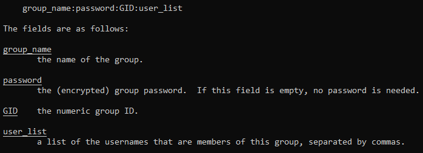
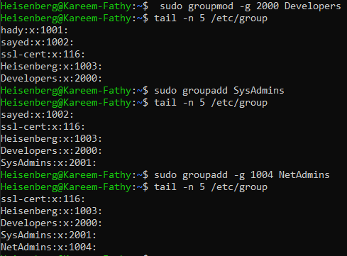
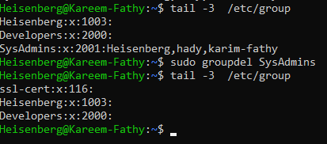
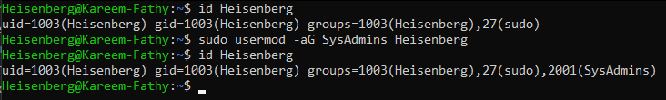
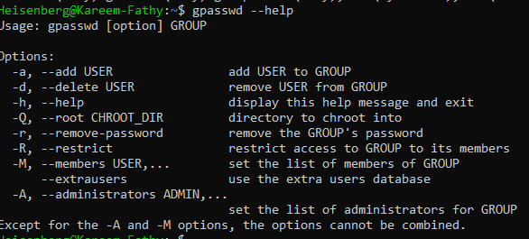

# 13: Managing Groups

## 1. Introduction
Groups allow you to manage permissions for multiple users at once. Instead of assigning permissions to each user individually, you add users to a group and assign permissions to that group.

### Groups Management Layout
> 

Users are assigned a **Primary Group** (usually same as username) and can belong to multiple **Secondary Groups**.

> **File:** `/etc/group` stores group definitions.
> 

**File Structure:**
> 

## 2. Creating & Deleting Groups

### Create a Group
```bash
sudo groupadd devs
```
*-g: Specify GID manually.*
> 

### Delete a Group
```bash
sudo groupdel devs
```
> 

## 3. Modifying Groups

### Rename a Group
```bash
sudo groupmod -n new_name old_name
```
> 

## 4. Managing Group Members

### Check User Groups
```bash
groups karim
```
> 

### Add User to Group
Use `usermod` to append (`-a`) a secondary group (`-G`).
```bash
sudo usermod -aG devs karim
```
> 

### Remove User from Group
Use `gpasswd` or `deluser` (Debian).
```bash
sudo gpasswd -d karim devs
```
> 

### Change Primary Group
```bash
newgrp devs
# Changes primary group for the current session only
```

## 5. Summary
-   **Primary Group:** Created automatically (same as username).
-   **Secondary Groups:** Grants additional access (sudo, docker).
-   **Commands:** `groupadd`, `usermod -aG`, `groups`.

---

## 6. 🏆 Master Example: Auditing Group Membership
**Scenario:** You need to audit who has `sudo` (admin) access on your server and remove a user "bob" who recently left the company from that group only.

```bash
# 1. Find all users in the 'sudo' group
grep "^sudo" /etc/group
# Output: sudo:x:27:karim,alice,bob

# 2. Remove 'bob' from 'sudo' group (without deleting his account)
gpasswd -d bob sudo
# Output: Removing user bob from group sudo

# 3. Verify the removal
groups bob
# Output: bob : bob developers
```

> **Note:** Changes to groups require the user to logout and login again to take effect.
-   Always use `-aG` when adding users to avoid removing them from other groups.
