# 14: Password Management & Aging

## 1. Introduction
Linux stores password hashes in `/etc/shadow` and provides tools to enforce password policies, such as expiration and complexity.
> 

## 2. The `/etc/shadow` File
Stores encrypted passwords and aging information. Readable only by root.
> 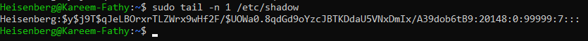

**Man Page:**
> 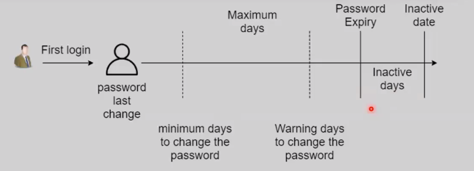

**Fields:**
1.  Username
2.  Encrypted Password
3.  Last Changed (Days since Jan 1, 1970)
4.  Min Age (Days before password can be changed)
5.  Max Age (Days before password expires)
6.  Warning Period (Days before expiration to warn user)
7.  Inactivity Period (Days after expiration before account locks)
8.  Expiration Date (Account expiry)

## 3. Password Aging (`chage`)
Manage password expiry policies.

**Syntax:**
```bash
chage [options] user
```

**Options & Examples:**
-   `-l`: List current policy.
    > 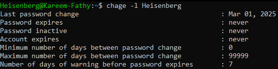

-   `-m`: Minimum days between changes.
    > 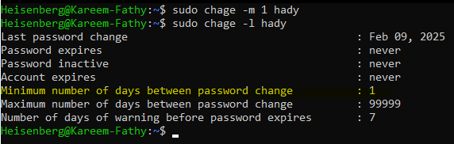

-   `-M`: Maximum days valid.
    > 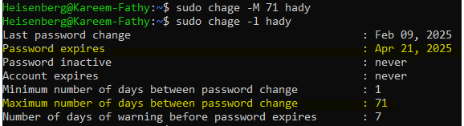

-   `-W`: Warning days.
    > 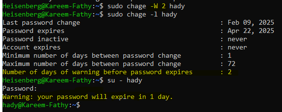

-   `-E`: Account expiration date (YYYY-MM-DD).
    -   Using `date` command for calculation:
        > 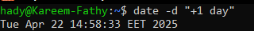
        > 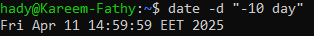
        > 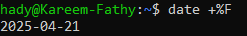
    -   Applying expiration:
        > 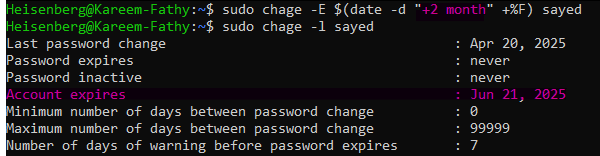

-   `-d 0`: Force password change on next login.
    > 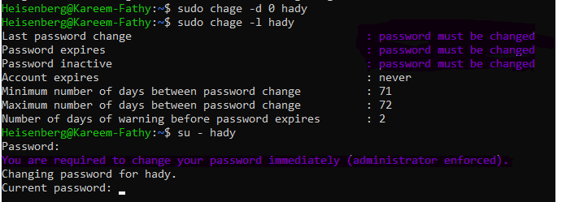

**Using `usermod` for Expiration:**
```bash
usermod -e YYYY-MM-DD user
```
> 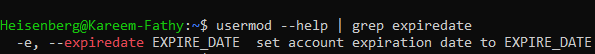
> 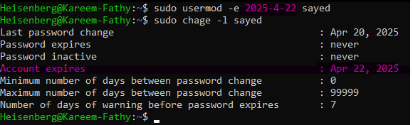

## 4. Locking & Unlocking Accounts
You can lock an account to prevent login without deleting it.

```bash
# Lock Account
sudo usermod -L karim

# Unlock Account
sudo usermod -U karim
```

## 5. Timeline Diagram
Visualizing password aging policy (`chage -d 2026-1-1 -m 2 -M 10 -W 3 -I 2 user`).
> 

## 6. Summary
-   **Change Password:** `passwd`
-   **Lock Account:** `passwd -l`
-   **Force Expiry:** `chage -d 0`

---

## 7. 🏆 Master Example: Implementing a Strict Password Policy
**Scenario:** Company policy requires all users to change their password every 90 days, and they must receive a warning 7 days before it expires.

```bash
# 1. Apply policy to an existing user 'karim'
# -M 90: Max days (90)
# -m 5: Min days (5) - prevents immediate changing back
# -W 7: Warning days (7)
chage -M 90 -m 5 -W 7 karim

# 2. Verify the policy
chage -l karim
# Output:
# Last password change                                    : Oct 01, 2023
# Password expires                                        : Dec 30, 2023
# Password inactive                                       : never
# Account expires                                         : never
# Minimum number of days between password change          : 5
# Maximum number of days between password change          : 90
# Number of days of warning before password expires       : 7
```

> **Security Tip:** For system-wide enforcement, you would edit `/etc/login.defs`.

## 8. Key Takeaways
-   **`/etc/shadow`** is the secure storage for passwords.
-   Use **`chage`** to enforce password rotation policies.
-   Use **`chage -d 0`** to force a password reset for new users.