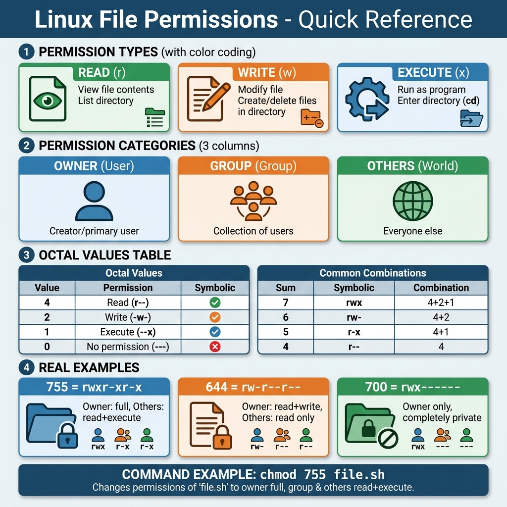
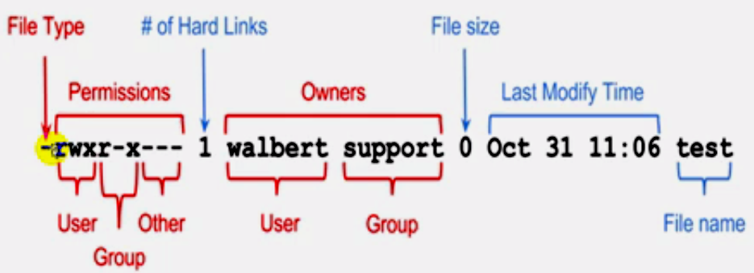
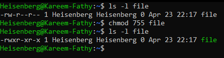
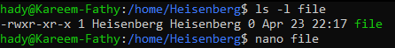
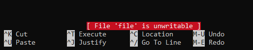
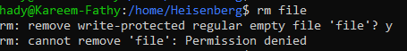
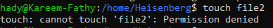

# 15: Controlling Access to Files (Permissions)

## 1. Introduction
Linux file permissions control who can read, write, and execute files. They are essential for system security.

## 2. Permission Types
> 

Every file has three permission scopes:
1.  **User (u):** The owner of the file.
2.  **Group (g):** The group assigned to the file.
3.  **Others (o):** Everyone else.
> 

**File Types:**
> 

## 3. Permission Types
| Type | Symbol | Octal | File Effect | Directory Effect |
| :--- | :--- | :--- | :--- | :--- |
| **Read** | `r` | 4 | View content | List contents (`ls`) |
| **Write** | `w` | 2 | Modify content | Create/Delete files |
| **Execute** | `x` | 1 | Run as script/program | Enter directory (`cd`) |

**Reading Permissions (`ls -l`):**
> 

## 4. Changing Permissions (`chmod`)

### Symbolic Method
Uses letters (`u,g,o` and `+,-,=`).
```bash
chmod u+x script.sh      # Add execute to user
chmod g-w file.txt       # Remove write from group
chmod o=r public.doc     # Set others to read-only
chmod +r file            # Add read to everyone
```
> 

### Octal Method
Uses numbers (Sum of 4, 2, 1).
```bash
chmod 755 script.sh
# User: 7 (4+2+1) = rwx
# Group: 5 (4+0+1) = r-x
# Others: 5 (4+0+1) = r-x
```
> 

## 5. Effects of Permissions
**On Files:**
-   Without Write permission, editors saving changes will fail.
    > 
    > 
    > 

**On Directories:**
-   Without Write permission, I cannot create files inside.
    > 
---

## 7. 🏆 Master Example: Setting Up a Secure Team Directory
**Scenario:** You need to create a shared folder `/var/project` for the `devs` group.
1.  All members of `devs` can read/write files.
2.  Others have **no access**.
3.  **New files** created usually inherit the `devs` group automatically.
4.  Users can only delete **their own files** (like `/tmp`).

```bash
# 1. Create directory and set group ownership
mkdir /var/project
chgrp devs /var/project

# 2. Set permissions: Owner(rwx), Group(rwx), Others(---)
chmod 770 /var/project

# 3. Enable SGID (2): New files inherit 'devs' group
# 4. Enable Sticky Bit (1): Protect writes/deletes
chmod 2770 /var/project
chmod +t /var/project

# Final Command (Combined):
chmod 3770 /var/project
```

### What does `3770` mean?
-   **3 (Special):** `2` (SGID) + `1` (Sticky).
-   **7 (User):** `rwx` (Full access for owner).
-   **7 (Group):** `rwx` (Full access for group `devs`).
-   **0 (Others):** `---` (No permissions for outsiders).

> This is the **standard secure collaboration setup** for shared directories in Linux environments.

## 6. Recursive Changes
Use `-R` to apply permissions to a directory and all valid contents.
```bash
chmod -R 755 /var/www/html
```
> 
> 

## 7. Default Permissions (`umask`)
The `umask` determines default permissions for new files.
-   **Logic:** `Default - Umask = Final Permission`.
-   **Base:** Files (666), Directories (777).
> 

## 8. Real-World Scenarios

### Scenario 1: Web Server Directory Permissions
**Problem:** Apache/Nginx can't read your website files.

**Solution:**
```bash
# Set proper permissions for web root
sudo chown -R www-data:www-data /var/www/html
sudo chmod -R 755 /var/www/html
sudo chmod -R 644 /var/www/html/*.html
```

### Scenario 2: Shared Project Directory
**Problem:** Team members need to edit files in `/var/projects/`.

**Solution:**
```bash
# Create a shared group
sudo groupadd developers

# Add users to group
sudo usermod -aG developers alice
sudo usermod -aG developers bob

# Set permissions
sudo chown -R root:developers /var/projects
sudo chmod -R 2775 /var/projects  # SGID ensures new files inherit group
```

> For more on group management, see [13_Managing_Groups.md](./13_Managing_Groups.md).

### Scenario 3: Making a Script Executable
**Problem:** Script won't run (`Permission denied`).

**Solution:**
```bash
chmod +x script.sh
# OR
chmod 755 script.sh
```

## 9. Key Takeaways
-   **`chmod`** changes permissions (covered here).
-   **`chown`** changes ownership (see [16_Managing_Ownership.md](./16_Managing_Ownership.md)).
-   Directories need **Execute (x)** permission to be accessed (`cd`).
-   Use SGID (`2xxx`) on shared directories to maintain consistent group ownership.