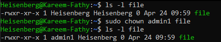
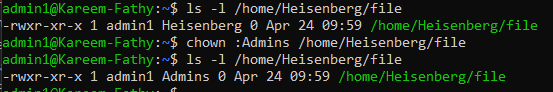
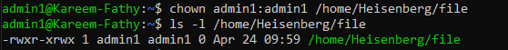

# 16: Managing Ownership (chown)

## 1. Introduction
Every file and directory in Linux has an assigned **User Owner** and **Group Owner**. The `chown` (Change Ownership) command is used to modify these values.
> 

## 2. Syntax
```bash
chown [OPTIONS] USER[:GROUP] FILE
```

## 3. Usage Examples

### Change User Owner
Transfer ownership of a file to another user.
```bash
sudo chown karim file.txt
```
*Sets the owner of `file.txt` to `karim`.*
> 

### Change Group Owner
Transfer group ownership to another group.
```bash
sudo chown :developers file.txt
```
*Sets the group of `file.txt` to `developers`.*
> **Note:** You can also use `chgrp developers file.txt`.
> 

### Change User and Group Together
```bash
sudo chown karim:developers file.txt
```
*Sets owner to `karim` and group to `developers`.*
> 

## 4. Recursive Ownership
Use the `-R` flag to change ownership for a directory and all its contents (files and subdirectories).

```bash
sudo chown -R karim:developers /var/www/html
```

## 5. Summary
-   **chown:** Change owner.
-   **chgrp:** Change group.
-   **-R:** Recursive change.

---

## 6. 🏆 Master Example: Fixing Web Server Permissions
**Scenario:** You deployed a website to `/var/www/html`, but the web server (Apache/Nginx user `www-data`) cannot read the files because you uploaded them as `root`. The site returns "403 Forbidden".

```bash
# 1. Check current ownership
ls -l /var/www/html/index.php
# Output: -rw-r--r-- 1 root root ... (Wrong!)

# 2. Fix ownership recursively containing all files
# Change owner to current user ($USER) so YOU can edit them.
# Change group to 'www-data' so the WEB SERVER can read them.
sudo chown -R $USER:www-data /var/www/html

# 3. Verify
ls -l /var/www/html/index.php
# Output: -rw-r--r-- 1 karim www-data ... (Correct!)
```

> **Result:** You can edit files, and the web server can serve them. 403 error solved.

## 7. Key Takeaways
-   Only root (or sudo) can change file ownership.
-   Colon (`:`) separates user and group.
-   `-R` applies changes recursively.
