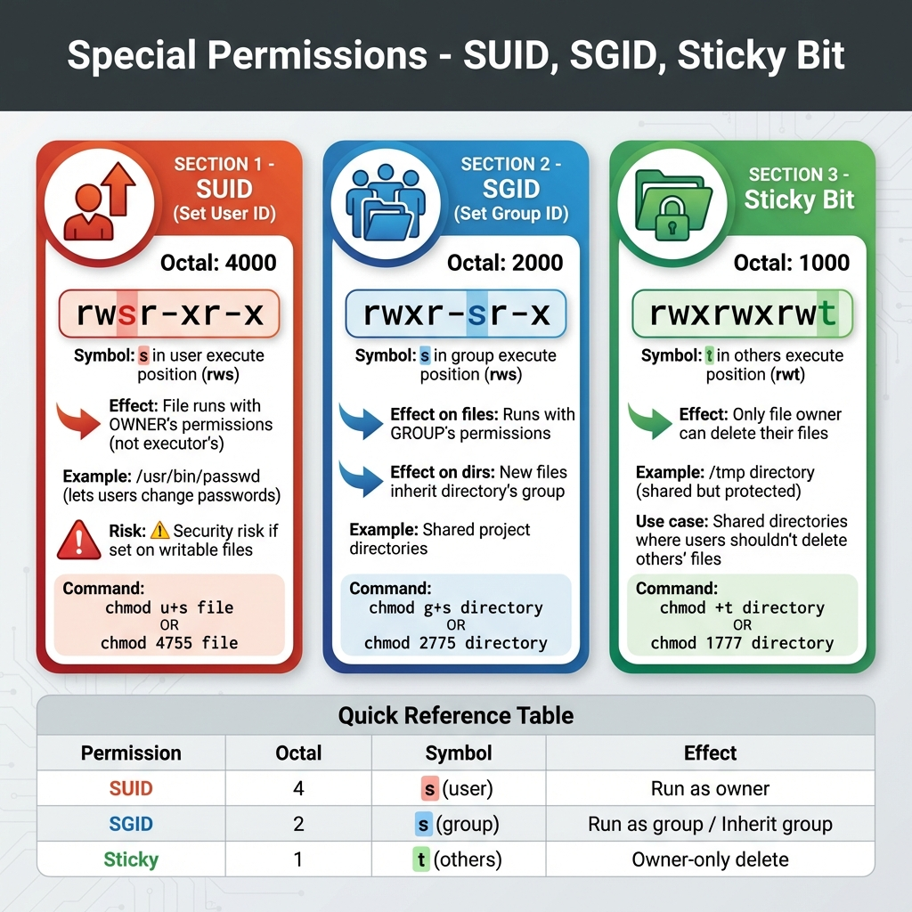
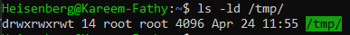

# 17: Special Permissions

## 1. Introduction
Beyond the standard read, write, and execute permissions, Linux provides **Special Permissions** that alter the behavior of executables and directories. These include **SUID**, **SGID**, and the **Sticky Bit**.

### Quick Reference
> 

## 2. SUID (Set User ID) - 4  **Symbol:** `s` (in User field)
-   **Octal Value:** `4`
-   **Function:** Executes a file with the permissions of the **file owner**, not the user running it.
-   **Use Case:** `passwd` command (needs root to modify `/etc/shadow`).

```bash
chmod u+s /usr/bin/passwd
# OR
chmod 4755 /usr/bin/passwd
```
*Output: `-rwsr-xr-x`*
> 

## 3. SGID (Set Group ID)
-   **Symbol:** `s` (in Group field)
-   **Octal Value:** `2`
-   **Function:**
    -   **Files:** Executes with permissions of the group owner.
    -   **Directories:** New files created inside inherit the **group ownership of the directory**, not the creating user's primary group.
-   **Use Case:** Shared team directories.

```bash
chmod g+s /var/www/html
# OR
chmod 2775 /var/www/html
```
*Output: `drwxrwsr-x`*
> 

## 4. Sticky Bit
-   **Symbol:** `t` (in Others field)
-   **Octal Value:** `1`
-   **Function:** Used on directories to restrict deletion. Only the **file owner**, **directory owner**, or **root** can delete or rename files.
-   **Use Case:** `/tmp` directory.

```bash
chmod +t /tmp
# OR
chmod 1777 /tmp
```
*Output: `drwxrwxrwt`*
> 

## 5. Umask (User File Creation Mask)
Controls default permissions for new files/directories.
-   **Formula:** `Default - Umask = Final Permission`
-   **Files:** `666 - 022 = 644`
-   **Directories:** `777 - 022 = 755`

**Configuration:**
-   Temporary: Run `umask 027`
-   Permanent: Add to `/etc/bashrc` or `~/.bashrc`.

## 6. Summary
-   **SUID (4):** Run as owner (e.g., `passwd`).
-   **SGID (2):** Inherit group ownership (Shared folders).
-   **Sticky (1):** Only owner deletes (Public temp folders).

---

## 7. 🏆 Master Example: Security Audit for SUID Binaries
**Scenario:** SUID files are dangerous because they run as root. A hacker might create a hidden SUID bash shell to keep root access. You need to find all SUID files on the system to audit them.

```bash
# 1. Find all files with SUID bit set
# -perm /4000: Look for SUID bit
# -type f: Only files
# 2>/dev/null: Hide permission denied errors
find / -perm /4000 -type f 2>/dev/null

# Common Output (Safe):
# /usr/bin/passwd
# /usr/bin/sudo
# /usr/bin/mount

# Suspicious Output (DANGER):
# /tmp/.hidden_script
# /home/user/bash
```

> **Action:** If you see something like `/home/user/bash` with SUID, your system is likely compromised!
