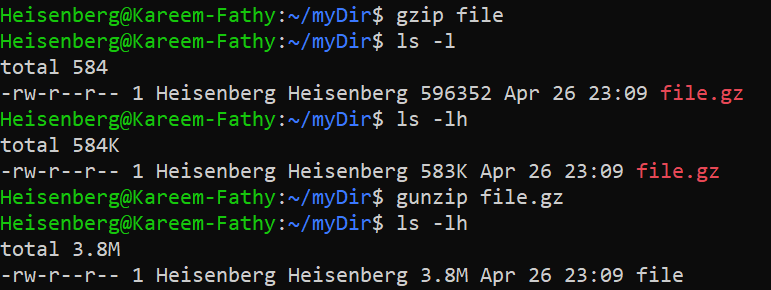
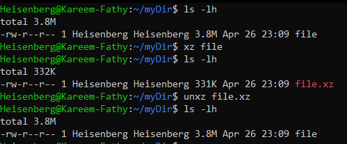

# 18: Compressing and Archiving

## 1. Introduction
**Archiving** groups multiple files into a single bundle, while **Compressing** reduces file size. In Linux, these are often performed together using `tar`.

## 2. Compression Tools
> 

These tools compress single files.

| Tool | Extension | Speed | Ratio | Command | Decompress |
| :--- | :--- | :--- | :--- | :--- | :--- |
| **gzip** | `.gz` | Fast | Low | `gzip file` | `gunzip file.gz` |
| **bzip2** | `.bz2` | Med | Med | `bzip2 file` | `bunzip2 file.bz2` |
| **xz** | `.xz` | Slow | High | `xz file` | `unxz file.xz` |

> 
> 
> 

### Performance Comparison
> 

## 3. Archiving with `tar`
The `tar` (Tape ARchive) command combines files and can also apply compression.

**Syntax:**
```bash
tar [options] [archive_name] [files/directories]
```

**Common Options:**
-   `-c`: Create archive.
-   `-x`: Extract archive.
-   `-f`: Specify filename (Must be last argument).
-   `-v`: Verbose (show progress).
-   `-z`: Use `gzip` compression.
-   `-j`: Use `bzip2` compression.
-   `-J`: Use `xz` compression.

## 4. Examples

### Create & Compress
```bash
# Gzip (Most Common)
tar -czf archive.tar.gz folder/

# Xz (Best Compression)
tar -cJf archive.tar.xz folder/
```
> 

### Extract
```bash
# Extract any tar archive
tar -xf archive.tar.gz

# Extract to specific directory
tar -xf archive.tar.gz -C /tmp/
```

### List Contents
```bash
tar -tf archive.tar.gz
```

## 5. Key Takeaways
-   **`tar -czf`** to create Compressed Archives (Gzip).
-   **`tar -xf`** to extract.
-   **`gzip`** is faster; **`xz`** saves more space.
