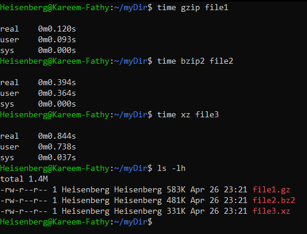
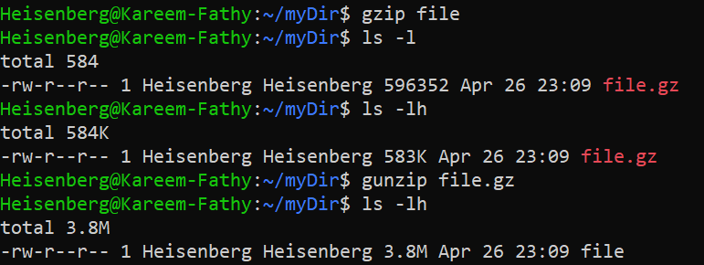
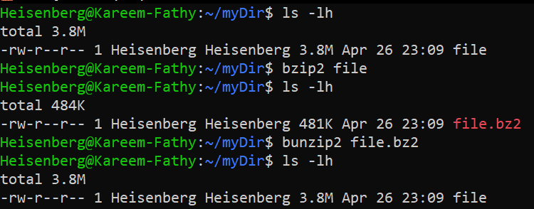
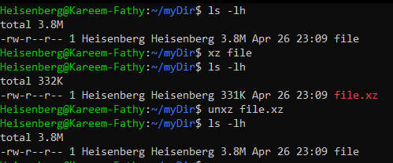
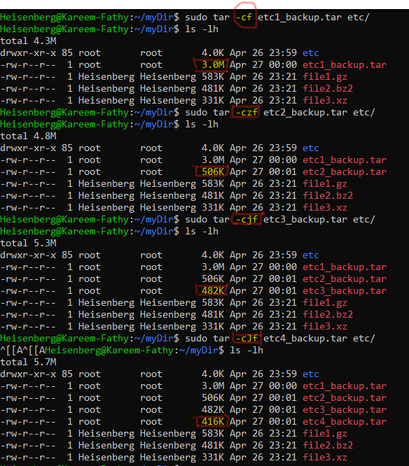

# 18: Compressing and Archiving

## 1. Introduction
**Archiving** groups multiple files into a single bundle, while **Compressing** reduces file size. In Linux, these are often performed together using `tar`.

## 2. Compression Tools
> <!--  -->
> 

These tools compress single files.

| Tool | Extension | Speed | Ratio | Command | Decompress |
| :--- | :--- | :--- | :--- | :--- | :--- |
| **gzip** | `.gz` | Fast | Low | `gzip file` | `gunzip file.gz` |
| **bzip2** | `.bz2` | Med | Med | `bzip2 file` | `bunzip2 file.bz2` |
| **xz** | `.xz` | Slow | High | `xz file` | `unxz file.xz` |

> <!--  -->
> <!--  -->
> <!--  -->
> 

### Performance Comparison
> <!--  -->

## 3. Archiving with `tar`
The `tar` (Tape ARchive) command combines files and can also apply compression.

**Syntax:**
```bash
tar [options] [archive_name] [files/directories]
```

**Common Options:**
-   `-c`: Create archive.
-   `-x`: Extract archive.
-   `-f`: Specify filename (Must be last argument).
-   `-v`: Verbose (show progress).
-   `-z`: Use `gzip` compression.
-   `-j`: Use `bzip2` compression.
-   `-J`: Use `xz` compression.

## 4. Archiving & Compressing with `zip`
Unlike `tar`, which relies on external tools to compress, the `zip` utility performs both archiving and compression natively in one step. It is the absolute standard for cross-platform sharing (Windows/macOS).

**Note:** `zip` and `tar` are completely separate tools and algorithms. You cannot extract a `.zip` using `tar`.

**Syntax:**
```bash
# Create Archive (Use -r to recursively include directory contents)
zip -r archive_name.zip folder/

# Extract Archive
unzip archive_name.zip
```

## 5. Examples

### Create & Compress
```bash
# Gzip (Most Common)
tar -czf archive.tar.gz folder/

# Xz (Best Compression)
tar -cJf archive.tar.xz folder/
```


<div width="600">
    
</div>

### Extract
```bash
# Extract any tar archive
tar -xf archive.tar.gz

# Extract to specific directory
tar -xf archive.tar.gz -C /tmp/
```

### List Contents
```bash
tar -tf archive.tar.gz
```

## 6. Key Takeaways
-   **`tar -czf`** to create Compressed Archives (Gzip).
-   **`tar -xf`** to extract.
-   **`gzip`** is faster; **`xz`** saves more space.
-   **`zip -r`** to natively bundle and compress for cross-platform usage.