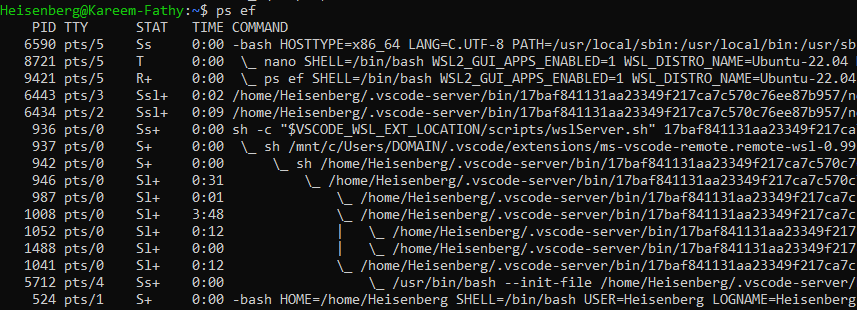

# 20: Managing Linux Processes

## 1. Introduction
A process is a running instance of a program. Linux assigns a unique **PID** (Process ID) to every process. The mother of all processes is `systemd` (PID 1).

### Process Lifecycle
> 

## 2. Viewing Processes (`ps`)

### Basic Usage
-   `ps`: View processes in current shell.
-   `ps aux`: View **all** running processes on the system (BSD style).
-   `ps -ef`: View **all** running processes (Standard syntax).

> 
> 

**Common Columns:**
-   **PID:** Process ID.
-   **USER:** Owner of the process.
-   **%CPU / %MEM:** Resource usage.
-   **STAT:** Process State (R=Running, S=Sleeping, Z=Zombie).

### Process Tree (`pstree`)
Visualizes the parent-child relationship of processes.
```bash
pstree -p
```
> 

## 3. Searching Processes (`pgrep`)
Find PIDs by name.
```bash
# Find PIDs for 'ssh' processes
pgrep -a ssh

# Find processes by user
pgrep -u karim
```

## 4. Killing Processes (`kill`)
We use signals to control processes.

**Common Signals:**
-   **15 (SIGTERM):** Polite kill (Default). Asks process to stop gracefully.
-   **9 (SIGKILL):** Force kill. Immediately destroys process (cannot be ignored).
-   **2 (SIGINT):** Interrupt (Ctrl+C).
-   **1 (SIGHUP):** Reload configuration.

> [!CAUTION]
> **SIGKILL (-9) Should Be a Last Resort**
> 
> Using `kill -9` forcefully terminates a process **without** giving it a chance to:
> - Save data or commit transactions
> - Close database connections properly
> - Release file locks
> - Clean up temporary files
> 
> **Always try `kill` (SIGTERM) first**, and only use `kill -9` if the process is unresponsive.

**Commands:**
```bash
# Kill by PID (polite - allows cleanup)
kill 1234

# Force kill (only if SIGTERM fails)
kill -9 1234

# Kill by Name
pkill nginx
killall apache2
```

## 5. Background Jobs
-   **`&`**: Start command in background (`long_script.sh &`).
-   **`Ctrl+Z`**: Pause current foreground job.
-   **`bg`**: Resume paused job in background.
-   **`fg`**: Bring background job to foreground.
-   **`jobs`**: List active jobs in current shell.
> 

## 6. 🏆 Master Example: Debugging High CPU
**Scenario:** The system is slow. You need to identify the rogue process consuming the most CPU, verify what it is, and terminate it.

### Step 1: Find the Culprit
Run `ps` sorted by CPU usage to grab the top process.
```bash
ps aux --sort=-%cpu | head -n 2
# Output:
# USER     PID  %CPU %MEM  COMMAND
# karim   9999  98.5  2.1  ./mining_script.sh
```

### Step 2: Investigate
Before killing it, verify what it's doing (e.g., checking open files).
```bash
lsof -p 9999
# Shows files opened by this process
```

### Step 3: Terminate Gracefully
Try to stop it nicely first.
```bash
kill -15 9999
```

### Step 4: Verify & Force Kill (if needed)
Check if it's still running after a few seconds. If it's stuck (Zombie or ignoring signal), force kill.
```bash
pgrep -l mining_script || kill -9 9999
```

---

## 7. Key Takeaways
-   Use `ps aux` to monitor all processes.
-   Use `kill` (SIGTERM) first, `kill -9` (SIGKILL) only if necessary.
-   `&` runs tasks in the background.
-   Background jobs are tied to the current shell session.