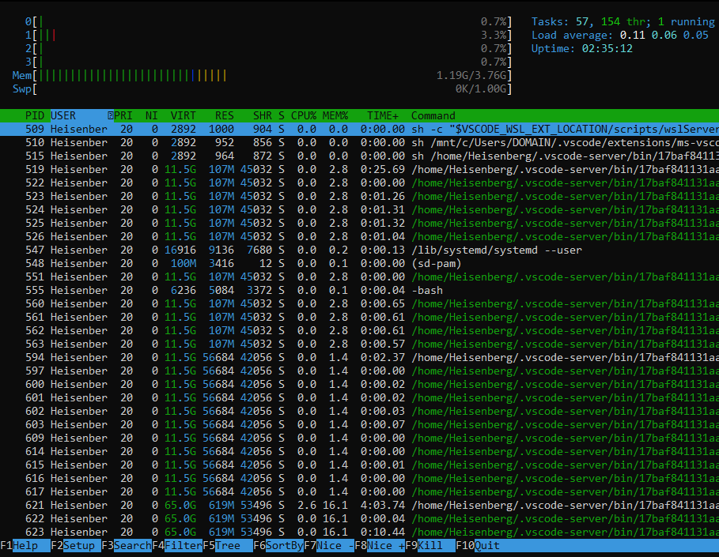

# 21: Monitoring Linux Processes

## 1. Introduction
Linux provides real-time monitoring tools to track system performance, CPU usage, memory consumption, and running processes.

## 2. Top (`top`)
The `top` command displays a dynamic, real-time view of the running system.
> 
> 

### Interactive Keys
| Key | Action |
| :--- | :--- |
| `h` | Help |
| `1` | Show CPU cores |
| `M` | Sort by Memory |
| `P` | Sort by CPU (Default) |
| `k` | Kill a process (enter PID) |
| `q` | Quit |

## 3. Htop (`htop`)
A more user-friendly, colorful, and scrollable alternative to `top`.
-   Allows selecting processes with arrow keys/mouse.
-   Easier process killing (`F9`).
-   Tree view (`F5`).
> 

> **Note:** Requires installation (`sudo apt install htop`).

## 4. Process Priorities (Nice)
The kernel schedules processes based on priority.
-   **Nice Value:** Ranges from **-20** (Highest Priority) to **19** (Lowest Priority).
-   **Default:** 0.

### Starting a process with priority
```bash
nice -n 10 my_script.sh
# Starts with lower priority (10)
```

### Changing priority of running process (`renice`)
```bash
sudo renice -n -5 -p 1234
# Changes PID 1234 to higher priority (-5)
```

---

## 6. 🏆 Master Example: Diagnosing a "Slow Server"
**Scenario:** Users complain the server is slow. You need to verify if it's CPU, Memory, or Disk that is the bottleneck.

```bash
# 1. Check Load Average and CPU (is load > cores?)
uptime
# Output: load average: 4.5, 3.2, 1.0 (High load!)

# 2. Check RAM usage (is Swap being used?)
free -h
# Output: Swap: 2.0G used (Bad sign! RAM is full)

# 3. Check Disk Space (is root partition full?)
df -h /
# Output: Use% 98% (Critical!)

# 4. Identify the process causing all this
htop
# (Sort by CPU/MEM to find the culprit)
```

> **Diagnosis:** If Swap is high, you need more RAM. If Load is high, check CPU hogs. If Disk is full, clean logs/temp files.

## 5. Summary
-   **top/htop:** Real-time monitoring.
-   **df/du:** Disk usage.
-   **free:** Memory usage.