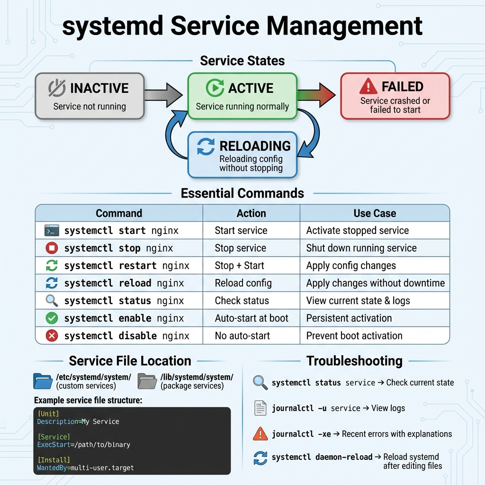
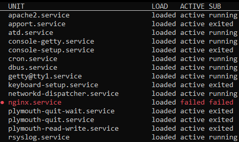
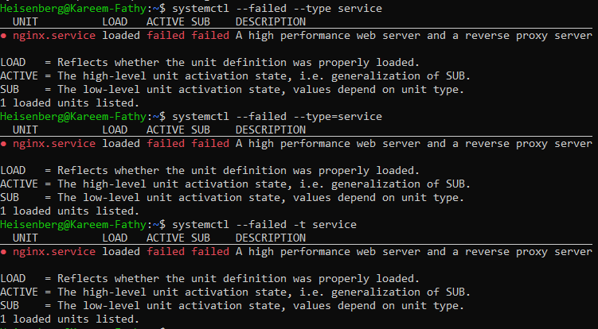
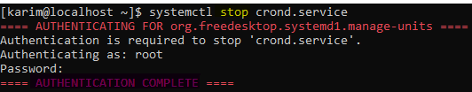
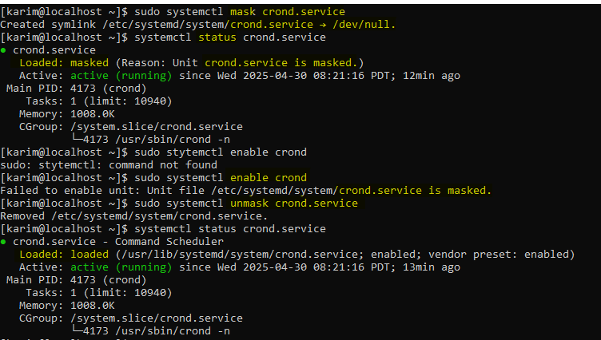

# 22: Services and Daemons (systemd)

## 1. Introduction
A **Service** (or Daemon) is a background process that waits for requests or performs tasks without user intervention (e.g., `sshd`, `httpd`). **Systemd** is the system and service manager for modern Linux distributions.

### Service Lifecycle
> 

## 2. Managing Services (`systemctl`)

### Listing Services
```bash
systemctl list-units --type=service
systemctl list-unit-files
```
> 
> 

### Basic Commands
| Action | Command |
| :--- | :--- |
| **Start** | `sudo systemctl start service_name` |
| **Stop** | `sudo systemctl stop service_name` |
| **Restart** | `sudo systemctl restart service_name` |
| **Reload** | `sudo systemctl reload service_name` |
| **Check Status** | `systemctl status service_name` |

> 

### Failed Services
```bash
systemctl --failed
```
> 

## 3. Boot Behavior
Control whether a service starts automatically when the computer turns on.

-   **Enable (Auto-start):**
    ```bash
    sudo systemctl enable service_name
    ```
-   **Disable (No auto-start):**
    ```bash
    sudo systemctl disable service_name
    ```

## 4. Service States
-   **active (running):** Service is currently running.
    > 
-   **inactive (dead):** Service is stopped.
    > 
-   **enabled:** Will start at boot.
-   **disabled:** Will NOT start at boot.
-   **masked:** Completely locked, cannot be started manually or automatically.
    > 

## 4. Summary
-   **systemctl start/stop/restart:** Control state.
-   **systemctl enable/disable:** Control bootup.
-   **journalctl:** Debug logs.

---

## 5. 🏆 Master Example: Creating a Custom Service
**Scenario:** You have a Python script `app.py` that needs to run in the background, restart automatically if it crashes, and start on boot.

```bash
# 1. Create unit file
sudo nano /etc/systemd/system/myapp.service

# 2. Add content:
# [Unit]
# Description=My Python App
# After=network.target
#
# [Service]
# User=karim
# ExecStart=/usr/bin/python3 /home/karim/app.py
# Restart=always
# RestartSec=5
#
# [Install]
# WantedBy=multi-user.target

# 3. Reload systemd to see the new file
sudo systemctl daemon-reload

# 4. Start and Enable
sudo systemctl enable --now myapp

# 5. Verify
systemctl status myapp
```

> **Result:** Your script is now a robust system service!
-   **Start/Stop** controls *current* state.
-   Service names often end in `d` (e.g., `sshd`, `httpd`, `crond`).
