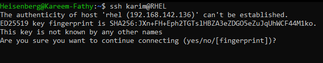
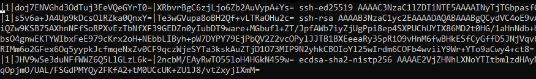
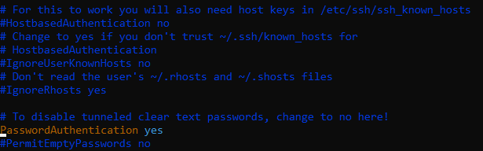
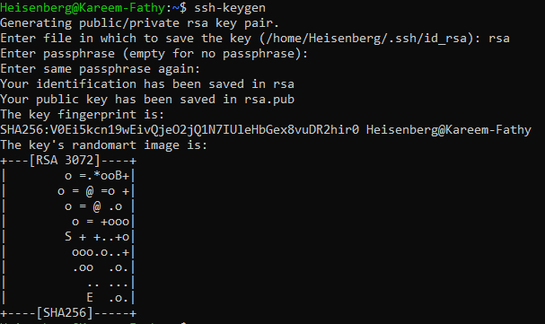
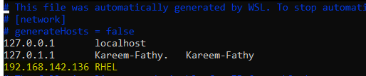
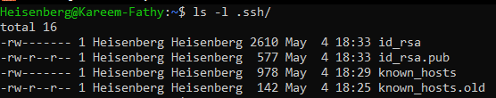
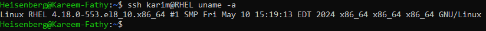

# 24: Configuring and Securing SSH

## 1. Introduction
**SSH (Secure Shell)** allows secure remote access to Linux systems. It encrypts all communication defined in the `ssh` protocol.

## 2. Basic Usage

### Connect to Server
```bash
ssh user@hostname_or_ip
```
*Port defaults to 22.*
> 
> 

## 2. SSH Authentication Methods

### Authentication Flow
> 

### A. Password Authentication
Simple but vulnerable to Brute Force attacks. Enabled by default.
> 

### B. Key-Based Authentication (Recommended)
More secure. Uses a Public/Private key pair.

**Steps to Setup:**
1.  **Generate Keys (on Client):**
    ```bash
    ssh-keygen -t rsa -b 4096
    ```
    *Creates `~/.ssh/id_rsa` (Private) and `~/.ssh/id_rsa.pub` (Public).*
    > 

2.  **Copy Public Key to Server:**
    ```bash
    ssh-copy-id user@remote_ip
    ```

3.  **Set Permissions (Critical):**
    ```bash
    chmod 700 ~/.ssh
    chmod 600 ~/.ssh/id_rsa
    chmod 644 ~/.ssh/id_rsa.pub
    ```

4.  **Connect:**
    ```bash
    ssh user@ip
    ```
    > 

### Viewing Keys
Keys are stored in `~/.ssh/`.
> 

## 4. Securing SSH
Edit `/etc/ssh/sshd_config` to harden security.

| Setting | Recommendation | Reason |
| :--- | :--- | :--- |
| `PermitRootLogin` | `no` | Prevent direct root login. |
| `PasswordAuthentication` | `no` | Force key-based auth (after keys are set up). |
| `Port` | `2222` (example) | Change default port to reduce noise scans. |
| `AllowUsers` | `user1 user2` | Whitelist specific users. |

> **Apply Changes:** `sudo systemctl restart sshd`

## 5. Remote Commands
Run commands without logging in:
```bash
ssh user@host command
```
> 

## 6. Real-World Scenarios

### Scenario 1: Cannot Connect to SSH Server
**Problem:** `ssh: connect to host 192.168.1.10 port 22: Connection refused`

**Troubleshooting:**
```bash
# 1. Check if SSH service is running
sudo systemctl status sshd

# 2. Check if port 22 is listening
ss -tuln | grep :22

# 3. Check firewall rules
sudo ufw status  # Ubuntu
sudo firewall-cmd --list-all  # RHEL

# 4. Test network connectivity
ping 192.168.1.10
```

> For network troubleshooting, see [23_Managing_Networks.md](./23_Managing_Networks.md).

### Scenario 2: "Permission denied (publickey)"
**Problem:** Key-based auth is enabled but connection fails.

**Solution:**
```bash
# Check key permissions on CLIENT
chmod 700 ~/.ssh
chmod 600 ~/.ssh/id_rsa
chmod 644 ~/.ssh/id_rsa.pub

# Check authorized_keys on SERVER
chmod 700 ~/.ssh
chmod 600 ~/.ssh/authorized_keys

# Verify key is correct
cat ~/.ssh/id_rsa.pub  # on client
cat ~/.ssh/authorized_keys  # on server (should contain the public key)
```

### Scenario 3: Setting up SSH for multiple servers
**Problem:** Managing different keys for different servers.

**Solution:** Use `~/.ssh/config`
```bash
# Create SSH config file
vim ~/.ssh/config

# Add:
Host server1
    HostName 192.168.1.10
    User admin
    IdentityFile ~/.ssh/id_rsa_server1

Host server2
    HostName 192.168.1.20
    User root
    IdentityFile ~/.ssh/id_rsa_server2
    Port 2222
```

Now you can simply use:
```bash
ssh server1
ssh server2
```

## 7. Key Takeaways
-   **Never** share your private key (`id_rsa`).
-   Disable **Root Login** and **Password Authentication** for production servers.
-   Ensure correct file permissions (`600` for private key, `644` for public key).
-   Use `~/.ssh/config` to manage multiple SSH connections easily.