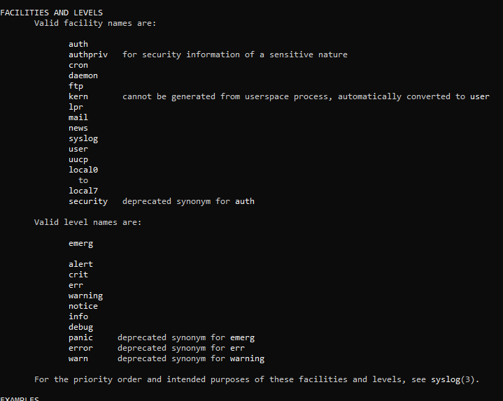

# 25: Analyzing and Storing Logs

## 1. Introduction
Logs are critical for troubleshooting. Linux uses centralized logging services like **rsyslog** (traditional) and **systemd-journald** (modern).

## 2. Rsyslog (Text-Based)
Stores logs in plain text files.
-   **Config:** `/etc/rsyslog.conf`
-   **Common Log Files (`/var/log/`):**
    -   `messages` / `syslog`: General system logs.
    -   `secure` / `auth.log`: Authentication (SSH, sudo) logs.
    -   `boot.log`: Boot messages.
    -   `dmesg`: Kernel buffer (hardware events).

**Log Facilities & Priorities:**
> 

## 3. Systemd-Journald (Binary)
Stores logs in a structured binary format.
-   **Command:** `journalctl`

### Using `journalctl`
```bash
# View all logs (paginated)
journalctl

# Follow logs in real-time (like tail -f)
journalctl -f

# Filter by Priority
journalctl -p err    # Show errors and critical only

# Filter by Unit (Service)
journalctl -u sshd

# Filter by Time
journalctl --since "1 hour ago"
journalctl --since "2023-10-01" --until "2023-10-02"

# Debug failed services (MOST USEFUL)
journalctl -xe
# -x: Add explanatory help text
# -e: Jump to end (recent logs)
```

> [!TIP]
> **Quick Debugging:** When a service fails, run `journalctl -xe` immediately. It shows the most recent logs with helpful explanations and highlights errors in red.
---

## 4. 🏆 Master Example: Security Audit with Journalctl
**Scenario:** You investigate a reported unauthorized access attempt. You need to find all **SSH authentication failures** that happened **in the last 1 hour** and see which IPs were involved.

```bash
journalctl -u ssh --since "1 hour ago" | grep "Failed password" | awk '{print $(NF-3)}' | sort | uniq -c
```

### Breakdown:
1.  **`journalctl -u ssh`**: Filter logs for the SSH service unit only.
2.  **`--since "1 hour ago"`**: Limit the time range to the last hour.
3.  **`grep "Failed password"`**: Filter lines indicating a failed login attempt.
4.  **`awk '{print $(NF-3)}'`**: Print the 4th field from the end (usually the IP address in standard SSH logs).
5.  **`sort | uniq -c`**: Count unique occurrences of each attacking IP.

> **Result:** A clear list of attacking IP addresses and how many times they tried to brute-force your server recently.

## 4. Log Persistence
By default, `journald` logs might be volatile (lost on reboot).
-   To persist: Set `Storage=persistent` in `/etc/systemd/journald.conf`.
    > 

-   Reload service:
    ```bash
    systemctl restart systemd-journald
    ```
    > 

## 5. Key Takeaways
-   **Text logs** (`/var/log`) are easy to read with `cat`, `less`, `tail`.
-   **`journalctl`** offers powerful filtering capabilities for modern systems.
-   Check `/var/log/secure` or `journalctl -u sshd` for login issues.
-   Use `journalctl -xe` as your first debugging step for failed services.