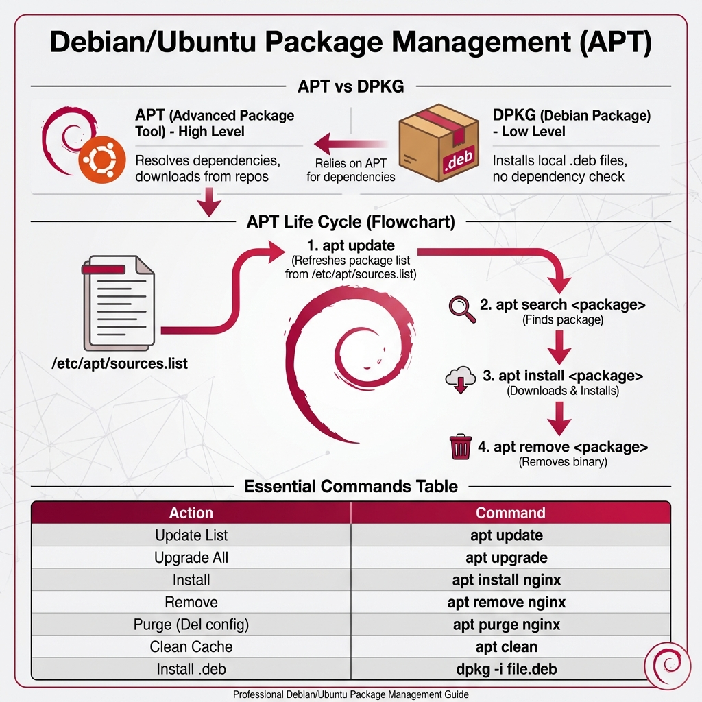
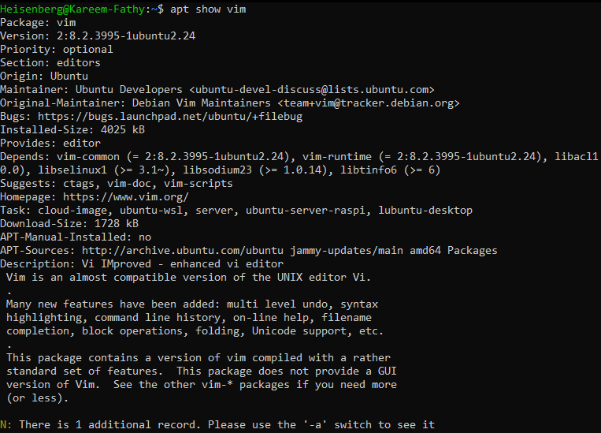

# 26: Debian Package Management

## 1. Introduction
Managing software is critical. Debian-based systems (Ubuntu, Kali, Mint) use **APT** (Advanced Package Tool) and **dpkg**.

### Package Management Cycle
> 

## 2. Low-Level Management (`dpkg`)
Directly manages `.deb` files. Does **not** resolve dependencies.

| Action | Command |
| :--- | :--- |
| **Install** | `sudo dpkg -i package.deb` |
| **Remove** | `sudo dpkg -r package_name` |
| **List Installed** | `dpkg -l` |
| **Check Info** (Local file) | `dpkg --info package.deb` |
| **Check Contents** (Local file) | `dpkg -c package.deb` |

## 3. High-Level Management (`apt`)
Retrieves packages from repositories and resolves dependencies automatically.
> 

| Action | Command |
| :--- | :--- |
| **Update Metadata** | `sudo apt update` |
| **Upgrade Packages** | `sudo apt upgrade` |
| **Install Package** | `sudo apt install package_name` |
| **Remove Package** | `sudo apt remove package_name` |
| **Search Package** | `apt search keyword` |
| **Show Details** | `apt show package_name` |

### Apt Options Visualized
**List Options:**
> 
> 

**Search:**
> 

**Show:**
> 

**Dependencies:**
> 

### Repositories
-   **Source File:** `/etc/apt/sources.list`
-   **Additional Repos:** `/etc/apt/sources.list.d/*.list`

## 4. Key Takeaways
-   Use **`apt`** for daily tasks (install/update).
-   Use **`dpkg`** only when installing standalone `.deb` files downloaded manually.
-   Always run `apt update` before installing software to ensure you get the latest version.