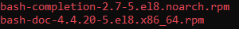
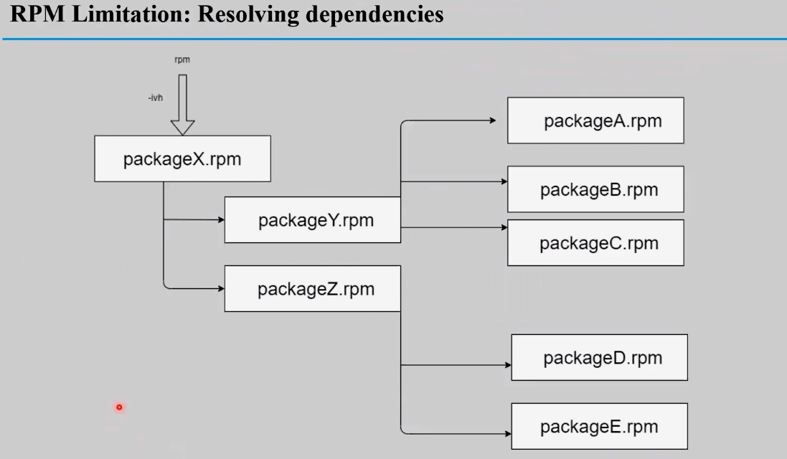
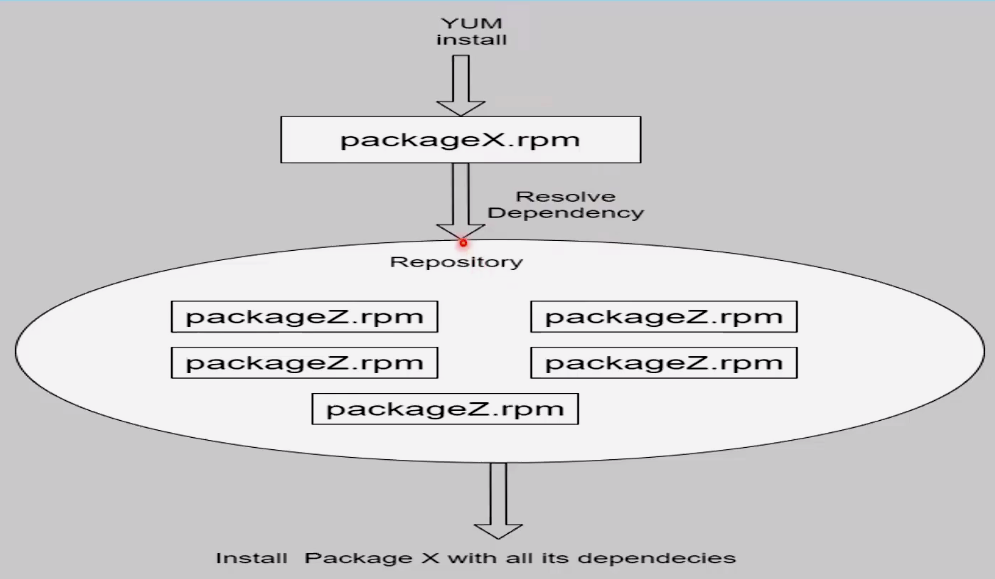

# 27: Red Hat Package Management

## 1. Introduction
RedHat-based systems (RHEL, CentOS, Fedora) use **DNF** (Dandified YUM) and **RPM**. `dnf` is the modern replacement for `yum`.

### Package Management Cycle
> 

## 2. DNF vs RPMia `rpm`, `yum` (older), or `dnf` (modern).

## 2. Low-Level Management (`rpm`)
Directly manages `.rpm` files. Does **not** resolve dependencies.
> 

**Searching RPMs:**
> 

**Dependencies Warning:**
> 

| Action | Command |
| :--- | :--- |
| **Install** | `sudo rpm -ivh package.rpm` |
| **Upgrade** | `sudo rpm -Uvh package.rpm` |
| **Remove** | `sudo rpm -e package_name` |
| **Query Installed** | `rpm -q package_name` |
| **List All** | `rpm -qa` |

## 3. High-Level Management (`yum` / `dnf`)
Retrieves packages from repositories and resolves dependencies. `dnf` is the successor to `yum`.
> 

| Action | Command |
| :--- | :--- |
| **Install** | `sudo dnf install package_name` |
| **Remove** | `sudo dnf remove package_name` |
| **Update** | `sudo dnf update` |
| **Search** | `dnf search keyword` |
| **Info** | `dnf info package_name` |

### Repositories
-   **Location:** `/etc/yum.repos.d/*.repo`

## 4. Key Takeaways
-   **`dnf`** is the standard for modern RHEL/CentOS systems.
-   **`rpm`** is used for standalone package files.
-   `rpm -ivh` flags: **I**nstall, **V**erbose, **H**ash (progress bar).
