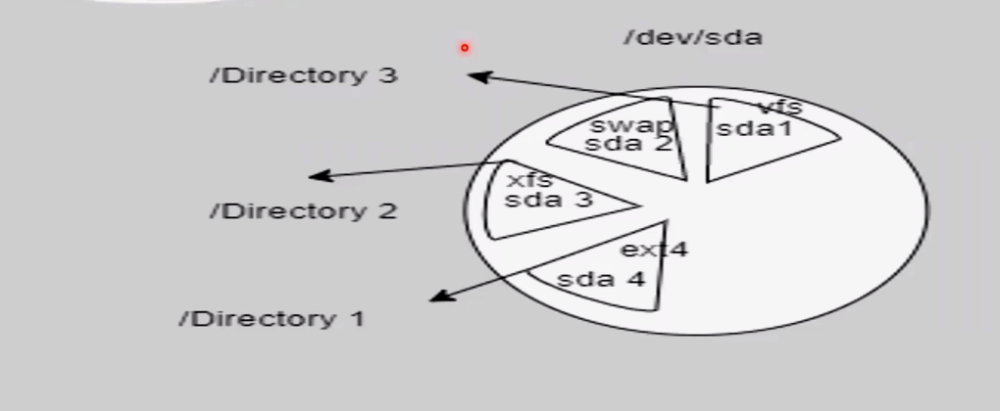
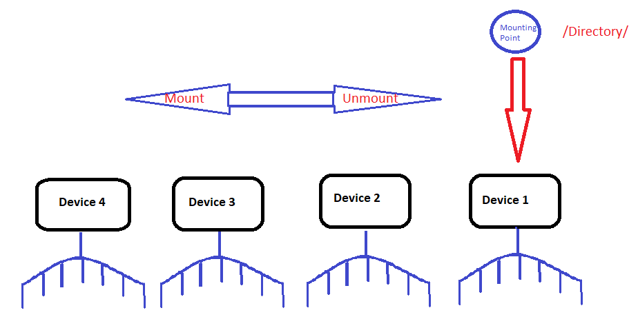

# 28: Linux File Systems & Mounting

## 1. Introduction
Linux supports various file systems (`ext4`, `xfs`, `btrfs`). Disks must be **partitioned** and **mounted** to be accessible.
> 

## 2. Partitioning Schemes
-   **MBR (Master Boot Record):** Legacy. Max 4 primary partitions. Max 2TB disk.
-   **GPT (GUID Partition Table):** Modern (UEFI). Unlimited partitions. Supports large disks (>2TB).

## 3. Device Naming
Found in `/dev/`.
-   **IDE/Legacy:** `/dev/hda`
-   **SATA/SCSI/USB:** `/dev/sda`, `/dev/sdb`
    -   Partitions: `/dev/sda1`, `/dev/sda2`
-   **NVMe:** `/dev/nvme0n1`
    -   Partitions: `/dev/nvme0n1p1`
-   **Virtual:** `/dev/vda`

## 4. Mounting
Attaching a storage device to a directory (Mount Point).

### Temporary Mounting
```bash
# Mount
sudo mount /dev/sdb1 /mnt/usb

# Unmount
sudo umount /mnt/usb
```
> 

### Persistent Mounting (`/etc/fstab`)
The `/etc/fstab` file defines which filesystems are automatically mounted at boot.

> 

> [!DANGER]
> **Editing `/etc/fstab` Can Break Your System**
> 
> A syntax error in `/etc/fstab` can **prevent your system from booting**. The system will drop you into emergency mode.
> 
> **ALWAYS** test your changes before rebooting:
> ```bash
> sudo mount -a
> ```
> This command attempts to mount all filesystems in `/etc/fstab`. If it fails, fix the error before rebooting.

### Viewing Mounts
```bash
df -h      # Disk Free (Human readable)
lsblk      # List Block Devices (Tree view)
du -sh .   # Disk Usage summary for current directory
mount      # Show all currently mounted filesystems
```

## 6. Summary
-   **mount/umount:** Attach/Detach storage.
-   **df -h:** Check space.
-   **lsblk:** List devices.
-   **/etc/fstab:** Permanent mounts.

---

## 7. 🏆 Master Example: Mounting a New Data Disk Permanently
**Scenario:** You added a new 100GB hard drive `/dev/sdb` to your server. You need to format it, mount it to `/data`, and ensure it mounts automatically after reboot.

```bash
# 1. Create partition (using fdisk or parted - skip for simplicity, assume /dev/sdb1 exists)
# 2. Format with ext4
sudo mkfs.ext4 /dev/sdb1

# 3. Create mount point
sudo mkdir /data

# 4. Get the UUID (Universally Unique Identifier) - Safer than device names!
sudo blkid /dev/sdb1
# Output: /dev/sdb1: UUID="a1b2c3d4-..." TYPE="ext4"

# 5. Add to /etc/fstab for persistence
# Open file: sudo nano /etc/fstab
# Add line:
# UUID=a1b2c3d4-...  /data  ext4  defaults  0  2

# 6. Test configuration (Critical step!)
sudo mount -a
# If no errors, it worked. If errors, FIX IT before rebooting or system won't boot!
```

> **Why UUID?** Device names like `/dev/sdb` can change if you add/remove disks. UUIDs never change.