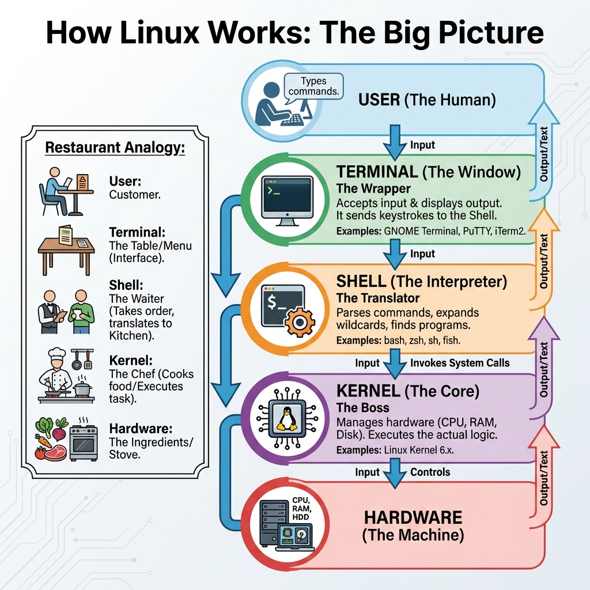

# 00: Terminals and Shells in Linux

## 1. الصورة الكاملة (The Big Picture)
عشان تفهم اللينكس شغال إزاي، لازم تفرق بين 3 حاجات أساسية. تخيل الموضوع كأنه مطعم:

> 

### تشبيه المطعم (The Restaurant Analogy 🍽️)
1.  **الزبون (User):** ده أنت! عايز تطلب حاجة (مثلاً: "هاتلي قائمة الملفات").
2.  **الترمنال (Terminal):** دي الترابيزة أو المنيو اللي بتتعامل معاها. شاشة بتكتب فيها وبتشوف النتيجة.
    *   *أمثلة:* GNOME Terminal, PuTTY, iTerm2.
3.  **الشيل (Shell):** ده "الجرسون". بياخد طلبك من الترمنال، ويفهمه (يترجمه)، ويروح يبلغه للمطبخ.
    *   *أمثلة:* Bash, Zsh, Fish.
4.  **الكرنل (Kernel):** ده "الشيف" أو مدير المطبخ. هو اللي بيشغل الهاردوير (CPU, RAM, Disk) عشان ينفذ الطلب بجد.

---

## 2. يعني إيه Shell؟
الـ **Shell** هو برنامج بياخد الأوامر منك وبيبعتها للـ Kernel ينفذها. هو الوسيط بينك وبين الجهاز. اللينكس فيه أنواع كتير من الـ Shells، كل واحد ليه مميزات.

## 3. أشهر أنواع الـ Shells
1.  **`sh` (Bourne Shell):** الجد الأكبر لكل الـ Shells. قديم وبسيط.
2.  **`bash` (Bourne Again Shell):** ده "الزعيم". الأشهر والأكثر استخداماً في أغلب توزيعات اللينكس (Ubuntu, CentOS, etc.).
3.  **`zsh` (Z Shell):** ده "الروق". نسخة متطورة من bash فيها مميزات وألوان وثيمات (MacOS بيستخدمه دلوقت).
4.  **`fish` (Friendly Interactive Shell):** "الصديق". سهل جداً وبيكمل الأوامر لوحده (Auto-suggestion) من غير إعدادات كتير.

## 4. إزاي تفتح Shell؟
في طريقتين عشان توصل للـ CLI (Command Line Interface):

### أ. الشاشة السوداء (Virtual Consoles - TTYs)
- دي شاشة كونسول حقيقية من غير ماوس ولا جرافيك.
- بتوصلها عن طريق `Ctrl + Alt + F1` لحد `F6`.
- **الترتيب:**
    - `tty1` - `tty2`: غالباً محجوزين للواجهة الرسومية (GUI).
    - `tty3` - `tty6`: شاشات سوداء تقدر تعمل منها Login.

### ب. محاكي الترمنال (Terminal Emulators - PTS)
- ده البرنامج اللي بتفتحه جوه الويندوز أو اللينكس ديسكتوب.
- أمثلة: GNOME Terminal, Konsole.
- كل ما تفتح Tab جديد، بتعمل حاجة اسمها **PTS** (Pseudo Terminal).

## 5. هيكلية التيرمنال (Hierarchy)
```
/dev
  ├── tty1  (شاشة الجرافيك)
  ├── tty3  (شاشة سوداء 1)
  ├── tty4  (شاشة سوداء 2)
  └── pts
      ├── pts/0  (نافذة الترمنال 1)
      ├── pts/1  (نافذة الترمنال 2)
```

### أوامر تعرف منها أنت فين
```bash
# اعرف اسم الترمنال بتاعتك
tty
# النتيجة: /dev/pts/0

# شوف مين عامل Login وفاتح إيه
who

# شوف شجرة العمليات وتفاصيل الترمنال
ps -aux --forest | grep pts
```

## 6. الخلاصة (Summary)
- **Terminal:** الشاشة اللي بتكتب فيها.
- **Shell:** البرنامج اللي بيفهم الأوامر (bash).
- **Prompt:** العلامة اللي بتظهرلك مستنية تكتب `user@host:~$`.

---

## 7. 🏆 مثال من سوق العمل (Master Example)
**السيناريو:** أنت عايز "تزبط" الترمنال بتاعتك عشان تبقى أسرع في الشغل. محتاج تعمل 3 حاجات:
1.  تعمل اختصار (Alias) لتحديث السيستم.
2.  تضيف فولدر السكربتات بتاعك للـ `PATH` عشان تشغلها من أي مكان.
3.  تغير شكل الـ Prompt عشان يعرض الوقت.

```bash
# افتح ملف إعدادات الشيل (غالباً .bashrc)
nano ~/.bashrc

# --- انزل للآخر وضيف السطور دي ---

# 1. Alias عشان التحديث بكلمة واحدة
alias update='sudo apt update && sudo apt upgrade -y'

# 2. ضيف فولدر scripts للـ PATH
export PATH="$PATH:$HOME/scripts"

# 3. غير شكل الـ Prompt (وقت - يوزر - مكان)
export PS1="\[\033[01;32m\]\t \[\033[01;34m\]\u@\h:\w\$ \[\033[00m\]"

# --- احفظ واخرج (Ctrl+O, Enter, Ctrl+X) ---

# طبق التغييرات فوراً
source ~/.bashrc
```

> **النتيجة:** دلوقت تقدر تكتب `update` بس عشان تحدث الجهاز، وشكل الترمنال بقى "محترفين"!

## 8. ملاحظات هامة (Key Takeaways)
- الـ **Shell** هو المترجم، والـ **Bash** هو أشهر مترجم.
- الـ **TTY** هي شاشة الكونسول الأصلية.
- الـ **PTS** هي شاشة الترمنال اللي جوه الجرافيك.
