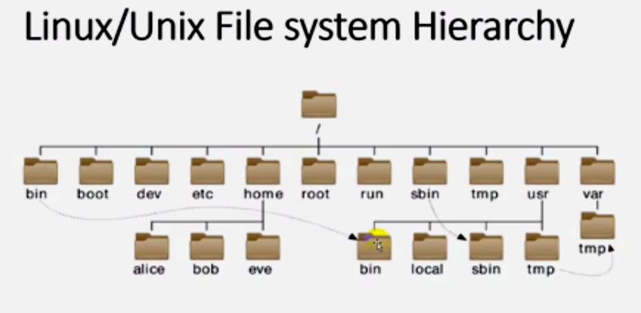
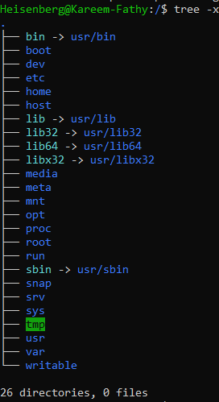
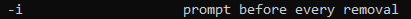
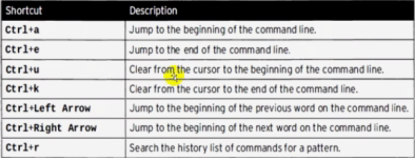

# 01: أوامر أساسية (Basic Commands)

## 1. مقدمة
عشان تبقى Linux Admin شاطر، لازم "تهضم" الأوامر الأساسية دي. الدليل ده هيعلمك إزاي تتحرك جوه السيستم، تدير الملفات، وتعرف معلومات عن الجهاز، وتبدل بين اليوزرز.

## 2. معلومات النظام (System Information)

### المعالج والذاكرة (CPU & Memory)
```bash
# اعرف الجهاز شغال بقاله قد إيه (Uptime) والحمل عليه (Load)
uptime
# النتيجة: 10:00:00 up 1:00, 2 users, load average: 0.00, 0.01, 0.05
> 

# Uptime بشكل مقروء للبشر
uptime -p
# النتيجة: up 1 hour, 54 minutes

# تفاصيل البروسيسور (CPU)
lscpu | grep 'Model name\|Socket(s)\|Core(s) per socket\|Thread(s) per core\|CPU MHz\|Architecture'
> 

# استهلاك الرامات (Memory Usage)
free -h
# Output:
#               total        used        free      shared  buff/cache   available
# Mem:           7.8G        2.1G        3.2G        150M        2.5G        5.3G
# Swap:          2.0G        0B          2.0G
```
> 

### مساحة الهارد (Disk Usage)
```bash
# المساحة الفاضية والمستخدمة (Human-readable)
df -h
# Output:
# Filesystem      Size  Used Avail Use% Mounted on
# /dev/sda1       100G   30G   70G  30% /
> 

# مساحة فولدر معين
du -sh /var/log
# Output: 500M    /var/log
```

> [!TIP]
> **يعني إيه Load Average؟**
> الأرقام التلاتة دول (مثلاً `0.00, 0.01, 0.05`) بيمثلوا الحمل على الـ CPU في آخر دقيقة، و 5 دقايق، و 15 دقيقة.
> لو عندك جهاز بـ 4 Cores، والـ Load وصل 4.00، ده معناه إن البروسيسور شغال بطاقتة القصوى (100%).

---

## 3. التحرك والملفات (Navigation & File Operations)

### التحرك (Basic Navigation)
```bash
# أنا واقف فين؟ (Print Working Directory)
pwd

# اعرض الملفات (قائمة طويلة، حجم مقروء، مترتبة بالوقت)
ls -lthr

# روح لفولدر معين
cd /path/to/directory

# ارجع للمكان اللي كنت فيه
cd -

# اعرض شجرة الملفات
tree -L 2 /path/to/directory  # اعرض لحد عمق مستويين بس
```

### إدارة الملفات والفولدرات
```bash
# اعمل ملف فاضي أو حدث توقيته
touch file.txt

# اعمل فولدرات جوه بعض مرة واحدة
mkdir -p dir1/dir2/dir3

# انسخ ملفات
cp file.txt backup.txt
cp -r /source /destination      # نسخ كامل للفولدر (Recursive)
cp -r -p /source /destination   # الحفاظ على الصلاحيات والتواريخ

# نقل / إعادة تسمية
mv oldname.txt newname.txt
mv -v file.txt /new/location/   # وريني بيحصل إيه (Verbose)

# مسح الملفات
rm file.txt
rm -r directory/                # مسح فولدر كامل
rm -i file.txt                  # اسألني الأول (Interactive)
```

> 

### حركات متقدمة (Advanced File Operations)
```bash
# اعمل ملف بحجم معين (مفيد للتجربة)
dd if=/dev/zero of=file.img bs=1M count=100

# فضي محتويات فولدر بس سيب الفولدر نفسه
rm -r /dir/*

# اعرض محتوى ملف
cat file.txt
```

> [!CAUTION]
> **أوامر خطيرة جداً** - راجعها 100 مرة قبل ما تدوس Enter:
> - `rm -rf /` (بيمسح السيستم كله!)
> - `rm -rf /*` (نفس المصيبة)
> - `dd if=/dev/sda of=/dev/sdb` (بيمسح الهارد بالكامل ويكتب عليه داتا تانية)

---

## 4. إدارة المستخدمين (User Management)

### اعرف أنا مين
```bash
# اسم اليوزر الحالي
whoami
```

### التبديل بين اليوزرز بـ `su`
```bash
# بدل ليوزر تاني (وخليك في نفس المكان ونفس الإعدادات)
su username

# بدل ليوزر تاني (وحمل ملفات إعداداته كأنك لسه داخل) - الأفضل
su - username

# ادخل بـ root
su -
```

### استخدام `sudo` (لصلاحيات الـ Root)
```bash
# ابقى root (بس خليك في نفس الفولدر)
sudo su

# ابقى root (وروح لـ /root وحمل الإعدادات)
sudo su -

# افتح Shell بصلاحيات الـ root (أنصح به)
sudo -i
```

> [!IMPORTANT]
> **الفرق بين `sudo -i` و `sudo su -`:**
> - `sudo -i` هي الطريقة **الأنضف والأحسن**.
> - بتمنع فتح عمليات ملهاش لازمة (`sudo → su → shell`).
> - الاتنين بيطلبوا الباسورد بتاعك أنت (مش باسورد الـ root).

لمزيد من التفاصيل عن `sudo`، شوف [09_Gain_Superuser_Access.md](./09_Gain_Superuser_Access.md).

---

## 5. تاريخ الأوامر (Command History)

```bash
# وريني كل الأوامر اللي كتبتها قبل كده
history

# كرر آخر أمر
!!

# كرر آخر أمر كان بيبدأ بكلمة 'ssh'
!ssh

# ابحث في الهيستوري (بحث تفاعلي)
Ctrl + R  # وبعدين اكتب اللي بتدور عليه
```

---

## 6. الوقت والتاريخ (Date & Time)

```bash
# التاريخ والوقت الحالي
date

# تنسيق معين (سنة-شهر-يوم)
date +%F
# Output: 2024-03-10

# حسابات الوقت
date -d "3 days ago" +%F    # تاريخ من 3 أيام
date -d "next monday"       # الاتنين الجاي تاريخه كام؟

# النتيجة (Calendar)
cal
cal 2024        # السنة كلها
cal 3 2024      # شهر مارس بس

# إدارة التوقيت (Time Zone)
timedatectl                                    # الإعدادات الحالية
timedatectl list-timezones                     # اعرض المناطق المتاحة
timedatectl set-timezone America/New_York      # غير التوقيت
```

---

## 7. أدوات معالجة النصوص (Text Processing Tools)

```bash
# حول الحروف من Small لـ Capital
echo "hello world" | tr 'a-z' 'A-Z'
# Output: HELLO WORLD

# اعرض الكلام على الشاشة واحفظه في ملف في نفس الوقت
echo "Hello, Linux!" | tee output.txt
```

لتفاصيل أكتر، شوف [30_Text_Processing_Tools.md](./30_Text_Processing_Tools.md).

---

## 8. اختصارات الكيبورد (Shortcuts)

| الاختصار | وظيفته |
| :--- | :--- |
| `Alt + .` | الصق آخر كلمة كتبتها في الأمر اللي فات (سحر!) |
| `Ctrl + L` | نظف الشاشة (`clear`) |
| `Ctrl + C` | الغاء الأمر الحالي |
| `Ctrl + D` | اخرج من الشيل (Exit) |
| `Ctrl + R` | ابحث في الهيستوري |

> 

---

## 9. ملفات نظام مهمة (Important System Files)

| الملف | الوصف |
| :--- | :--- |
| `/etc/passwd` | بيانات اليوزرز |
| `/etc/group` | بيانات الجروبات |
| `/etc/shadow` | الباسوردات المشفرة |
| `/etc/login.defs` | إعدادات تسجيل الدخول الافتراضية |
| `/var/log/secure` (RHEL) or `/var/log/auth.log` (Debian) | لوجات الدخول والأمان |
| `/etc/ssh/sshd_config` | إعدادات سيرفر الـ SSH |
| `/etc/rsyslog.conf` | إعدادات اللوجات |
| `/etc/systemd/journald.conf` | إعدادات الـ Systemd Journal |

لمزيد من التفاصيل، شوف [02_Linux_File_system_Hierarchy.md](./02_Linux_File_system_Hierarchy.md).

---

## 10. ملفات الأجهزة الخاصة (Special Device Files)

| الملف | الوصف |
| :--- | :--- |
| `/dev/random` | شوشرة عشوائية عالية الجودة (بيوقف لو مفيش Data كفاية) |
| `/dev/urandom` | شوشرة عشوائية سريعة (مبيوقفش) |
| `/dev/zero` | مصدر لا نهائي للأصفار (Null Bytes) |
| `/dev/null` | "الثقب الأسود" - أي حاجة بتروحله بتختفي |

**مثال:**
```bash
# اعمل ملف 10 ميجا مليان أصفار
dd if=/dev/zero of=testfile bs=1M count=10

# نفذ أمر وارمي النتيجة في الزبالة (متعرضش حاجة)
command > /dev/null 2>&1
```

---

## 11. 🏆 مثال من سوق العمل: تجهيز Workspace لمشروع جديد
**السيناريو:** بدأت مشروع جديد اسمه "omega". مطلوب منك تعمل هيكلية للمشروع فيها فولدرات `src`, `docs`, `logs` وتعمل ملف `README.md` فاضي، كل ده بسرعة.

```bash
# 1. اعمل الفولدر الرئيسي والفولدرات الفرعية بطلقة واحدة
mkdir -p omega/{src,docs,logs}

# 2. ادخل جوه الفولدر
cd omega

# 3. اعمل ملف الـ Readme
touch README.md

# 4. اتأكد من الهيكلية
ls -R
# Output:
# .:
# docs  logs  README.md  src
#
# ./docs:
#
# ./logs:
#
# ./src:
```

> **Pro Tip:** الأقواس `{}` في الـ `mkdir` وفرت عليك كتابة الأمر 3 مرات!

---

## 12. الزتونة (Key Takeaways)
- استخدم `ls -lthr` عشان تشوف أحدث الملفات في الآخر.
- استخدم `sudo -i` بدل `sudo su -` عشان تاخد صلاحيات الـ root بنظافة.
- دايماً استخدم `rm -i` وأنت بتتعلم عشان متندمش.
- `cd -` بيرجعك أسرع للي كنت فيه.
- لو الـ Load Average أعلى من عدد الـ Cores، جهازك بيستغيث!
