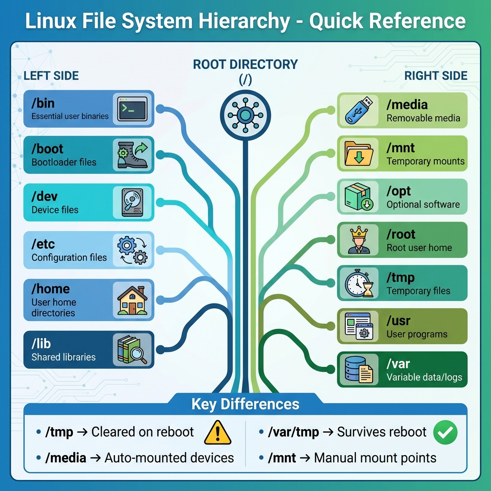

# 02: هيكلية ملفات لينكس (Linux File System Hierarchy)

## 1. مقدمة
لينكس ماشي بنظام **الشجرة المقلوبة** (Single Inverted Tree). كل حاجة بتبدأ من **الجذر** (Root Directory) اللي هو `/`، وأي ملف أو فولدر بيتفرع منه.
بعكس الويندوز اللي بيستخدم حروف للبارتيشن (C:, D:)، لينكس بيعمل "Mount" للأجهزة جوه فولدرات في الشجرة دي.

### صورة توضيحية
> 

## 2. شجرة الملفات (The File System Tree)

```bash
/                           # الجذر (أبو الكل)
├── bin -> usr/bin          # أوامر أساسية لكل اليوزرز (ls, cp, cat)
├── boot                    # ملفات الإقلاع (kernels, initrd)
├── dev                     # ملفات الأجهزة والهاردوير (hard drives, tty)
├── etc                     # ملفات الإعدادات (System-wide configuration)
├── home                    # بيوت اليوزرز (Home Directories)
├── lib -> usr/lib          # مكتبات النظام (Shared Libraries)
├── media                   # الفلاشات والأسطوانات (بتظهر هنا أوتوماتيك)
├── mnt                     # مكان التركيب اليدوي (Manual Mount)
├── opt                     # برامج إضافية خارجية
├── proc                    # معلومات العمليات والسيستم (Virtual Filesystem)
├── root                    # بيت الـ Root (المدير) لوحده
├── run                     # بيانات التشغيل المؤقتة (PIDs, sockets)
├── sbin -> usr/sbin        # أوامر الإدارة (للـ Root بس)
├── srv                     # بيانات الخدمات (زي ملفات الويب سايت)
├── sys                     # معلومات الهاردوير (Virtual Filesystem)
├── tmp                     # ملفات مؤقتة (بتتمسح لما ترستر)
├── usr                     # برامج وبيانات المستخدمين (Secondary hierarchy)
└── var                     # بيانات متغيرة (Logs, Spools, Cache)
```

## 3. أهم الفولدرات بالتفصيل

| الفولدر | وظيفته | نصيحة |
| :--- | :--- | :--- |
| **/bin** & **/usr/bin** | الأوامر الأساسية | متضيفش ملفات هنا بإيدك. استخدم الـ Package Manager. |
| **/sbin** & **/usr/sbin** | أوامر الإدارة (System Admin) | غالباً بتحتاج `sudo` عشان تشغلها. |
| **/usr/local/bin** | برامج متسطبة يدوياً | المكان الآمن للسكربتات بتاعتك عشان متعملش مشاكل مع السيستم. |
| **/etc** | ملفات الكونفيج (Config) | خد منها Backup قبل ما تلعب فيها. |
| **/var** | اللوجات والداتا المتغيرة | عينك دايماً على `/var/log` لو في مشكلة. |
| **/tmp** | ملفات مؤقتة | بتتمسح مع كل ريستارت. |
| **/var/tmp** | ملفات مؤقتة بجد | مبتتمسحش مع الريستارت. |

## 4. 🏆 مثال من سوق العمل: استخراج معلومات من `/proc`
**السيناريو:** فولدر `/proc` ده عبارة عن "شاشة" بتعرضلك اللي بيحصل جوه الكرنل. أنت محتاج تعرف **موديل البروسيسور** و **حجم الرامات** بالظبط من غير ما تستخدم أوامر خارجية.

```bash
# 1. هات اسم موديل البروسيسور
cat /proc/cpuinfo | grep "model name" | head -n 1
# Output: model name : Intel(R) Core(TM) i7-8550U CPU @ 1.80GHz

# 2. هات حجم الرامات الكلي
cat /proc/meminfo | grep "MemTotal"
# Output: MemTotal:       16303284 kB
```

> **معلومة:** على فكرة، أوامر زي `lscpu` و `free` أصلاً بتقرأ من الملفات دي وتبهرهالك!

## 5. الزتونة (Key Takeaways)
-   **`/` (Root)** هو الكبير بتاع الملفات كلها.
-   **`/root`** ده الـ Home بتاع المدير، غير الـ `/` اللي هو بداية السيستم.
-   **`/home`** ده المكان اللي فيه ملفاتك الشخصية.
-   **`/etc`** ده "غرفة التحكم" اللي فيها الإعدادات.
-   في اللينكس الحديث، فولدرات `/bin`, `/sbin`, `/lib` بقت مجرد وصلات (Links) لـ `/usr`.
