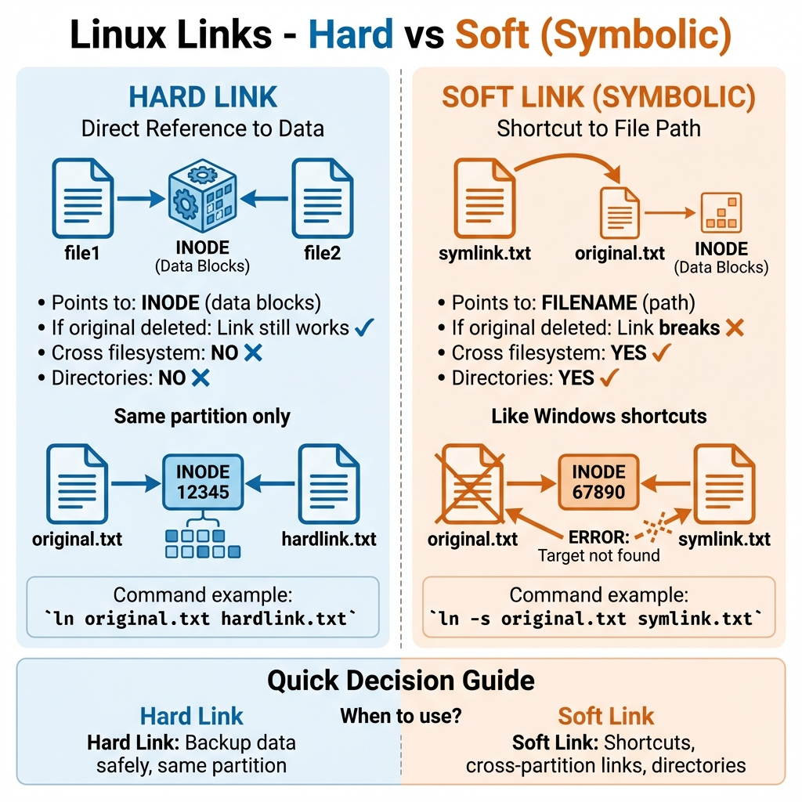
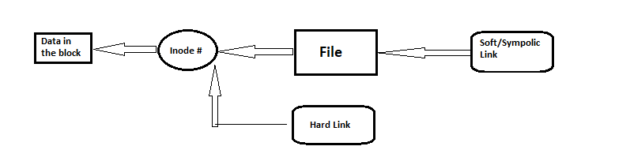

# 03: Inodes & Links (الروابط وملفات التتبع)

## 1. أساسيات نظام الملفات
قبل ما نتكلم عن الـ Inodes، لازم تفهم الهارد متقسم إزاي:
- **Partition Table:** بتقسم الهارد لـ "حته" (Partitions).
- **Formatting:** بيحدد نوع نظام الملفات (زي `ext4`, `xfs`).
- **Inode Table:** جدول أو داتابيز بتخزن معلومات عن كل ملف.

## 2. يعني إيه Inode؟
الـ **Inode** (أو Index Node) هو "البطاقة الشخصية" لأي ملف. هو المكان اللي السيستم بيخزن فيه كل المعلومات عن الملف **ماعدا اسمه ومحتواه**.

### الـ Inode بيشيل إيه؟
- رقم الـ Inode (ID فريد للملف).
- نوع الملف والصلاحيات (Permissions).
- المالك (Owner) والمجموعة (Group).
- حجم الملف.
- تواريخ (إنشاء، تعديل، فتح).
- **مؤشرات (Pointers):** بتقول للسيستم الداتا الفعلية للملف موجودة فين على الهارد.

> **ملحوظة:** استخدم `ls -li` عشان تشوف رقم الـ Inode بتاع الملفات.

## 3. الروابط (Links)
الروابط بتخليك تفتح نفس الداتا بأكتر من اسم ملف.

### مقارنة سريعة
> 

> 

### أ. الرابط الرمزي (Soft Link / Symbolic Link)
- **الفكرة:** زي الـ **Shortcut** في الويندوز بالظبط. هو ملف بيشاور على **اسم** ملف تاني.
- **لو الملف الأصلي اتمسح:** الرابط بيبوظ (Broken Link) ومبيفتحش حاجة.
- **الملاذ:** ينفع يتعمل بين هاردات مختلفة (Partitions مختلفة).
- **الطريقة:**
    ```bash
    ln -s <الملف_الأصلي> <اسم_الرابط>
    ```

### ب. الرابط الصلب (Hard Link)
- **الفكرة:** ده اسم تاني لنفس الـ **Inode**. يعني الملفين هما نفس الملف بالظبط، بس بأسماء مختلفة.
- **لو الملف الأصلي اتمسح:** الرابط شغال عادي والداتا موجودة (الداتا مبتتمسحش غير لما كل الـ Hard Links تتمسح).
- **الملاذ:** لازم يكونوا على **نفس** البارتيشن. ومينفعش يتعمل لفولدر.
- **الطريقة:**
    ```bash
    ln <الملف_الأصلي> <اسم_الرابط>
    ```

## 4. الزتونة (Summary)
- **Inode:** الـ Metadata بتاعة الملف (صلاحيات، حجم، مالك).
- **Hard Link:** بيشاور على الـ Inode (نسخة طبق الأصل).
- **Soft Link:** بيشاور على المسار (Shortcut).

---

## 5. 🏆 مثال من سوق العمل: مراجعة روابط الديبلويمينت
**السيناريو:** أنت بتعمل Deploy لويب سايت. بتستخدم Soft Link اسمه `/var/www/current` بيشاور على النسخة الشغالة حالياً (مثلاً `v1.0`). عايز تتأكد هو بيشاور فين، وبعدين تحدثه يشاور على `v2.0` في لحظة واحدة (Zero Downtime).

```bash
# 1. شوف الرابط بيشاور فين
ls -l /var/www/current
# Output: lrwxrwxrwx ... /var/www/current -> /var/www/releases/v1.0

# 2. غير الرابط عشان يشاور على v2.0 (استخدم -fn عشان تفرض التغيير)
ln -sfn /var/www/releases/v2.0 /var/www/current

# 3. اتأكد إن التغيير حصل
ls -l /var/www/current
# Output: lrwxrwxrwx ... /var/www/current -> /var/www/releases/v2.0
```

> **ليه بنستخدم Soft Links؟** عشان الـ "Zero Downtime Deployments". أنت بترفع النسخة الجديدة (`v2.0`) في الخلفية، ولما تخلص، بتغير الرابط في "فيمتو ثانية"، فالموقع مبيقعش.
