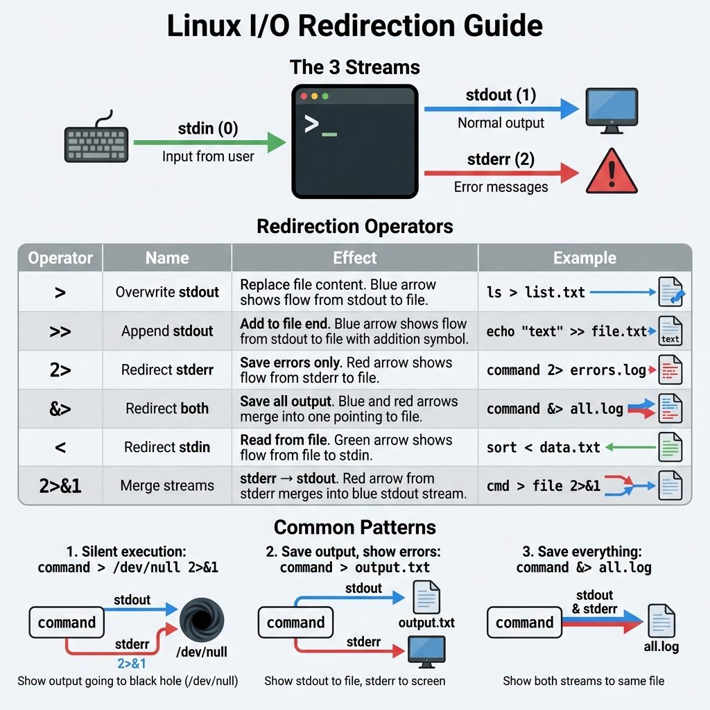

# 06: توجيه الإدخال والإخراج (Redirection)

## 1. مقدمة
الـ **Redirection** بيخليك تتحكم في "سباكة" اللي بيكتب: الأوامر بتطلع نتايجها فين (Output)، وبتاخد دخلات منين (Input).

## 2. قنوات الاتصال (File Descriptors)
لينكس بيدي رقم لكل قناة اتصال:
- **0**: المدخل القياسي (`stdin`) - الكيبورد.
- **1**: المخرج القياسي (`stdout`) - الشاشة (النتائج العادية).
- **2**: مخرج الأخطاء (`stderr`) - الشاشة (رسائل الخطأ).

### صورة توضيحية
> 

## 3. علامات التوجيه (Redirection Operators)

### أ. الكتابة فوق القديم (`>`)
بيمسح محتوى الملف القديم ويكتب الجديد مكانه.
- `1>` أو `>`: توجيه النتائج العادية.
- `2>`: توجيه الأخطاء بس.
- `&>`: توجيه الاتنين مع بعض (النتائج والأخطاء).

```bash
ls > file_list.txt      # احفظ النتيجة في ملف (ولو موجود هيمسحه)
ls non_existent 2> error.log # احفظ رسالة الخطأ في ملف
```

### ب. الإضافة (`>>`)
بيزود الكلام الجديد في آخر الملف من غير ما يمسح القديم (Append).
- `1>>` أو `>>`: زود النتائج.
- `2>>`: زود الأخطاء.
- `&>>`: زود الكل.

```bash
echo "New Entry" >> debug.log
```

## 4. أمثلة عملية
```bash
# افصل النتائج عن الأخطاء (كل واحد في ملف)
ls /home /nothing 1> output.txt 2> error.txt

# ارمي كله في ملف واحد
ls /home /nothing &> all_logs.txt

# ارمي النتيجة في "الزبالة" (Black Hole) عشان مش عايز تشوفها
command > /dev/null 2>&1
```

## 5. الزتونة (Key Takeaways)
- `>` بيمسح ويكتب من الأول.
- `>>` بيزود على القديم.
- `2>` ده بتاع رسايل الـ Error.
- `/dev/null` ده المحرقة اللي بنرمي فيها الحاجات اللي مش عايزينها.
