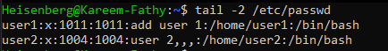
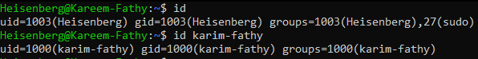
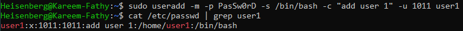
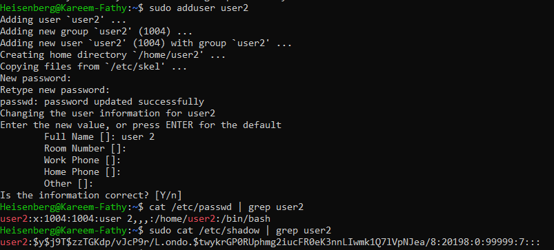

# 12: إدارة المستخدمين (Managing Local Users)

## 1. مقدمة
لينكس نظام "متعدد المستخدمين" (Multi-user)، يعني كذا واحد يقدروا يستخدموه في نفس الوقت. إدارة اليوزرز وصلاحياتهم هي "ألف باء" إدارة أنظمة.

### أنواع الحسابات
> 
1.  **المدير (Root):** الـ ID بتاعه (`UID`) دايماً `0`.
2.  **حسابات النظام (System Users):** الـ `UID` من `1` لـ `999`. دي حسابات بتشغل برامج زي Apache أو MySQL (مش ناس حقيقيين).
3.  **المستخدمين العاديين (Regular Users):** الـ `UID` بيبدأ من `1000`. دول البني آدمين زيي وزيك.

## 2. ملفات مهمة جداً
- `/etc/passwd`: فيه بيانات كل اليوزرز.
    > 
- `/etc/shadow`: فيه الباسوردات المشفرة.
- `/etc/group`: فيه بيانات المجموعات.

**هيكلية `/etc/passwd`:**
> 

**إزاي تعرف بيانات يوزر؟**
```bash
id karim
# هيعرضلك الـ UID والـ GID والمجموعات اللي هو فيها
```
> 

## 3. إنشاء مستخدم جديد (`useradd`)

**الطريقة:**
```bash
useradd [options] username
```

**أهم الاختيارات:**
- `-m`: اعمل لليوزر ده Home Directory (مهم جداً).
- `-s`: حدد الشيل بتاعه (زي `/bin/bash`).
- `-c`: اكتب وصف (كومنت) لليوزر ده.
- `-G`: ضيفه في مجموعات إضافية.

**مثال:**
```bash
# اعمل يوزر اسمه karim، واعمله Home، وخليه يستخدم Bash، وضيفه في جروب sudo
sudo useradd -m -s /bin/bash -c "DevOps Engineer" -G sudo karim
```
> 

> [!TIP]
> لو عايز تريح دماغك، استخدم أمر `adduser` (لو موجود)، ده بيسألك أسئلة وبيعمل كل حاجة أوتوماتيك.
> 

## 4. تعديل المستخدم (`usermod`)

**الطريقة:**
```bash
usermod [options] username
```

**أهم الاختيارات:**
- `-aG`: ضيف اليوزر لجروب جديد (من غير ما تشيله من الجروبات القديمة). **ركز في `-a` دي عشان مهمة**.
    > 
- `-L`: اقفل الحساب (Lock).
- `-U`: افتح الحساب (Unlock).

**مثال:**
```bash
# ضيف karim لجروب docker
sudo usermod -aG docker karim
```

**تغيير الباسورد:**
```bash
sudo passwd karim
```
> 

## 5. مسح المستخدم (`userdel`)

**الطريقة:**
```bash
# امسح اليوزر
sudo userdel karim

# امسح اليوزر وملفاته (الـ Home بتاعه) - وده الأفضل لو مش محتاج ملفاته
sudo userdel -r karim
```

## 6. التبديل بين اليوزرز (`su`)
| الأمر | بيعمل إيه |
| :--- | :--- |
| `su karim` | بيبدل لـ karim بس بيسيبك في نفس المكان وبإعداداتك القديمة. |
| `su - karim` | بيبدل لـ karim وبيحمل إعداداته كأنك لسه داخل (Clean Login). **ده الصح**. |
| `sudo -i` | بيقلبك Root مع تحميل إعداداته. |

## 7. الزتونة (Key Takeaways)
- دايماً استخدم `useradd -m` عشان اليوزر يجيله بيت (Home).
- استخدم `usermod -aG` عشان تضيف جروبات من غير ما تمسح القديم.
- `su -` أحسن وأنضف من `su` بس.
