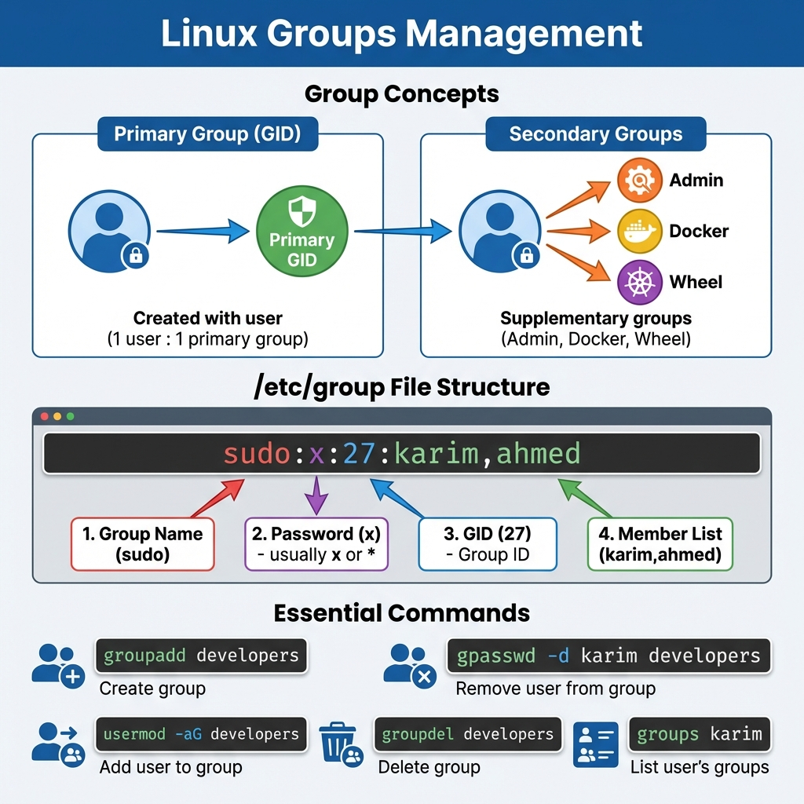
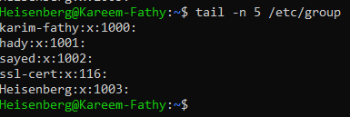
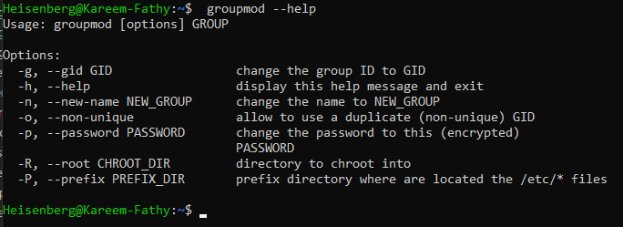
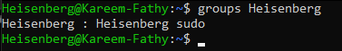

# 13: إدارة المجموعات (Managing Groups)

## 1. مقدمة
المجموعات (Groups) بتخليك تدي صلاحيات لناس كتير مرة واحدة. بدل ما تدي صلاحية لـ "أحمد" و "منى" و "علي" كل واحد لوحده، حطهم كلهم في جروب "Devs" وادي الصلاحية للجروب.


### مخطط إدارة المجموعات
> 

### أنواع الجروبات
- **Primary Group (مجموعة أساسية):** بتتعمل أوتوماتيك بنفس اسم اليوزر.
- **Secondary Groups (مجموعات إضافية):** دي اللي بتديك صلاحيات زيادة (زي `sudo` أو `docker`).

> **الملف:** `/etc/group` هو اللي فيه كل الجروبات.
> 
> 

## 2. إدارة الجروبات

### إنشاء جروب
```bash
sudo groupadd devs
```
> 

### مسح جروب
```bash
sudo groupdel devs
```
> 

### تغيير اسم جروب
```bash
sudo groupmod -n new_name old_name
```
> 

## 3. إدارة الأعضاء

### اعرف أنا في جروبات إيه
```bash
groups karim
```
> 

### ضيف يوزر لجروب
استخدم `usermod` مع `-aG` (Append Group).
```bash
sudo usermod -aG devs karim
```
> 

### شيل يوزر من جروب
استخدم `gpasswd` أو `deluser`.
```bash
sudo gpasswd -d karim devs
```
> 

## 4. الزتونة (Summary)
- **Primary Group:** بتتولد مع اليوزر.
- **Secondary Groups:** بتديك السلطة.
- **الأوامر:** `groupadd`, `usermod -aG`, `groups`.

---

## 5. 🏆 مثال من سوق العمل: مراجعة وتنظيف الصلاحيات
**السيناريو:** مطلوب منك تعمل جرد (Audit) وتشوف مين معاه صلاحيات `sudo` (أدمن)، وتشيل موظف اسمه "bob" ساب الشركة من الجروب ده بس من غير ما تمسح حسابه نفسه.

```bash
# 1. هات كل الناس اللي في جروب sudo
grep "^sudo" /etc/group
# Output: sudo:x:27:karim,alice,bob

# 2. شيل bob من الجروب
gpasswd -d bob sudo
# Output: Removing user bob from group sudo

# 3. اتأكد إنه اتشال
groups bob
# Output: bob : bob developers
```

> **ملحوظة:** أي تغيير في الجروبات لازم اليوزر يعمل Logout و Login (أو يقفل ويفتح) عشان يحس بالتغيير.
