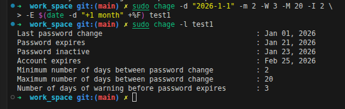

# 14: إدارة كلمات السر (Password Management)

## 1. مقدمة
لينكس بيخزن الباسوردات (مشفرة طبعاً) في ملف `/etc/shadow`. الملف ده محدش يقدر يقراه غير الـ Root.
> 

**بيانات الملف ده بتحدد:**
- الباسورد إيه.
- آخر مرة اتغير امتى.
- صلاحيته قد إيه (Expres امتى).
- امتى الحساب يتقفل لو الباسورد انتهت.

## 2. سياسات انتهاء الباسورد (`chage`)
الأمر `chage` (Change Age) هو اللي بنستخدمه عشان نتحكم في عمر الباسورد.

**الطريقة:**
```bash
chage [options] user
```

**أهم الاختيارات:**
- `-l`: اعرض السياسة الحالية لليوزر.
- `-m`: أقل مدة (مينفعش يغير الباسورد قبلها).
- `-M`: أقصى مدة (الباسورد تنتهي بعدها).
- `-W`: فترة التحذير (حذره قبل ما تنتهي بكام يوم).
- `-E`: تاريخ انتهاء الحساب نفسه (YYYY-MM-DD).
- `-d 0`: اجبر اليوزر يغير الباسورد أول ما يدخل المرة الجاية.

## 3. قفل وفتح الحساب
ممكن تقفل حساب مؤقتاً (تمنعه يدخل) من غير ما تمسحه.

```bash
# قفل الحساب (Lock)
sudo usermod -L karim

# فتح الحساب (Unlock)
sudo usermod -U karim
```

## 4. الزتونة (Summary)
- **غيّر الباسورد:** `passwd`
- **اقفل الحساب:** `passwd -l` أو `usermod -L`
- **اجبره يغير الباسورد:** `chage -d 0`

---

## 5. 🏆 مثال من سوق العمل: تطبيق سياسة أمنية صارمة
**السيناريو:** سياسة الشركة الجديدة بتقول إن كل الموظفين لازم يغيروا الباسورد كل **90 يوم**، ولازم يجيلهم تحذير قبلها بـ **7 أيام**، ومينفعش يغيروها مرتين في نفس الـ **5 أيام**.

```bash
# 1. طبق السياسة على karim
# -M 90: تنتهي بعد 90 يوم
# -m 5: استنى 5 أيام بين كل تغيير
# -W 7: حذره قبل النهاية بـ 7 أيام
chage -M 90 -m 5 -W 7 karim

# 2. راجع السياسة
chage -l karim
# Output:
# ...
# Minimum number of days between password change          : 5
# Maximum number of days between password change          : 90
# Number of days of warning before password expires       : 7
```

> **نصيحة أمنية:** لو عايز تطبق ده على الناس الجديدة أوتوماتيك، عدل في ملف `/etc/login.defs`.
