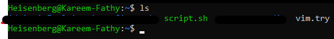
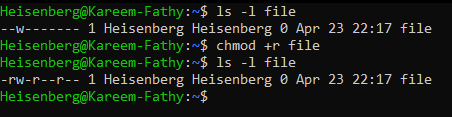
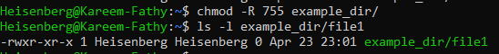
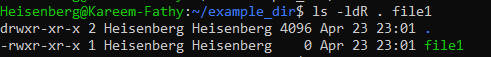
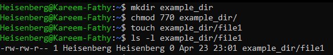

# 15: التحكم في صلاحيات الملفات (Permissions)

## 1. مقدمة
صلاحيات الملفات هي اللي بتحدد مين يقدر يقرأ، يكتب، أو يشغل الملفات. دي أهم حاجة في أمان السيستم.

## 2. أنواع الصلاحيات (Permission Types)
> 

كل ملف ليه 3 مستويات من الصلاحيات:
1.  **User (u):** المالك الأصلي للملف (Owner).
2.  **Group (g):** المجموعة اللي بتملك الملف.
3.  **Others (o):** أي حد تاني في السيستم.
> 

> 

## 3. معاني الصلاحيات

| النوع | الرمز | الرقم (Octal) | التأثير على الملف | التأثير على الفولدر |
| :--- | :--- | :--- | :--- | :--- |
| **Read** | `r` | 4 | تشوف محتوى الملف | تعرض محتويات الفولدر (`ls`) |
| **Write** | `w` | 2 | تعدل في الملف | تمسح أو تضيف ملفات جوه الفولدر |
| **Execute** | `x` | 1 | تشغله كبرنامج | تدخل جوه الفولدر (`cd`) |

**Reading Permissions (`ls -l`):**
> 

## 4. تغيير الصلاحيات (`chmod`)

### طريقة الحروف (Symbolic)
استخدم `u,g,o` مع `+,-,=` عشان تضيف أو تشيل صلاحية.

```bash
chmod u+x script.sh      # خلي اليوزر يقدر يشغل السكربت
chmod g-w file.txt       # شيل الكتابة من الجروب
chmod o=r public.doc     # خلي الناس التانية تقرأ بس
chmod +r file            # خلي كله يقرأ
```
> 

### طريقة الأرقام (Octal)
اجمع أرقام الصلاحيات (4, 2, 1).

```bash
chmod 755 script.sh
# User: 7 (4+2+1) = rwx (كاملة)
# Group: 5 (4+0+1) = r-x (قراءة وتشغيل)
# Others: 5 (4+0+1) = r-x (قراءة وتشغيل)
```
> 

## 5. تأثير الصلاحيات
- **على الملفات:** لو مفيش `Write`، مش هتعرف تحفظ التعديلات.
- **على الفولدرات:** لو مفيش `Write`، مش هتعرف تعمل ملفات جديدة جواه. لو مفيش `Execute`، مش هتعرف تدخله أصلاً بـ `cd`.
> 
> 

## 6. التغيير المتكرر (Recursive)
استخدم `-R` عشان تطبق الصلاحية على الفولدر وكل اللي جواه.
```bash
chmod -R 755 /var/www/html
```
> 
> 

## 7. الصلاحيات الافتراضية (`umask`)
الـ `umask` بيحدد الصلاحيات اللي الملف بياخدها أول ما يتخلق.
- القاعدة: `الأصل - الـ Umask = النتيجة`.
- الأصل للملفات: `666`.
- الأصل للفولدرات: `777`.
> 

---

## 8. 🏆 مثال من سوق العمل: عمل فولدر مشترك للمطورين
**السيناريو:** عايز تعمل فولدر `/var/project` لجروب `devs`:
1.  أعضاء الجروب يقروا ويكتبوا براحتهم.
2.  الغرباء ملهوش دعوة خالص.
3.  **أي ملف جديد** يتخلق جوه، يبقى ملك الجروب أوتوماتيك (مش ملك اللي عمله).
4.  محدش يمسح شغل حد (Sticky Bit).

```bash
# 1. اعمل الفولدر وغير الجروب بتاعه
mkdir /var/project
chgrp devs /var/project

# 2. اضبط الصلاحيات الأساسية (770)
# Owner(rwx), Group(rwx), Others(---)
chmod 770 /var/project

# 3. فعل الـ SGID والنبي (2) والـ Sticky Bit (1)
# SGID (2): عشان توريث الجروب
# Sticky (1): عشان حماية المسح
chmod 2770 /var/project   # SGID
chmod +t /var/project     # Sticky

# الأمر النهائي (مجمع):
chmod 3770 /var/project
```

### يعني إيه `3770`؟
- **3 (Special):** `2` (SGID) + `1` (Sticky).
- **7 (User):** `rwx`.
- **7 (Group):** `rwx`.
- **0 (Others):** `---`.

> دي **الخطة القياسية** لأي فولدر مشترك (Shared Directory) في الشركات.

## 9. الزتونة (Key Takeaways)
- **`chmod`** بيغير الصلاحيات.
- الفولدر لازم يكون واخد `x` عشان تعرف تدخله.
- الـ **SGID** أهم حاجة في الفولدرات المشتركة عشان الملفات الجديدة تاخد نفس الجروب.
