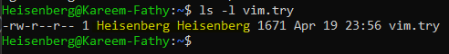

# 16: إدارة الملكية (Managing Ownership)

## 1. مقدمة
كل ملف وفولدر في لينكس لازم يكون ليه **User** (مالك) و **Group** (مجموعة مالكة). الأمر `chown` (Change Owner) هو اللي بيغيرهم.
> 

## 2. الطريقة (Syntax)
```bash
chown [OPTIONS] USER[:GROUP] FILE
```

## 3. أمثلة الاستخدام

### تغيير المالك (User)
انقل ملكية الملف ليوزر تاني.
```bash
sudo chown karim file.txt
```

### تغيير الجروب (Group)
انقل ملكية الجروب لجروب تاني.
```bash
sudo chown :developers file.txt
```
*ممكن برضه تستخدم `chgrp developers file.txt` بس `chown` أسهل.*

### تغيير الاتنين مرة واحدة
```bash
sudo chown karim:developers file.txt
```
*كده المالك بقى `karim` والجروب بقى `developers`.*

## 4. التغيير المتكرر (Recursive)
استخدم `-R` (كابيتال) عشان تغير الفولدر وكل اللي جواه في خطوة واحدة.

```bash
sudo chown -R karim:developers /var/www/html
```

## 5. الزتونة (Summary)
- **chown:** بتغير المالك.
- **chgrp:** بتغير الجروب.
- **-R:** بتطبق التغيير على الفولدر باللي فيه.

---

## 6. 🏆 مثال من سوق العمل: إصلاح صلاحيات سيرفر الويب
**السيناريو:** رفعت ملفات الموقع بتاعك في `/var/www/html` بس الويب سيرفر (Apache أو Nginx) مش عارف يقرأهم وبيديك "403 Forbidden". السبب إنك رفعتهم كـ `root`.

```bash
# 1. شوف الملكية الحالية
ls -l /var/www/html/index.php
# Output: -rw-r--r-- 1 root root ... (غلط!)

# 2. صلح الملكية لكل الملفات
# غير المالك لليوزر بتاعك ($USER) عشان تعرف تعدل
# غير الجروب لـ 'www-data' عشان السيرفر يعرف يقرأ
sudo chown -R $USER:www-data /var/www/html

# 3. اتأكد
ls -l /var/www/html/index.php
# Output: -rw-r--r-- 1 karim www-data ... (صح!)
```

> **النتيجة:** أنت بتعرف تعدل، والسيرفر بيعرف يعرض، والـ Error راح.

## 7. معلومة ع الطاير
- محدش يقدر يغير ملكية ملف غير الـ **Root** (أو باستخدام sudo).
- النقطتين (`:`) هما اللي بيفصلوا بين اليوزر والجروب.
