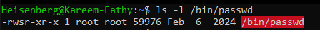
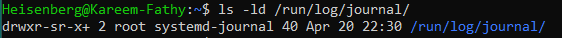

# 17: الصلاحيات الخاصة (Special Permissions)

## 1. مقدمة
غير الصلاحيات العادية (r, w, x)، لينكس فيه صلاحيات خاصة بتغير سلوك الملفات والفولدرات: **SUID**, **SGID**, **Sticky Bit**.

## 2. نظرة سريعة (Special Permissions Overview)
> 

## 2. SUID (Set User ID)
- **الرمز:** `s` (في خانة اليوزر Owner).
- **الرقم:** `4`.
- **الوظيفة:** الملف بيشتغل **بصلاحية صاحبه**، مش بصلاحية اللي شغله.
- **أشهر مثال:** أمر `passwd`. هو مملوك لـ root، فبيخليك تعدل في `/etc/shadow` كأنك root مؤقتاً.

```bash
chmod u+s /usr/bin/passwd
# أو
chmod 4755 /usr/bin/passwd
```
*الشكل: `-rwsr-xr-x`*
> 

## 3. SGID (Set Group ID)
- **الرمز:** `s` (في خانة الجروب Group).
- **الرقم:** `2`.
- **الوظيفة:**
    - **للملفات:** بيشتغل بصلاحية الجروب المالك.
    - **للفولدرات (المهمة):** أي ملف جديد يتعمل جوه، **بيورث نفس الجروب** بتاع الفولدر الأب، مش الجروب بتاع اللي عمله.
- **الاستخدام:** الفولدرات المشتركة بين التيمات.

```bash
chmod g+s /var/www/html
# أو
chmod 2775 /var/www/html
```
*الشكل: `drwxrwsr-x`*
> 

## 4. Sticky Bit
- **الرمز:** `t` (في خانة Others).
- **الرقم:** `1`.
- **الوظيفة:** بتتحط على الفولدرات العامة عشان تمنع المسح. محدش يقدر يمسح الملف غير **صاحبه** أو **مدير الفولدر** أو **الروت**.
- **الاستخدام:** فولدر `/tmp`.

```bash
chmod +t /tmp
# أو
chmod 1777 /tmp
```
*الشكل: `drwxrwxrwt`*
> 

## 5. الزتونة (Summary)
- **SUID (4):** اشتغل كأنك صاحب الملف (خطير، زي `passwd`).
- **SGID (2):** ورث الجروب للملفات الجديدة (مفيد للشير).
- **Sticky (1):** محدش يمسح حاجتي غيري (زي `/tmp`).

---

## 6. 🏆 مثال من سوق العمل: كشف الاختراقات (Security Audit)
**السيناريو:** ملفات الـ SUID دي خطيرة لأنها بتدي صلاحيات Root. الهاكرز بيحبوا يعملوا نسخة من `bash` ويدوها SUID عشان يرجعوا Root وقت ما يحبوا. لازم تفتش عليهم.

```bash
# 1. دور على كل الملفات اللي واخدة SUID
# -perm /4000: دور على الـ SUID bit
# -type f: ملفات بس
# 2>/dev/null: اخفي رسايل الـ Error
find / -perm /4000 -type f 2>/dev/null

# النتيجة الطبيعية (Safe):
# /usr/bin/passwd
# /usr/bin/sudo
# /usr/bin/mount

# نتيجة مرعبة (DANGER):
# /tmp/.hidden_script
# /home/user/bash
```

> **تحذير:** لو لقيت حاجة زي `/home/user/bash` واخدة SUID، يبقى السيرفر بتاعك مخترق بنسبة 99%!
