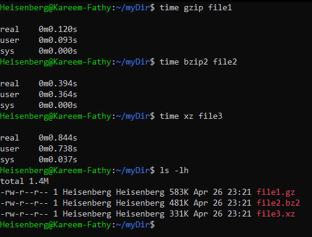
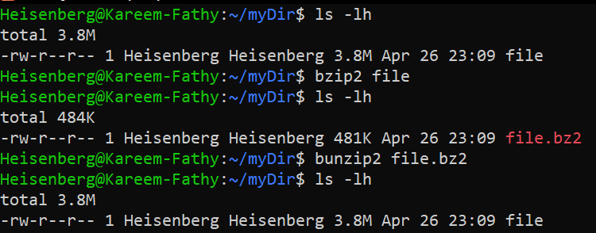
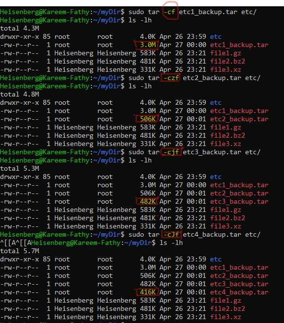

# 18: الضغط والأرشفة (Compressing and Archiving)

## 1. مقدمة
الأرشفة (Archiving) يعني تجمع كذا ملف في ملف واحد (حزمة). والضغط (Compression) يعني تصغر حجم الملفات دي. في لينكس، العمليتين دول غالباً بيتعملوا مع بعض باستخدام الجوكر `tar`.

## 2. أدوات الضغط (Compression Tools)
> 

الأدوات دي بتضغط الملفات (كل ملف لوحده).

| الأداة | الامتداد | السرعة | نسبة الضغط | الأمر | فك الضغط |
| :--- | :--- | :--- | :--- | :--- | :--- |
| **gzip** | `.gz` | سريع | متوسطة | `gzip file` | `gunzip file.gz` |
| **bzip2** | `.bz2` | متوسط | كويسة | `bzip2 file` | `bunzip2 file.bz2` |
| **xz** | `.xz` | بطيء | عالية جداً | `xz file` | `unxz file.xz` |

> 
> 
> 

### مقارنة الأداء (Performance Comparison)
> 

## 3. الأرشفة باستخدام `tar`
الأمر `tar` (Tape ARchive) هو الأساس. بيجمع الملفات وممكن يضغطها كمان في نفس الوقت.

**الطريقة:**
```bash
tar [options] [archive_name] [files/directories]
```

**أهم الاختيارات:**
- `-c`: اعمل أرشيف جديد (Create).
- `-x`: فك الأرشيف (Extract).
- `-f`: اسم الملف (لازم ييجي في الآخر).
- `-v`: وريني بتعمل إيه (Verbose).
- `-z`: اضغط بـ `gzip` (الأشهر).
- `-j`: اضغط بـ `bzip2`.
- `-J`: اضغط بـ `xz`.

## 4. أمثلة عملية

### الضغط والأرشفة (Create & Compress)
```bash
# استخدام Gzip (الأكثر انتشاراً)
tar -czf archive.tar.gz folder/

# استخدام Xz (أعلى ضغط ممكن)
tar -cJf archive.tar.xz folder/
```
> 

### فك الضغط (Extract)
```bash
# فك أي ملف tar
tar -xf archive.tar.gz

# فك في مكان معين (غير المكان اللي أنا فيه)
tar -xf archive.tar.gz -C /tmp/
```

### عرض المحتويات بس (من غير فك)
```bash
tar -tf archive.tar.gz
```

## 5. الزتونة (Key Takeaways)
- استخدم **`tar -czf`** عشان تعمل ملف مضغوط (tar.gz).
- استخدم **`tar -xf`** عشان تفك أي ملف مضغوط.
- **`gzip`** سريع، **`xz`** بيوفر مساحة أكتر.
