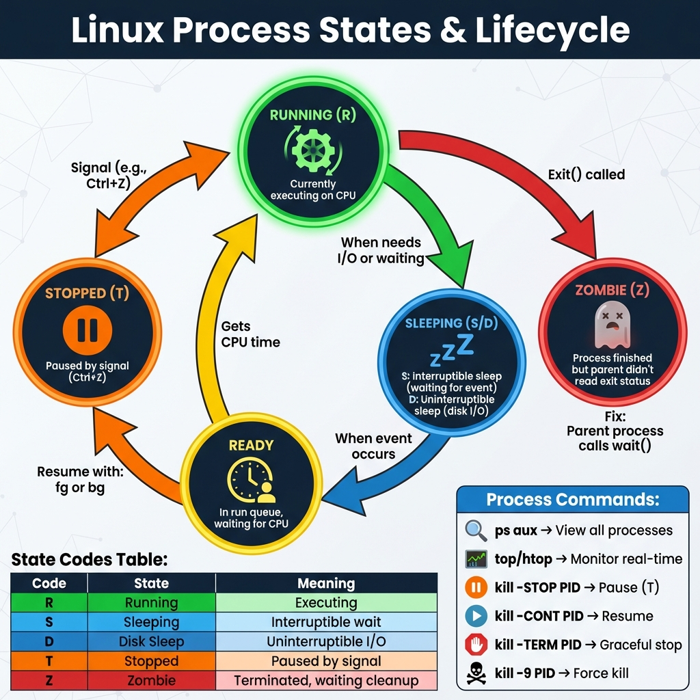
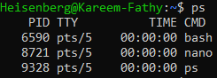
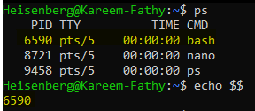
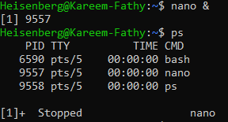

# 20: إدارة العمليات (Managing Processes)

## 1. مقدمة
البروسيس (Process) هي أي برنامج شغال. لينكس بيدي رقم لكل عملية اسمه **PID**. "أم العمليات" كلها هي `systemd` ورقمها 1.

### دورة حياة العملية (Process Lifecycle)
> 

## 2. عرض العمليات (`ps`)

### الاستخدام
- `ps`: بيعرض البرامج اللي شغالة في الشاشة دي بس.
- `ps aux`: بيعرض **كل** حاجة شغالة في السيستم (ده اللي بنستخدمه دايماً).

> 
> 

**أهم العواميد:**
- **PID:** رقم العملية.
- **USER:** مين اللي مشغلها.
- **%CPU / %MEM:** واكلة قد إيه من الجهاز.
- **STAT:** حالتها (R=شغالة، S=نايمة، Z=زومبي/مهنجة).

### شجرة العمليات (`pstree`)
بتوريك مين مشغل مين.
```bash
# شجرة العمليات (Process Tree)
pstree -p

# شجرة العمليات للشل الحالي (PID $$) مع الآباء
pstree -ps $$
# output: systemd(1)───systemd(1839)───terminator(7897)───zsh(7906)───pstree(7954)
```
> 

## 3. البحث عن عملية (`pgrep`)
هات رقم العملية (PID) بالاسم.
```bash
# هات رقم عملية الـ ssh
pgrep -a ssh

# هات عمليات اليوزر karim
pgrep -u karim
```

## 4. قتل العمليات (`kill`)
إحنا مش بنقتلهم بجد، إحنا بنبعتلهم "إشارات" (Signals).

**أهم الإشارات:**
- **15 (SIGTERM):** (الافتراضي) لو سمحت اقفلي يا بروسيس. بتديها فرصة تحفظ الداتا وتنضف وراها. **(الأدب مطلوب).**
- **9 (SIGKILL):** (القاتل) موت فوراً! مفيش تفاهم. البروسيس بتختفي في لحظتها ومبتلحقش تحفظ حاجة.
- **2 (SIGINT):** زي ما تدوس `Ctrl+C`.

> [!CAUTION]
> **خلي SIGKILL (-9) آخر حل.**
> استخدمه بس لو البروسيس مهنجة ومبتردش على الـ SIGTERM. استخدامه عمال على بطال ممكن يبوظ داتا أو قواعد بيانات.

**الأوامر:**
```bash
# اقفل بالأدب (PID)
kill 1234

# اقفل بالعافية (Force Kill)
kill -9 1234

# اقفل بالاسم
pkill nginx
killall apache2
```

## 5. العمليات في الخلفية (Background Jobs)
- **`&`**: حطها في آخر الأمر عشان يشتغل في الخلفية (`script.sh &`).
- **`Ctrl+Z`**: وقف البرنامج مؤقتاً (Pause).
- **`bg`**: كمل البرنامج الموقوف بس في الخلفية.
- **`fg`**: هات البرنامج من الخلفية وحطه قدامي تاني.
- **`jobs`**: وريني إيه اللي شغال في الخلفية عندي.
> 

---

## 6. 🏆 مثال من سوق العمل: اصطياد بروسيس "مفجوعة"
**السيناريو:** السيرفر بطيء جداً. محتاج تعرف مين اللي واكل الـ CPU وتتصرف معاه.

### خطوة 1: امسك المتهم
اعرض العمليات مترتبة حسب استهلاك الـ CPU.
```bash
ps aux --sort=-%cpu | head -n 2
# PID: 9999, CMD: ./mining_script.sh
```

### خطوة 2: حقق معاه
شوف هو فاتح ملفات إيه قبل ما تموته.
```bash
lsof -p 9999
```

### خطوة 3: حاول معاه بالذوق
```bash
kill -15 9999
```

### خطوة 4: مفيش فايدة؟ خلصه.
لو لسه شغال بعد شوية، اديله الضربة القاضية.
```bash
kill -9 9999
```

## 7. الزتونة (Key Takeaways)
- `ps aux` عينك اللي بتشوف بيها السيستم.
- ابدأ دايماً بـ `kill` (رقم 15)، ولو منفعش استخدم `kill -9`.
- علامة `&` بتخلي الأمر يشتغل وتكمل أنت شغل عادي.
