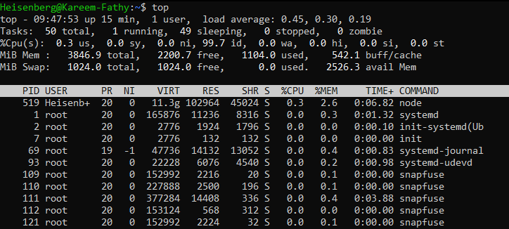
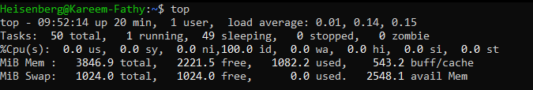

# 21: مراقبة العمليات (Monitoring Processes)

## 1. مقدمة
لينكس بيديك أدوات "لايف" عشان تراقب أداء الجهاز لحظة بلحظة: استهلاك البروسيسور (CPU)، الرامات (RAM)، والعمليات الشغالة.

## 2. الأمر `top`
ده "مراسلنا من قلب الحدث". بيعرضلك جدول بيتحرك كل شوية فيه استهلاك الموارد وترتيب العمليات.

> 
> 

### أزرار التحكم (Interactive Keys)
وأنت جوه `top`، ممكن تدوس:
- **`h`**: المساعدة (Help).
- **`1`**: اعرض كل الـ Cores بتوع البروسيسور (لو عندك Multicore).
- **`M`**: رتب العمليات حسب استهلاك الرامات (Memory).
- **`P`**: رتب حسب الـ CPU (ده الافتراضي).
- **`k`**: اقتل عملية (هيطلب منك الـ PID).
- **`q`**: اخرج.

## 3. الأداة `htop`
دي النسخة "المتداولة" والشيك من top. ملونة، بتدعم الماوس، وأسهل بكتير في الاستخدام.
- ممكن تختار العملية بالأسهم.
- دوس `F9` عشان تقتل العملية.
- دوس `F5` عشان تعرضهم في شكل شجرة.
> 

> **ملحوظة:** غالباً بتحتاج تسطبها الأول (`sudo apt install htop`).

## 4. أولويات العمليات (Nice Value)
الكرنل بيقرر مين يشتغل الأول بناءً على "الأهمية" أو الـ Nice Value.
- المقياس من **-20** (أعلى أولوية - بلطجي) لـ **19** (أقل أولوية - غلبان).
- الافتراضي: **0**.

### تشغيل برنامج بأولوية منخفضة
```bash
# شغل السكربت ده بس متخليهوش يزاحم الناس (Nice = 10)
nice -n 10 my_script.sh
```

### تغيير أولوية برنامج شغال (`renice`)
```bash
# علي أولوية العملية 1234 (خليها -5) - محتاج sudo عشان تعلي
sudo renice -n -5 -p 1234
```

---

## 5. 🏆 مثال من سوق العمل: تشخيص سيرفر "بيحتضر"
**السيناريو:** اليوزرز بيشتكوا إن السيرفر بطيء جداً. محتاج تعرف مين السبب: الـ CPU، ولا الرامات، ولا الهارد؟

```bash
# 1. شوف الحمل العام (Load Average)
uptime
# Output: load average: 4.5, 3.2, 1.0 (عالي جداً!)

# 2. شوف الرامات (هل بنستخدم الـ Swap؟)
free -h
# Output: Swap: 2.0G used (مؤشر خطر! الرامات خلصت وبنكتب ع الهارد)

# 3. شوف مساحة الهارد
df -h /
# Output: Use% 98% (مصيبة! الهارد مفول)

# 4. اعرف مين السبب
htop
# (رتب بالـ CPU مرة وبالـ MEM مرة وهات المتهم)
```

> **التشخيص:** لو الـ Swap عالي، محتاج رامات زيادة. لو الـ Load عالي، شوف العمليات المفجوعة. لو الهارد مليان، نضف اللوجات.

## 6. الزتونة (Summary)
- **top/htop:** للمراقبة اللحظية.
- **df/du:** لمساحة الهارد.
- **free:** لاستهلاك الرامات.
