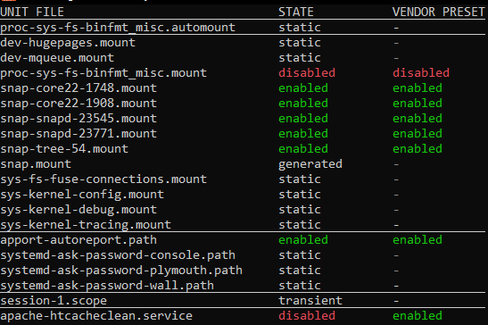
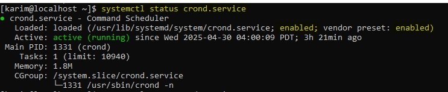
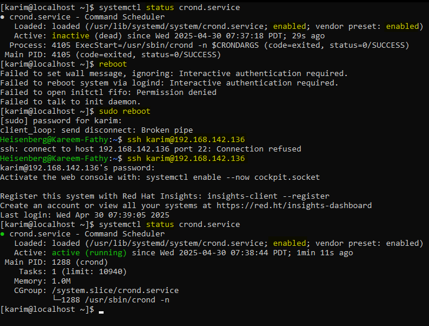

# 22: الخدمات (Services & Daemons)

## 1. مقدمة
الـ **Service** (أو Daemon) هو برنامج بيشتغل في الخلفية، بيستنى طلبات أو بينفذ وظائف من غير ما حد يشغله (زي `httpd` بتاع الويب، أو `sshd` بتاع الاتصال). المدير المسئول عنهم في اللينكس الحديث هو **systemd**.

## 2. خدمة دورة الحياة (Service Lifecycle)
> 

## 2. إدارة الخدمات (`systemctl`)

### عرض الخدمات
```bash
# اعرض كل الخدمات الشغالة
systemctl list-units --type=service

# اعرض كل الخدمات (شغالة أو لا)
systemctl list-unit-files
```
> 
> 

### أوامر التحكم الأساسية
| الأمر | الوظيفة |
| :--- | :--- |
| `sudo systemctl start <name>` | شغل الخدمة فوراً. |
| `sudo systemctl stop <name>` | وقف الخدمة فوراً. |
| `sudo systemctl restart <name>` | اقفل وافتح تاني (ريستارت). |
| `sudo systemctl reload <name>` | اقرأ ملفات الإعدادات من غير ما تقفل (لو البرنامج بيدعم ده). |
| `systemctl status <name>` | وريني حالة الخدمة (شغالة ولا ميتة؟). |

> 

### الخدمات اللي فشلت (Failed)
```bash
systemctl --failed
```
> 

## 3. التحكم في بدء التشغيل (Boot)
إزاي تخلي الخدمة تشتغل لوحدها لما الجهاز يفتح؟

- **Enable (شغلها مع الـ Boot):**
    ```bash
    sudo systemctl enable service_name
    ```
- **Disable (متشغلهاش مع الـ Boot):**
    ```bash
    sudo systemctl disable service_name
    ```

## 4. حالات الخدمة (States)
- **active (running):** شغالة وزي الفل.
    > 
- **inactive (dead):** واقفة.
    > 
- **enabled:** هتشتغل لما الجهاز يرستر.
- **disabled:** مش هتشتغل لما الجهاز يرستر.
- **masked:** مقفولة بضبة ومفتاح (مينفعش تشغلها حتى يدوي).
    > 

## 5. 🏆 مثال من سوق العمل: عمل خدمة خاصة (Custom Service)
**السيناريو:** عندك سكربت بايثون `app.py` عايزة يشتغل في الخلفية، ولو "كرّش" (Crashed) يشتغل تاني لوحده، ويقوم مع بداية الجهاز.

```bash
# 1. اعمل ملف الخدمة
sudo nano /etc/systemd/system/myapp.service

# 2. اكتب جواه:
# [Unit]
# Description=My Python App
# After=network.target (استنى لما الشبكة تشتغل)
#
# [Service]
# User=karim (شغله باليوزر ده)
# ExecStart=/usr/bin/python3 /home/karim/app.py
# Restart=always (لو مات شغله تاني)
# RestartSec=5 (استنى 5 ثواني قبل ما تشغله)
#
# [Install]
# WantedBy=multi-user.target (عشان الـ Enable يشتغل)

# 3. عرف الـ systemd إن في خدمة جديدة
sudo systemctl daemon-reload

# 4. شغلة واعمله Enable
sudo systemctl enable --now myapp

# 5. اتأكد
systemctl status myapp
```

> **النتيجة:** السكربت بتاعك بقى خدمة سيستم محترمة ومستقرة.
