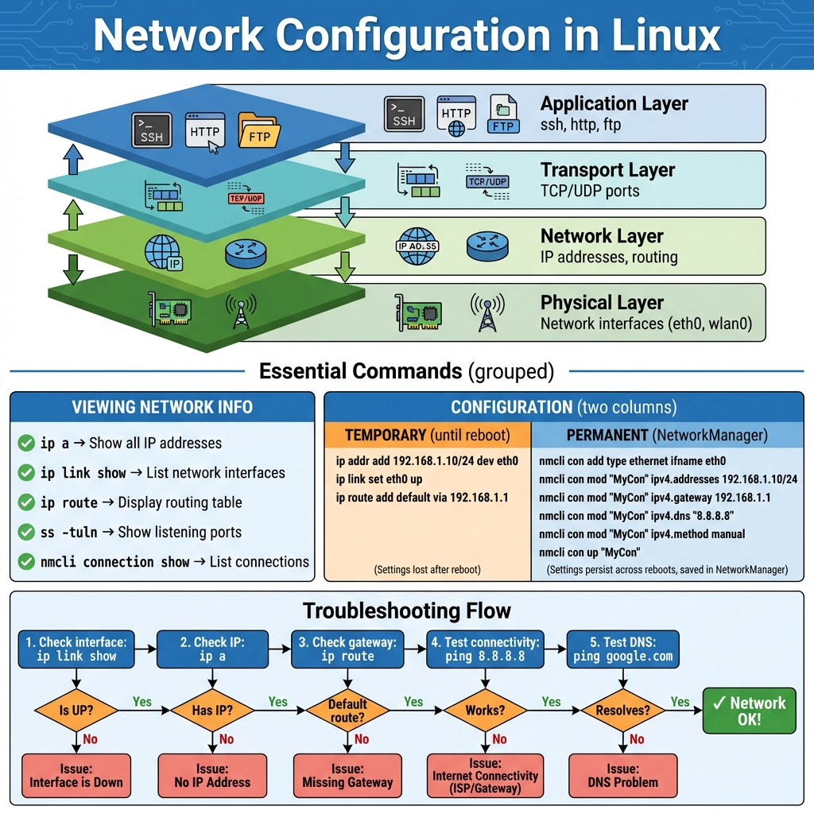

# 23: إدارة الشبكات (Managing Networks)

## 1. مقدمة
الشبكات هي عصب أي سيرفر. لينكس مليان أدوات عشان تظبط الـ IP، وتراقب الاتصالات، وتحل مشاكل النت.

### دليل إعداد الشبكات (Network Configuration Guide)
> 

## 2. أسماء كروت الشبكة
زمان كان اسمها `eth0`، دلوقتي الأسماء بقت غريبة شوية زي `enp3s0` أو `wlp2s0`.
- `en`: يعني كابل (Ethernet).
- `wl`: يعني واي فاي (Wireless).
- الباقي أرقام بتدل على مكانه في المازربورد (عشان الاسم ميتغيرش لو فكيت الكارت وركبته تاني).

## 3. عرض الإعدادات
> **ملحوظة:** انسى `ifconfig` و `netstat`، دول بتوع زمان. دلوقتي العصر عصر `ip` و `ss`.

```bash
# اعرض عناوين الـ IP
ip a
# أو بشياكة وألوان
ip -c -br a
```

## 4. مدير الشبكة (`nmcli`)
ده "الريموت كنترول" بتاع الـ NetworkManager من التيرمنال.

```bash
# اعرض الاتصالات
nmcli connection show

# شغل أو وقف اتصال
nmcli con up "Wired connection 1"
nmcli con down "Wired connection 1"

# ضبط IP ثابت (Static IP) - خطوة بخطوة
nmcli con mod "MyCon" ipv4.addresses 192.168.1.10/24  # الـ IP
nmcli con mod "MyCon" ipv4.gateway 192.168.1.1       # الروتر
nmcli con mod "MyCon" ipv4.dns "8.8.8.8 8.8.4.4"     # الـ DNS
nmcli con mod "MyCon" ipv4.method manual             # الطريقة مانيوال
nmcli con up "MyCon"                                 # فعل التغييرات
```

> [!IMPORTANT]
> **إوعى تنسى الـ DNS!** من غيره هيبقى معاك شبكة بس مش هتعرف تفتح مواقع (مش هتعرف تترجم Google.com لـ IP).

## 5. 🏆 مثال من سوق العمل: قطع النت (Troubleshooting)
**السيناريو:** السيرفر مش واصل بالنت. هنتتبع المشكلة بأسلوب الـ OSI Model (من تحت لفوق).

```bash
# 1. طبقة الكابلات (Link): الكابل واصل؟ الكارت شغال؟
ip link show eth0
# دور على كلمة "UP". لو "DOWN" يبقى الكابل مفصول أو الكارت مقفول.

# 2. طبقة الشبكة (IP): واخد IP ولا لأ؟
ip a
# دور على inet 192.168.x.x.

# 3. الروتر (Gateway): شايف الروتر ولا لأ؟
ip route      # اعرف مين الروتر (default via)
ping -c 3 192.168.1.1   # بنج عليه

# 4. النت الخارجي: واصل لجوجل؟
ping -c 3 8.8.8.8
# لو فاصل هنا يبقى العيب من الـ ISP (شركة النت) أو الروتر مش مخرجك.

# 5. الـ DNS: عارف تترجم الأسماء؟
ping -c 3 google.com
# لو ادالك "Temporary failure in name resolution" يبقى عندك نت بس الـ DNS بايظ.
# الحل: راجع ملف /etc/resolv.conf.
```

## 6. أدوات التشخيص
- **Ping:** الو يا انترنت؟
- **SS (Socket Statistics):** مين فاتح بورتات وبيسمع؟ (بديل netstat).
    ```bash
    ss -tuln
    # -t: TCP, -u: UDP, -l: Listening, -n: أرقام بس (أسرع)
    ```
- **Traceroute:** ماشي في أنهي سكة؟ (`tracepath google.com`).

## 7. إعدادات الـ DNS
- `/etc/hosts`: كراسة التليفونات المحلية (ده بيتفحص الأول).
    ```bash
    127.0.0.1       localhost
    192.168.1.100   myserver.local
    ```
- `/etc/resolv.conf`: عنوان سيرفر الـ DNS (زي 8.8.8.8).

## 8. الزتونة (Summary)
- **`ip a`**: عشان تعرف الـ IP بتاعك.
- **`nmcli`**: عشان تغير الإعدادات.
- **`ss -tuln`**: عشان تعرف إيه البورتات المفتوحة في جهازك.
