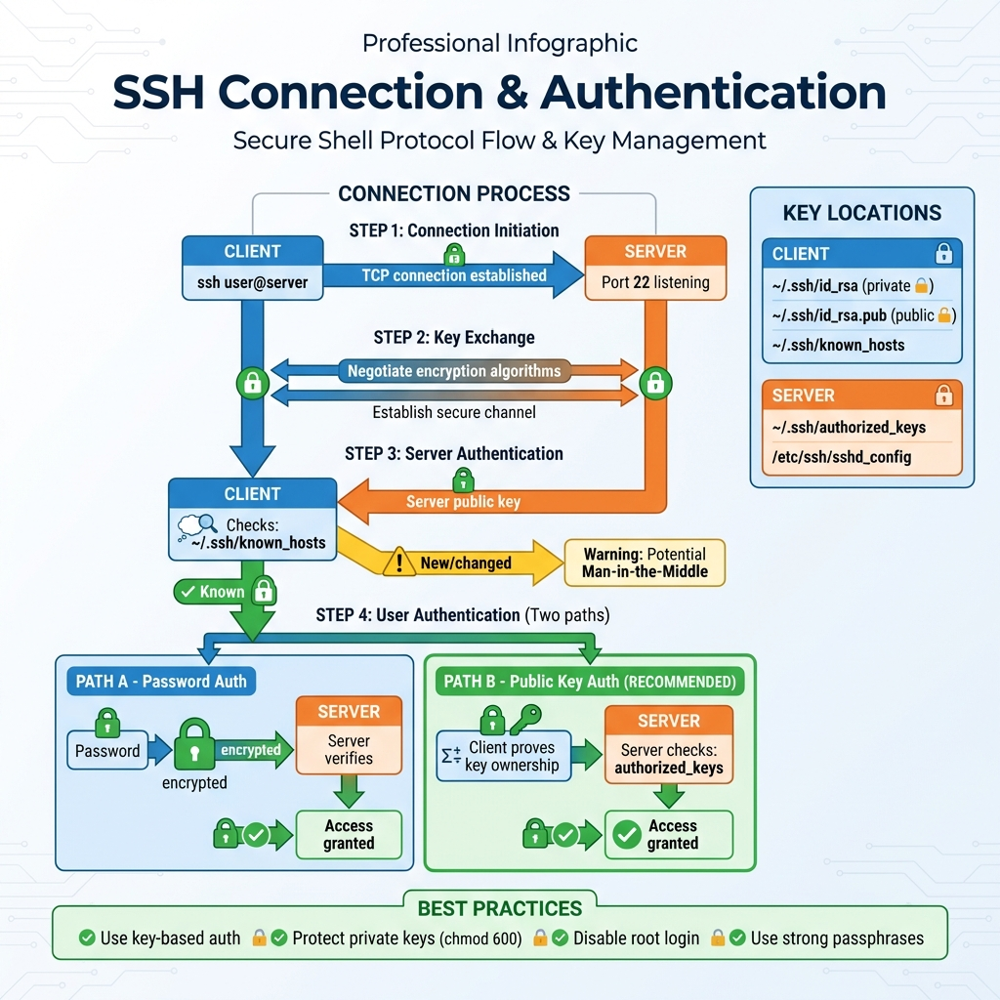

# 24: تأمين الـ SSH (Configuring & Securing SSH)

## 1. مقدمة
الـ **SSH** هو البوابة الرئيسية لإدارة سيرفرات لينكس عن بعد. هو آمن لأنه بيشفر كل الداتا، بس لو متأمنش صح ممكن يبقى ثغرة.

## 2. الاتصال (Basic Usage)
```bash
ssh user@hostname_or_ip
```
*البورت الافتراضي هو 22.*
> 
> 

## 3. طرق الدخول (Authentication)

### أ. الباسورد (Password Authentication)
> 

سهلة بس مش آمنة أوي. أي حد ممكن يجرب باسوردات كتير (Brute Force) لحد ما يدخل.
> 

### ب. المفاتيح (Key-Based Authentication) - **الصح**
أكثر أماناً بكتير. بتعمل مفتاحين: واحد معاك (Private) وواحد ع السيرفر (Public). مستحيل حد يدخل غير لو معاه المفتاح الخاص.

**خطوات الإعداد:**
1.  **اعمل المفاتيح (على جهازك أنت):**
    ```bash
    ssh-keygen -t rsa -b 4096
    ```
    *ده هيعمل ملفين في `~/.ssh/`: واحد اسمه `id_rsa` (ده سرك) و `id_rsa.pub` (ده اللي بتوزعه).*
    > 

2.  **ارفع المفتاح العام للسيرفر:**
    ```bash
    ssh-copy-id user@remote_ip
    ```

3.  **ادخل من غير باسورد:**
    ```bash
    ssh user@remote_ip
    ```
    > 

## 4. تأمين الـ SSH (Hardening)
عشان تأمن السيرفر بجد، لازم تعدل ملف الإعدادات `/etc/ssh/sshd_config`.

| الإعداد | التوصية | السبب |
| :--- | :--- | :--- |
| `PermitRootLogin` | `no` | امنع أي حد يدخل بـ root مباشرة. ادخل بيوزر عادي وبعدين اعمل sudo. |
| `PasswordAuthentication` | `no` | الغي الدخول بالباسورد خالص (بعد ما تتأكد إن المفاتيح شغالة!). |
| `Port` | `2222` (مثلاً) | غير البورت الافتراضي عشان تقلل هجمات الروبوتات العشوائية. |
| `AllowUsers` | `user1 user2` | حدد بالاسم مين مسموحله يدخل. |

> **تطبيق التغييرات:** `sudo systemctl restart sshd`

## 5. سيناريوهات حقيقية (Troubleshooting)

### سيناريو 1: "Permission denied (publickey)"
**المشكلة:** عامل مفاتيح بس مش راضي يدخل.
**السبب:** غالباً صلاحيات ملفات الـ ssh مش مضبوطة (لينكس موسوس جداً في الحتة دي).

**الحل:**
```bash
# على جهازك (Client)
chmod 700 ~/.ssh
chmod 600 ~/.ssh/id_rsa
chmod 644 ~/.ssh/id_rsa.pub

# على السيرفر (Server)
chmod 700 ~/.ssh
chmod 600 ~/.ssh/authorized_keys
```

### سيناريو 2: إدارة سيرفرات كتير
**المشكلة:** معاك مفاتيح كتير لسيرفرات مختلفة، ومش عايز تحفظ كل IP وكل مفتاح.
**الحل:** استخدم ملف `~/.ssh/config`.

```bash
# افتح الملف
vim ~/.ssh/config

# ضيف:
Host myserver
    HostName 192.168.1.10
    User admin
    IdentityFile ~/.ssh/id_rsa_custom
```
دلوقتي تقدر تكتب `ssh myserver` بس!

## 6. الزتونة (Key Takeaways)
- **إياك** تدي الـ Private Key (`id_rsa`) لأي مخلوق.
- اقفل الـ **Root Login** والـ **Password Auth** على سيرفرات الشغل.
- اضبط الصلاحيات: `600` للمفتاح الخاص، و `644` للعام.
