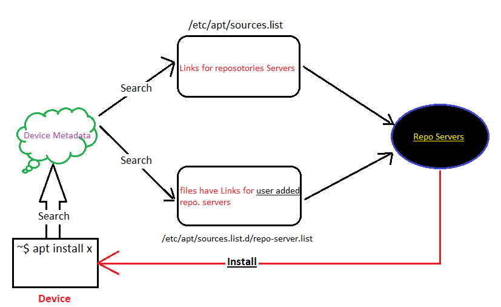
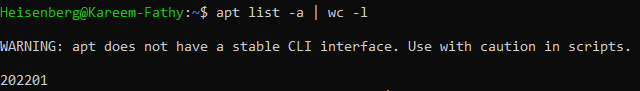
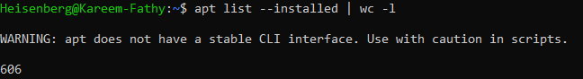
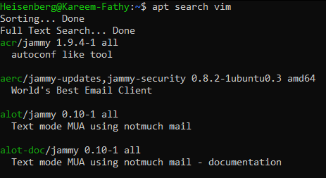
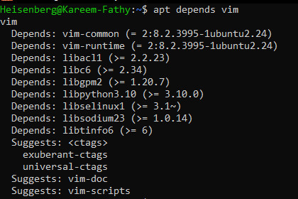

# 26: إدارة الحزم في ديبيان (Debian Package Management)

## 1. مقدمة
تثبيت البرامج في لينكس مش بملفات `.exe`. إحنا بنستخدم "مدير حزم" (Package Manager). في عيلة ديبيان (Ubuntu, Kali, Mint)، الباشا بتاعنا هو **APT**. ملفات التسطيب امتدادها `.deb`.

## 2. الإدارة المنخفضة (`dpkg`)
> 
ده الأداة اللي بتتعامل مع ملفات `.deb` مباشرة. عيبها إنها "غبية"، مبتفهمش الـ Dependencies (البرامج المعتمدة عليها).

| الحركة | الأمر |
| :--- | :--- |
| **تسطيب ملف deb** | `sudo dpkg -i package.deb` |
| **مسح برنامج** | `sudo dpkg -r package_name` |
| **عرض البرامج المتسطبة** | `dpkg -l` |
| **عرض محتويات ملف** | `dpkg -c package.deb` |

## 3. الإدارة الذكية (`apt`)
ده اللي بنستخدمه كل يوم. بيجيب البرامج من النت (Repositories)، وبيحل مشاكل الـ Dependencies لوحده.

| الحركة | الأمر |
| :--- | :--- |
| **تحديث قائمة البرامج** | `sudo apt update` |
> 
| **تحديث البرامج نفسها** | `sudo apt upgrade` |
| **تسطيب برنامج** | `sudo apt install package_name` |
| **مسح برنامج** | `sudo apt remove package_name` |
| **بحث عن برنامج** | `apt search keyword` |
| **معلومات عن برنامج** | `apt show package_name` |

### أمثلة بصرية (Visual Examples)
**List Options:**
> 
> 

**Search:**
> 

**Show:**
> 

**Dependencies:**
> 

### المخازن (Repositories)
البرامج بتيجي منين؟ من ملفات التكست دي:
- `/etc/apt/sources.list` (الملف الرئيسي).
- `/etc/apt/sources.list.d/*.list` (أي مخازن إضافية، زي Google Chrome أو Docker).

---

## 4. 🏆 مثال من سوق العمل: إصلاح التسطيب المكسور
**السيناريو:** ساعات وأنت بتسطب برنامج، النت يقطع أو العملية تفشل، والـ apt يهنج ويقولك "E: dpkg was interrupted".

```bash
# 1. حاول تصلح الاعتماديات المكسورة
sudo apt --fix-broken install

# 2. لو منفعش، نظف الكاش والملفات المحملة جزئياً
sudo apt clean
sudo apt autoclean

# 3. عملت مصيبة بـ dpkg؟ (سطبت ملف غلط وعايز تشيله بالقوة)
sudo dpkg --remove --force-all package_name

# 4. ارجع حدث القائمة
sudo apt update
```

## 5. الزتونة (Key Takeaways)
- استخدم **`apt`** في الطبيعي (سهل وذكي).
- استخدم **`dpkg`** بس لو معاك ملف `.deb` نزلته مانيوال (زي Google Chrome مثلاً).
- دايماً اعمل `apt update` قبل ما تسطب أي حاجة عشان تجيب آخر نسخة.
