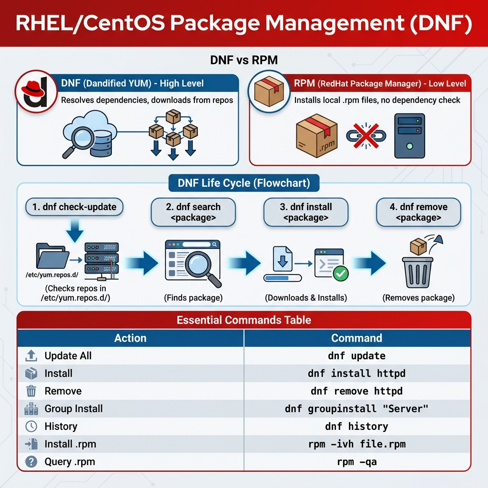
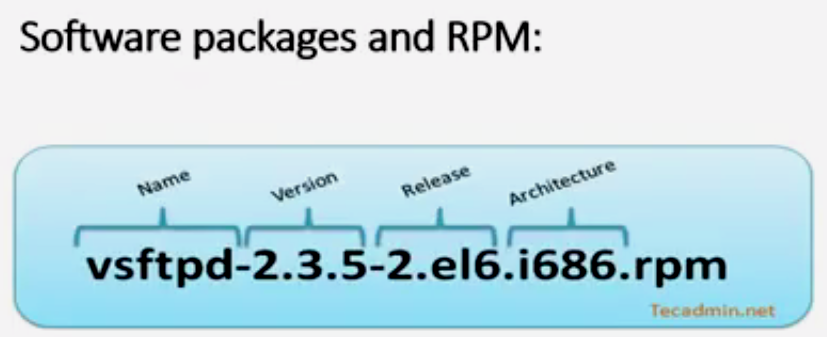

# 27: إدارة الحزم في ريد هات (Red Hat Package Management)

## 1. مقدمة
في عيلة Red Hat (RHEL, CentOS, Fedora)، بنستخدم **DNF** (النسخة المتطورة من YUM) و **RPM**. الامتداد هنا هو `.rpm`.

## 2. دورة إدارة الحزم (Package Management Cycle)
> 

## 2. الإدارة المنخفضة (`rpm`)
زي `dpkg` في ديبيان. بيتعامل مع الملفات مباشرة ومش بيحل Dependencies.

| الحركة | الأمر |
| :--- | :--- |
| **تسطيب** | `sudo rpm -ivh package.rpm` |
| **تحديث** | `sudo rpm -Uvh package.rpm` |
| **مسح** | `sudo rpm -e package_name` |
| **استعلام (هل البرنامج عندي؟)** | `rpm -q package_name` |
| **عرض كل اللي عندي** | `rpm -qa` |

> 
> 
> 

> **تفسير `ivh`:**
> - **i**: Install
> - **v**: Verbose (وريني تفاصيل)
> - **h**: Hash (شريط تقدم ####).

## 3. الإدارة الذكية (`dnf` / `yum`)
الـ `dnf` هو المستقبل، بس `yum` لسه شغال (غالباً بيبقى Link لـ `dnf`).
> 

| الحركة | الأمر |
| :--- | :--- |
| **تسطيب** | `sudo dnf install package_name` |
| **مسح** | `sudo dnf remove package_name` |
| **تحديث السيستم** | `sudo dnf update` |
| **بحث** | `dnf search keyword` |
| **معلومات** | `dnf info package_name` |

### المخازن (Repositories)
ملفات الـ `.repo` بتتحط في:
`/etc/yum.repos.d/`

---

## 4. 🏆 مثال من سوق العمل: "المجلد المجهول"
**السيناريو:** لقيت ملف في السيستم `/usr/bin/nc` وعايز تعرف ده برنامج إيه وجاي من أنهي حزمة (Package) عشان تشيله أو تحدثه.

```bash
# 1. اسأل قاعدة بيانات الـ RPM: الملف ده بتاع مين؟
rpm -qf /usr/bin/nc
# Output: nmap-ncat-7.92-1.el9.x86_64

# 2. عرفنا إن الحزمة اسمها nmap-ncat. هات معلومات عنها
dnf info nmap-ncat

# 3. لو عايز تشيلها
sudo dnf remove nmap-ncat
```

## 5. الزتونة (Key Takeaways)
- **`dnf`** هو الأساس في الأنظمة الحديثة (CentOS 8+).
- **`rpm -ivh`** لتسطيب الملفات المفردة.
- أمر **`rpm -qf`** (Query File) سحري عشان تعرف أصل أي ملف في السيستم.
