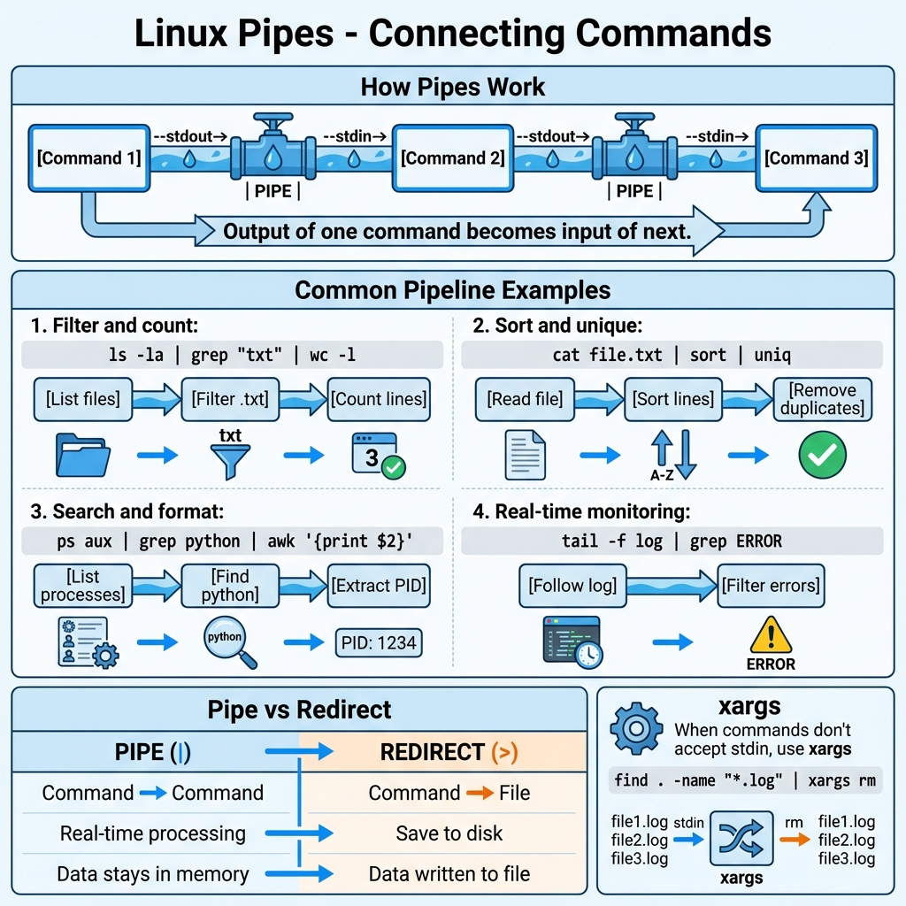

# 30: أدوات معالجة النصوص (Text Processing Tools)

## 1. مقدمة
لينكس "ملك" التعامل مع النصوص. أدوات زي `cut` و `tr` و `tee` بتخليك تشكل الداتا زي العجينة من التيرمنال.
> 

## 2. القص واللزق (`cut`)
بيقصقص الأعمدة من الملفات.

- `-d`: الفواصل (Delimiter) - الافتراضي هو الـ Tab.
- `-f`: رقم العمود (Field).

```bash
# هات أسماء اليوزرز (العمود الأول) من ملف الباسورد (مفصول بـ :)
cut -d ':' -f 1 /etc/passwd

# هات العمود الأول والتالت من ملف CSV (مفصول بـ ,)
cut -d ',' -f 1,3 data.csv
```

## 3. الترجمة والاستبدال (`tr`)
بيبدل حروف أو يمسحها. بيشتغل مع الأنابيب (`|`) بس.

```bash
# حول الحروف لـ Capital
echo "hello" | tr 'a-z' 'A-Z'
# النتيجة: HELLO

# امسح الأرقام
echo "pass123word" | tr -d '0-9'
# النتيجة: password

# ادمج المسافات الكتير في مسافة واحدة (مهم جداً) - Squeeze
echo "Too    many    spaces" | tr -s ' '
# النتيجة: Too many spaces
```

## 4. الحنفية المزدوجة (`tee`)
بيقرأ الداتا، ويعرضها قدامك ع الشاشة، وفي نفس الوقت يكتبها في ملف.

- `-a`: زود على الملف (Append) ومتمسحش القديم.

```bash
# اعرض محتويات الفولدر واحفظها في ملف لوج
ls -la | tee output.log
```

### أخطر استخدام لـ `tee` (مع `sudo`)
ليه مينفعش تقول `sudo echo "..." > /etc/hosts`؟
عشان الـ Redirection (`>`) بيتم بصلاحياتك أنت، مش صلاحيات الـ sudo. الحل هو `tee`:

```bash
echo "127.0.0.1 site.local" | sudo tee -a /etc/hosts
```
*كده `tee` هو اللي واخد sudo وهو اللي بيكتب في الملف.*

---

## 5. 🏆 مثال من سوق العمل: تقرير الزوار (Analytics)
**السيناريو:** عندك ملف `access.log` بتاع السيرفر، وعايز تطلع تقرير بـ **أكثر 5 متصفحات** زاروا موقعك، وتطلع النتيجة في ملف CSV.

```bash
# الخطوات:
# 1. اقرأ الملف (cat)
# 2. قص العمود بتاع المتصفح (cut)
# 3. رتبهم عشان نجمعهم (sort)
# 4. عد التكرار (uniq -c)
# 5. رتبهم تاني بالأكثر تكراراً (sort -nr)
# 6. هات أول 5 (head)
# 7. نظف المسافات والبدل عشان الـ CSV

cat access.log | cut -d '"' -f 6 | sort | uniq -c | sort -nr | head -n 5 | tr -s ' ' | tr ' ' ',' > top_agents.csv
```

> **القوة:** سطر واحد عملك شغل برنامج تحليل بيانات كامل!

## 6. الزتونة (Key Takeaways)
- `cut`: بيقطع عواميد.
- `tr`: بينظف ويبدل حروف.
- `tee`: بيكتب في ملف ويعرض ع الشاشة (وبينقذك في ملفات الروت).
- `sort` و `uniq`: الثنائي المرح للعد والترتيب.
