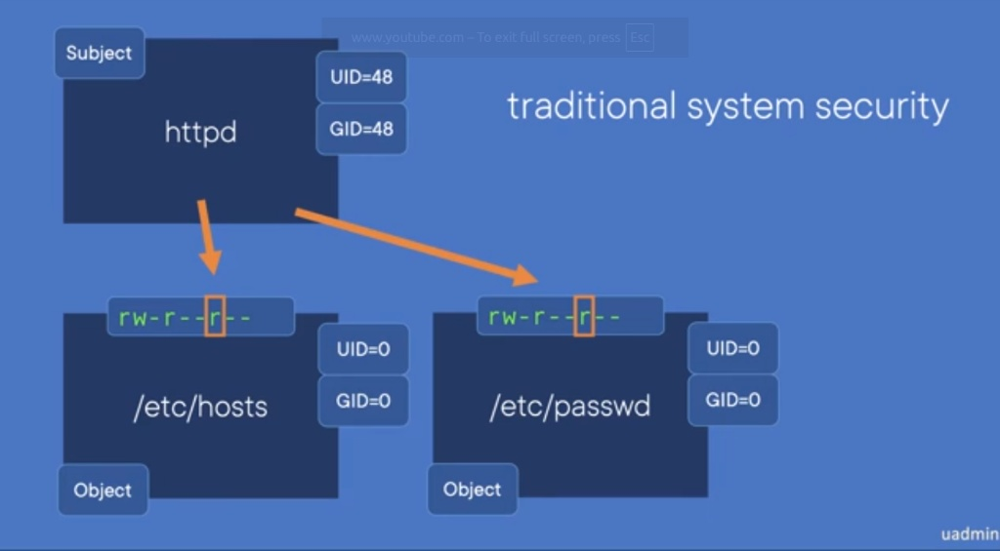

# Introduction to SELinux: MAC vs. DAC

---

## 1. The Problem: Traditional System Security (DAC)

Before diving into SELinux, it is crucial to understand the limitations of the traditional Linux security model, known as **Discretionary Access Control (DAC)**. 

The traditional DAC system evaluates access based on two primary components:
*   **The Subject:** The entity requesting to perform an action. In our scenario, this is the `httpd` (Web Server Process), running as a standard user (`UID=48`).
*   **The Object:** The target file or resource. For example, a highly sensitive system file like `/etc/passwd`, owned by `root` (`UID=0`).

### How DAC Works (The Vulnerability)
If we look at the permissions for `/etc/passwd`, they are typically set to `rw-r--r--` (644):
*   **Owner (root):** Read & Write (`rw-`)
*   **Group (root):** Read (`r--`)
*   **Others:** Read (`r--`)

Because the `httpd` process (`UID=48`) falls under the **Others** category, the DAC system allows it to read the file.

---

## 2. The Security Disaster

A Web Server process should only interact with web files (e.g., inside `/var/www/html/`). It has no business reading system files like `/etc/passwd`. 

However, due to DAC's broad permission structure, if a hacker exploits a vulnerability in the website and compromises the `httpd` process, they inherit its permissions. The hacker can now easily read **any** file on the system that is open to "Others," moving from a simple web exploit to a system-wide information leak.

---

## 3. The Solution: SELinux and MAC

To resolve this architectural flaw, Linux introduced **Mandatory Access Control (MAC)** through **SELinux**.

> **Note:** SELinux does not replace DAC. It acts as an additional, mandatory layer of security. If DAC denies access, the request is dropped immediately. If DAC allows access, SELinux steps in to make the final decision.

### How SELinux Fixes the Issue (Labeling)
Instead of relying solely on `rwx` permissions, SELinux attaches a **Security Context (Label)** to every subject and object in the system.

*   The `httpd` process gets a label (e.g., `httpd_t`).
*   System files get their own labels (e.g., `passwd_file_t`).

---

## 4. The SELinux Flow

When the compromised `httpd` process attempts to read `/etc/passwd`:
1.  **DAC Check:** Passes (Process is "Others" and has `r` permission).
2.  **SELinux Check:** Steps in and checks its rigid policy: *"Is the Type `httpd_t` explicitly allowed to read the Type `passwd_file_t`?"*

Since there is no such rule, SELinux immediately throws an **Access Denied** error. 

### Conclusion
This mechanism effectively **sandboxes** the Web Server. Even if a file's DAC permissions are misconfigured to `777`, SELinux will block the action if the labels do not match. The process is strictly confined to files labeled for web content (like `httpd_sys_content_t`).