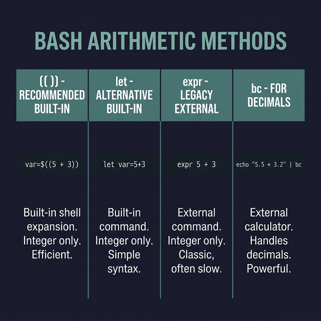

## 4. العمليات الحسابية في باش (Arithmetic Operations)

الباش بيقدم كذا طريقة عشان نعمل بيهم Processes حسابية. كل طريقة ليها استخداماتها وشكلها الخاص:

### طرق إجراء العمليات الحسابية (Methods):

1. **طريقة `$(( ))`**:
   دي أحدث وأشهر طريقة وأكتر واحدة بننصح بيها. والميزة إنك تقدر تسيب مسافات براحتك جوه الأقواس.
   ```bash
   result=$((5 + 3)) 
   echo $result  # النتيجة: 8
   ```

2. **أمر `let`**:
   هنا ببنستخدم أمر `let`، بس العيب إنك **ممنوع** تسيب أي مسافات بين الأرقام والعلامات.
   ```bash
   let result=5+3
   echo $result  # النتيجة: 8
   ```

3. **طريقة `$[ ]`**:
   دي طريقة قديمة شوية بس لسه شغالة (Spaces مسموحة).
   ```bash
   result=$[ 2 + 4 ]
   echo $result  # النتيجة: 6
   ```

4. **أمر `expr`**:
   ده برنامج منفصل ببنستخدمه عشان نحسب. ولازم تسيب مسافات (Spaces are necessary). كمان لو هتعمل ضرب `*` لازم تحط قبلها باك سلاش `\*` عشان التيرمينال متفتكرهاش الـ Wildcard.
   ```bash
   result=$(expr 10 - 2)
   echo $result  # النتيجة: 8
   ```

5. **أداة `bc` (Basic Calculator)**:
   الباش بطبيعته مبيفهمش الأرقام العشرية (الكسور). لو عايز تحسب كسور أو تعمل Processes معقدة، هنبعت العملية لأداة `bc` باستخدام الـ Pipeline `|`.
   ```bash
   result=$(echo "2.5 * 4" | bc)
   echo $result  # النتيجة: 10.0
   ```

---

### جدول العمليات الأساسية (Operators)

| العلامة | العملية | مثال | النتيجة |
|----------|-------------------|--------------------------|--------|
| `+`      | جمع (Addition) | `echo $((5 + 3))`        | `8`    |
| `-`      | طرح (Subtraction) | `echo $((5 - 3))`        | `2`    |
| `*`      | ضرب (Multiplication) | `echo $((5 * 3))`      | `15`   |
| `/`      | قسمة (Division) | `echo $((15 / 3))`       | `5`    |
| `**`     | أُس (Exponentiation) | `echo $((2 ** 3))`   | `8`    |
| `var++`  | تزويد 1 (Increment) | `((var=5)); ((var++))` | الـ Variable بقى بـ `6` |
| `var--`  | تنقيص 1 (Decrement)| `((var=5)); ((var--))` | الـ Variable بقى بـ `4` |

---

### استعمالات الأقواس المزدوجة `(( ))`
بعيداً عن الأقواس اللي فيها دولار ساين `$(( ))` اللي بتعوض بالنتيجة كنص.. إحنا ممكن بنستخدم الأقواس المزدوجة بس `(( ))` كأمر قائم بذاته.

1. **إتمام Processes التخزين الحسابية:**
   ```bash
   ((result = 5 + 3))
   echo $result  # النتيجة: 8
   ```
2. **الـ Increment و Decrement:**
   ```bash
   ((var = 5))
   ((var++))
   echo $var  # هيطبع 6
   ```

3. **المقارنات (Comparisons) وExit Status:**
   لما بتستخدم `(( ))` في مقارنة، هي مش بتطبع لك الحسبة دي صح ولا غلط، هي ببساطة بتغير Exit Status اللي اتفقنا بنقراها بـ `$?`.
   - لو المقارنة صح (True)، بترجع حالة خروج **`0`**.
   - لو المقارنة غلط (False)، بترجع حالة خروج **`1`**.
   
   | العلامة | معناها | مثال | خروج `$?` |
   |----------|--------------------------|--------------------------|-------------|
   | `==`     | يساوى | `((5 == 3))` | `1` (غلط) |
   | `!=`     | لا يساوى | `((5 != 3))` | `0` (صح) |
   | `>`      | أكبر من | `((5 > 3))`  | `0` (صح) |
   | `<`      | أصغر من | `((5 < 3))`  | `1` (غلط) |

   ودا بيخليها ممتازة جداً / قوي جوا أوامر الـ `if`:
   ```bash
   if ((5 > 3)); then
          echo "خمسة أكبر من تلاتة"
   fi
   ```

### خد بالك: الـ `$(( ))` بتعكس الأرقام!
لو استخدمت المقارنة بالـ `$(( ))`، دي مش بتغير الـ Exit status، دي بتطبع نتيجة المقارنة كقيمة رياضية:
- الصواب (True) بتطبع **`1`**.
- الخطأ (False) بتطبع **`0`**.
   ```bash
   echo $((5 > 3))  # هيطبع 1
   echo $((5 < 3))  # هيطبع 0
   ```



