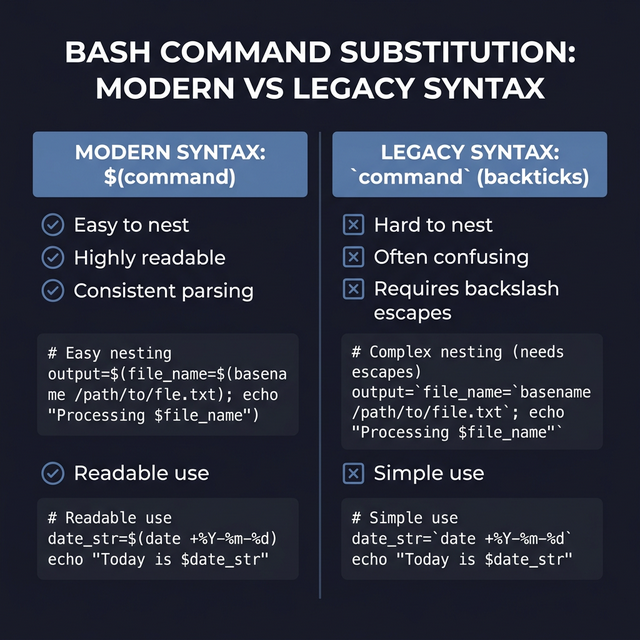

## 5. التعويض بالأوامر (Command Substitution)

عشان تفهم الكونسيبت ده ببساطة: "التعويض بالأوامر" هو إنك تخلي الباش ينفذ أمر معين، وبدل ما يطبع نتيجته على الشاشة، ياخد النتيجة دي (Output) ويخزنها في Variable أو يستخدمها كجزء من أمر تاني تكمله وتشتغل بيه.

### الصيغة (Syntax)

الموضوع ده ليه طريقتين في الكتابة:
1. **استخدام الأقواس مع الدولار ساين `$()` (الطريقة الأفضل والأحدث):**
   ```bash
   file=$(date)
   ```
   السطر ده معناه: "يا تيرمينال، نَفِّذ أمر `date`، واللي يطلعلك حطُّه جوه الـ Variable اللي اسمه `file`".

2. **استخدام الباكتيك أو علامة المد المقلوبة `` ` ` `` (الطريقة القديمة):**
   ```bash
   file=`date`
   ```

### أمثلة Process (Examples)

لو استخدمنا أمر معرفة التاريخ والوقت `date`:
```bash
file=$(date)
echo $file
# هيطبع مثلاً: Thu Mar  6 16:55:08 EET 2025
```

ولو بصينا على أمر تاني زي `whoami` اللي بيرجعلك اسم المستخدم اللي إنت داخل بيه:
```bash
name=`whoami`
echo $name
# هيطبع اسم المستخدم مثلاً: Heisenberg أو karim
```


### ملاحظات مهمة (Notes)
- **ليه بنفضل `$()` عن الباكتيك القديمة؟** لإنها مقروءة أكتر وأوضح للعين، وكمان بتسمحلك تعمل (Nesting)، يعني تقدر تحط أمر جوه أمر جوه أمر بكل سهولة، عكس الباكتيك اللي هتعمل مشاكل كتير في الـ (Escaping).
- دايماً ركز في المسافات والأقواس عشان متعملش أخطاء (Syntax errors).
- "التعويض بالأوامر" دي من أقوى مميزات البرمجة بالباش (Shell scripting) لإنها بتديلك ديناميكية إنك تاخد الداتا اللي بتطلعلك في اللحظة دي وتبني عليها أوامر تانية.


