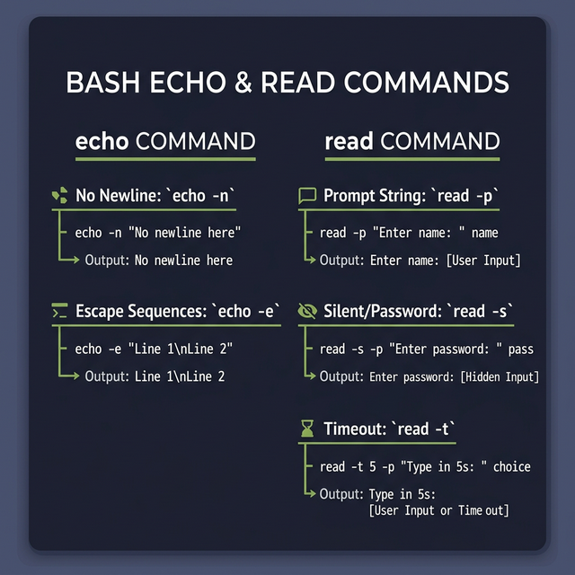

## 6. إدخال وتصدير البيانات (User Input and Output)

في أي إسكربت تفاعلي، هتحتاج تطبع رسايل للمستخدم أو تاخد منه بيانات. وبنعمل ده بأمرين أساسيين:

### 1. أمر الطباعة `echo`:
ببنستخدمه عشان نعرض نصوص أو نتايج على الشاشة.

**أهم الاختيارات (Options) معاه:**
- `-n`: بيمنع التيرمينال إنها تنزل سطر جديد (Newline) بعد ما تطبع الكلمة.
- `-e`: بيفعّل ترجمة العلامات الخاصة (Backslash escapes) زي:
   - `\t`: بتعمل مسافة كبيرة (Tab).
   - `\n`: بتنزل سطر جديد.
   - `\a`: بتعمل صوت تنبيه (Alert beep).

**أمثلة:**
```bash
# مثال 1: طباعة عادية
echo "Hello, World!"
# النتيجة: Hello, World! وهينزل سطر تلقائي

# مثال 2: استخدام -n 
echo -n "جاري التحميل..."
# النتيجة: جاري التحميل... (ومؤشر الكتابة هيفضل على نفس السطر)

# مثال 3: استخدام -e وتنسيق الجداول
echo -e "الاسم\tالعمر\nكريم\t25"
# النتيجة هتكون جدول صغير:
# الاسم    العمر
# كريم     25
```

---

### 2. أمر القراءة `read`:
ده الأمر المسئول عن تسجيل أي حاجة المستخدم بيكتبها على الكيبورد وتخزينها في Variable عشان بنستخدمها بعدين.

**الصيغة الأساسية (Syntax):**
```bash
read var_name1 var_name2
# كل كلمة المستخدميدخلها هتتخزن بالترتيب في الـ Variables دي.
```

**أهم الاختيارات (Options) معاه:**
- `-p "Message"`: بيطبع رسالة توضيحية للمستخدم (Prompt) قبل ما يطلب منه يكتب. بدل ما بتستخدم `echo` قبل الـ `read`.
- `-s`: قراءة سرية (Silent). بيخفي الكلام اللي المستخدم بيكتبه عشان لو بيدخل باسوورد.
- `-t <seconds>`: بيعمل عداد ثواني (Timeout). لو المستخدم متأخر ومكتبش حاجة في الوقت ده، الإسكربت بيكمل أو بيقفل لوحده.

**أمثلة شاملة:**
```bash
# مثال 1: رسالة توضيحية مباشرة مع -p
read -p "أدخل عمرك: " age
echo "عمرك هو $age سنة."

# مثال 2: الباسورد السري مع -s
read -s -p "أدخل الرقم السري: " password
echo -e "\nتم حفظ الرقم السري بنجاح."

# مثال 3: المهلة الزمنية مع -t
read -t 5 -p "أدخل لونك المفضل بسرعة (معاك 5 ثواني): " color
echo "لونك هو $color."
```

---

### 3. التمدد بالأقواس (Brace Expansion):
دي ميزة سحرية في الباش بتخليك تولد سلاسل نصوص أو أرقام بسهولة جداً / قوي من غير ما تكتبهم واحدة واحدة (بتنفع جداً / قوي لو بتعمل فولدرات كتير).

**أمثلة لتوضيح الفكرة:**
```bash
# 1. تمدد بسيط لكلمات
echo {A,B,C}
# النتيجة: A B C

# 2. نطاق أرقام متسلسل
echo {1..5}
# النتيجة: 1 2 3 4 5

# 3. دمج النصوص مع الأرقام (توليد أسامي ملفات)
echo file{1..3}.txt
# النتيجة: file1.txt file2.txt file3.txt

# 4. النطاق بقفزات معينة (زيادة 2 كل مرة)
echo {1..10..2}
# النتيجة: 1 3 5 7 9
```



