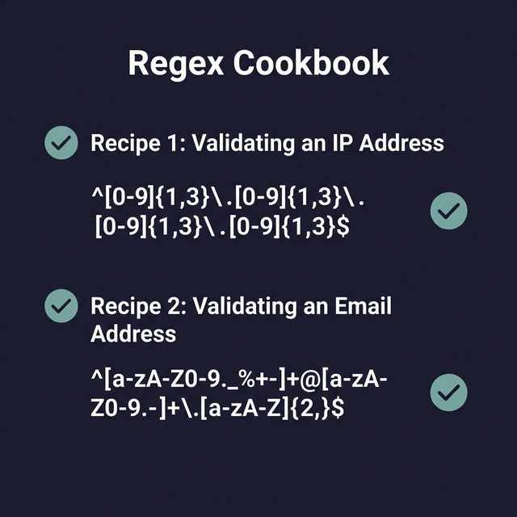

## 9. الـ Regular Expressions (Regex) الشاملة (Regular Expressions: The Definitive Guide)

الـ Regular Expressions (Regex) أو الـ Regex (ريجيكس) شكلها كأن قطة مشيت على الكيبورد، وتخض أي حد في البداية. لكن تحت الشكل المعقد ده، بتستخبى **لغة صغيرة وقوية جداً / قوي للبحث ومطابقة الأنماط**. دي مهارة تعتبر إضافة خرافية لقوتك كمهندس لينكس، DevOps، أو مبرمج عموماً.

في الدليل ده هنبعد عن السرد الممل بتاع الـ Documentation الرسمية، وهندخل في الشرح العملي والمباشر اللي هيخليك تكتب وتقرأ Regex كأنها لغتك التانية.

---

### 1. اللخبطة الكبيرة: Regex الأساسي (BRE) مقابل الممتد (ERE)
قبل ما نحفظ الرموز، لازم تفهم ليه الـ Regex ممكن يشتغل معاك في مكان ويضرب في مكان تاني.

أدوات لينكس القديمة بتدعم **Basic Regular Expressions (BRE)** بشكل افتراضي. في النوع ده، الرموز القوية زي `+`, `?`, `|`, `()`, `{}` **بتعتبر حروف عادية جداً / قوي** ومبتعملش أي سحر، إلا لو حطيت قبلها علامة الهروب `\`. الليلة دي كانت بتخلي الكود شكله بشع.

عشان كده عملوا **Extended Regular Expressions (ERE)** أو التعبيرات الممتدة. هنا الرموز دي بتشتغل بسحرها أوتوماتيك من غير أي `\`.

**القاعدة الذهبية:** دايماً استخدم الـ Extended (ERE) لو الأداة بتسمحلك بده، لأنه أنضف ومقروء أكتر.

```bash
# إزاي تشغل الـ ERE في الأدوات المشهورة:
grep -E 'pattern' file.txt     # ← بنضيف -E
sed -E 's/pattern/rep/g' file  # ← بنضيف -E 
awk '/pattern/' file.txt       # ← أمر awk بيستخدم ERE لوحده من غير إضافات!

# أمر المقارنة الداخلي في الباش [[ =~ ]] بيستخدم ERE برضه!
if [[ $text =~ ^[a-z]+$ ]]; then echo "Match"; fi
```


---

### 2. الرموز الأساسية (شغالة في الـ BRE و ERE)
دي الطبقة الأولى من السحر، الرموز اللي كل لغات العالم متفقة عليها.

#### `.` (النقطة: أي حرف)
تطابق **حرف واحد بس** أيًا كان (ما عدا النزول لسطر جديد).
* `b.t` هتطابق: `bat`, `bot`, `b9t`, `b_t`
* `b.t` مش هتطابق: `bt` (لأن ناقص حرف)، `baat` (لأن فيها حروف زيادة)

#### `^` (بداية السطر)
بتجبر النمط إنه لازم يكون في **أول السطر تماماً**.
* `^Hello` هتطابق: `"Hello World"`, `"Hello"`
* `^Hello` مش هتطابق: `"Say Hello"`

#### `$` (نهاية السطر)
بتجبر النمط إنه يكون في **آخر السطر تماماً**.
* `World$` هتطابق: `"Hello World"`, `"World"`
* `World$` مش هتطابق: `"World Peace"`

> **تلميح:** ممكن تدمجهم! `^Hello$` معناها السطر لازم يكون كلمة Hello بس لا غير. ولو حطيت `^$` دي معناها سطر فاضي تماماً.

#### `*` (تكرار: صفر أو أكثر)
بتطابق الحرف اللي *قبلها مباشرة* **صفر من المرات أو عدد غير نهائي**. (مبتعنيش "أي حاجة" زي الـ Globbing في الملفات!).
* `ab*c` هتطابق: `ac` (حرف الـb متكرر صفر مرة)، `abc` (مرة)، `abbbbc` (4 مرات).
* `.*` هتطابق: **أي حاجة في الوجود** بأي طول (لأنها عبارة عن نقطة يعني أي حرف، مضروبة في النجمة يعني متكررة براحتها).

#### `[ ]` (مجموعة حروف)
تطابق **حرف واحد بس** يكون موجود جوه الأقواس دي.
* `[cbr]at` هتطابق: `cat`, `bat`, `rat` (لكن مش `hat`).
* `[A-Z]` هتطابق: أي حرف إنجليزي كبير.
* `[0-9]` هتطابق: أي رقم.
* `[a-zA-Z0-9]` هتطابق: أي حرف أو رقم.

#### `[^ ]` (مجموعة النفي)
تطابق **حرف واحد بس** **عكس** اللي جوه الأقواس.
* `[^0-9]` هتطابق: أي حاجة مش رقم زي `A` أو `!` أو المسافة.
* `[^a-z]` هتطابق: أي حاجة مش حرف صغير.

#### `\` (علامة الهروب - Escape)
بتجرد الرمز اللي بعدها من سحره وتخليه حرف عادي.
* `3\.14` هتطابق 문자 `3.14` بالظبط. (لو مكتبناش الـ \ كان الـ 3.14 ممكن يطابق 3X14).


---

### 3. الرموز الممتدة (بتشتغل في ERE بس)
الرموز دي هي اللي بتعمل الشغل الجامد. (عشان تشتغل في النسخة القديمة BRE كنت هتحتاج تكتبها `\+` أو `\?` الخ).

#### `+` (تكرار: مرة واحدة أو أكثر)
بتطابق الحرف اللي قبلها **على الأقل مرة واحدة**.
* `ab+c` هتطابق: `abc`, `abbbc`
* `ab+c` مش هتطابق: `ac` (لازم على الأقل حرف b واحد).
* `^[0-9]+$` هتطابق: سطر كله أرقام ومفيهوش أي حاجة تانية.

#### `?` (اختياري: صفر أو مرة واحدة)
بتخلي الحرف اللي قبلها **جوازه زي عدمه** (ممكن يكون موجود وممكن لأ).
* `colou?r` هتطابق: `color` أو `colour`.
* `https?://` هتطابق: `http://` أو `https://`.

#### `{n,m}` (تحديد عدد التكرار بالظبط)
بتحدد إنت عايز الحرف يتكرر كم مرة لـ كم مرة.
* `a{3}` هتطابق: 3 حروف a لزق في بعض `aaa` بالظبط.
* `[0-9]{2,4}` هتطابق: من رقمين لحد 4 أرقام زي `12`, `1234`.
* `[a-z]{5,}` هتطابق: 5 حروف أو أكتر.

#### `|` (أو - OR)
بتطابق الكلمة اللي على يمينها **أو** اللي على شمالها.
* `cat|dog` هتطابق كلمة قطة أو كلب.
* `(start|stop|restart)` هتطابق أي كلمة من التلاتة دول.

#### `()` (التجميع - Grouping)
بنقفل على شوية حروف مع بعض عشان نطبق عليهم تأثير كامل بره القوس.
* `(abc)+` هتطابق `abc` أو `abcabc` (لو معملناش القوس وكتبنا `abc+` الـплюس هتكون على الـ c بس).

---

### 4. الفئات الجاهزة (POSIX Classes)
اللينكس بيوفر أقواس جاهزة لأسرة معينة من الحروف بدل ما تكتب إنت الحروف من A لـ Z، والميزة إنها بتفهم اللغات المختلفة أحسن.

| كود الـ POSIX | معناه | البديل التقليدي |
|---|---|---|
| `[[:digit:]]` | أي رقم عادى | `[0-9]` |
| `[[:alpha:]]` | أي حرف أبجدي (كبير أو صغير) | `[a-zA-Z]` |
| `[[:alnum:]]` | حروف وأرقام مع بعض | `[a-zA-Z0-9]` |
| `[[:space:]]` | المسافات، أسطر جديدة، تاب | `[ \t\n\v]` |
| `[[:upper:]]` | حروف الكابيتال بس | `[A-Z]` |
| `[[:lower:]]` | حروف السمول بس | `[a-z]` |

> **تحذير:** لازم تحطهم جوه أقواس المجموعات `[]` عشان يشتغلوا زي كده: `^[[:digit:]]+$`


---

### 5. استخدام Regex جوه الباش الأصلي `[[ =~ ]]`

إنت مش محتاج بتستخدم `grep` دايماً، الباش نفسه فيه محرك Regex داخلي قوي جداً / قوي جوه أمر المقارنة `[[ ]]`.

**3 قواعد حربية لنجاح الـ `=~`:**
1. بيستخدم النسخة المتطورة (ERE) أوتوماتيك!
2. **إياك** تحط علامات تنصيص `""` حوالين النمط (الـ Regex string). لو كتبت `"[0-9]"` الباش هيدور على أقواس وحروف مكتوبة زي إيه هي.
3. بيبحث "بحث جزئي" (Partial match). فلو عايز الكلمة كلها تتطابق اقفلها بـ `^` و `$`.

#### مثال: التأكد إن الإدخال أرقام بس
```bash
read -p "Enter your age: " age

if [[ $age =~ ^[0-9]+$ ]]; then
    echo "تمام، المدخل أرقام صافية."
else
    echo "غلط، الـ Regex اكتشف حروف أو رموز."
fi
```

#### الترقيع الذكي (Pro-Tip)
لما يكون شكل الـ Regex كبير ومخيف وممكن يبوظ الـ Parser بتاع الباش، الأفضل إنك تسجله في Variable الأول وبعدين تختبر بيه!
```bash
regex_email="^[a-zA-Z0-9._%+-]+@[a-zA-Z0-9.-]+\.[a-zA-Z]{2,}$"
if [[ "user@test.com" =~ $regex_email ]]; then 
    echo "إيميل سليم!"
fi
```

---

### 6. كتاب الوصفات العملي (Real-World Cookbook)
دي أكتر أنماط Regex هتحتاجها في شغلك:

#### 1. تنظيف الملفات من التعليقات والأسطر الفاضية
عشان تقرأ ملف config نضيــف (بيشيل الأسطر الفاضية، وبيشيل السطور اللي بتبدأ بشباك):
```bash
grep -E -v '^[[:space:]]*$|^[[:space:]]*#' config.conf
```

#### 2. التأكد من شكل الـ IP (IPv4)
بيشيك هيكلياً إن الـ IP بيتكون من 4 مجموعات أرقام بيفصل بينهم نقط:
```bash
ip_regex="^[0-9]{1,3}\.[0-9]{1,3}\.[0-9]{1,3}\.[0-9]{1,3}$"
```

#### 3. التأكد من شكل الإيميل (Email Validation)
نمط مبسط لكنه متعارف عليه في الـ industry للمطابقة العادية:
```bash
email_regex="^[a-zA-Z0-9._%+-]+@[a-zA-Z0-9.-]+\.[a-zA-Z]{2,}$"
```

#### 4. التأكد من شكل التاريخ (YYYY-MM-DD)
```bash
date_regex="^[0-9]{4}-[0-9]{2}-[0-9]{2}$"
```

#### 5. التأكد من الماك أدرس (MAC Address)
6 مجموعات من الأرقام أو الحروف بالشكل السداسي (Hex) بينهم نقطتين رئيسيتين:
```bash
mac_regex="^([0-9A-Fa-f]{2}:){5}[0-9A-Fa-f]{2}$"
```


