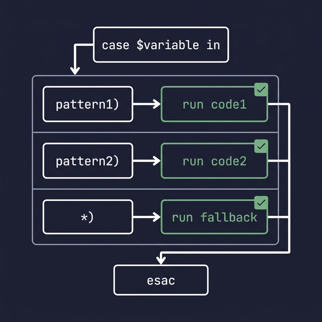
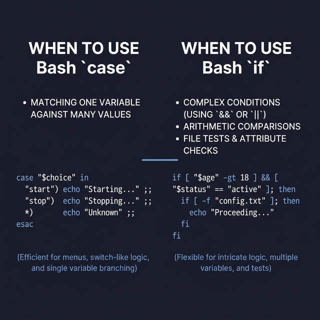

## 10. استخدام جملة الاختيارات (Case Statement)

جملة `case` في باش هي أفضل وأشيك بديل لجمل الـ `if` المتداخلة الكتير (الـ `elif`s) لو كنت عايز تقارن Variable واحد بشوية احتمالات أو كلمات مختلفة (Patterns). ببتستخدم كتير جداً / قوي لو بتعمل قايمة اختيارات للمستخدم (Menu).

**الصيغة العامة (Syntax):**
```bash
case $var1 in
    pattern1 | pattern2 | pattern3 )
        # الكود اللي هيشتغل لو الـ Variable بيطابق النمط الأول أو التاني أو التالت
        ;;
    pattern4)
        # الكود اللي هيشتغل للنمط الرابع
        ;;
    *)
        # (Default) الكود اللي هيشتغل لو الـ Variable مطلعتش أي حاجة من دول خالص
        ;;
esac
```

**قواعد وأسرار سريعة:**
- ببنستخدم علامة `|` عشان نقول "أو" (Logical OR) بين الاحتمالات في نفس السطر.
- ببنستخدم القوس اليمين `)` بس عشان نقفل الاحتمال.
- **مهم جداً / قوي:** كل بلوك كود لازم ينتهي بفاصلتين منقوطتين `;;` (Double semicolons) عشان الباش يفهم إن الاحتمال ده كوده خلص وميدخلش على اللي بعده.
- علامة النجمة `*` في الآخر دي زي الـ `else`، بتلم أي حاجة تانية متعرفهاش.
- بنقفل الجملة بكلمة `esac` (اللي هي case معكوسة).

---

### أمثلة Process

#### مثال 1: قايمة اختيارات بسيطة (Simple Menu)
```bash
echo "اختار فاكهة (تفاح، موز، برتقال):"
read fruit

case $fruit in
    تفاح | apple)
        echo "إنت اخترت تفاح."
        ;;
    موز | banana)
        echo "إنت اخترت موز."
        ;;
    برتقال | orange)
        echo "إنت اخترت برتقال."
        ;;
    *)
        echo "فاكهة غير معروفة، من فضلك اختار من القايمة."
        ;;
esac
```

#### مثال 2: استخدام النطاقات (Character Ranges) 
نقدر بنستخدم قدرات الـ Regex البسيطة جوه الـ case.
```bash
echo "أدخل تقديرك بالحروف (A-F):"
read grade

case $grade in
    [A-C])
        echo "ممتاز! شغل عالي."
        ;;
    [D-E])
        echo "جيد، بس محتاج تحسن قليل."
        ;;
    F)
        echo "تحتاج إلى مجهود أكبر (سقوط)."
        ;;
    *)
        echo "تقدير غير صالح، لازم حرف من A لـ F."
        ;;
esac
```

---

### إيه الفرق بين `case` و `if`؟ وإإمتى بنستخدم دي أو دي؟

- **الـ `case`:**
  - ممتازة لعمل **قوائم (Menus)** واختيارات للمستخدم.
  - شكلها أنضف بكتير وأسهل في القراية لو عندك Variable واحد عايز تشوفه بيساوي 5 أو 6 حالات مختلفة.
  - سرعتها أعلى نسبياً في مطابقة النصوص.
  
- **الـ `if`:**
  - مرنة جداً / قوي وبتستخدم في **الشروط المعقدة**.
  - تقدر تقارن بيها أرقام بـ "أكبر من" و"أصغر من"، وتقدر تجمع بيها مليون شرط مختلف مع بعض باستخدام `&&` و `||`.
  - تقدر بتستخدمها لكشف وجود الملفات جوه اللينكس بسهولة (بأمر `[ -f file ]`).

**الخلاصة:** لو بتقيس Variable واحد بناء على كلام محدد استخدم `case`، لو بتعمل شروط معقدة وحسابات أكبر استخدم `if`.



