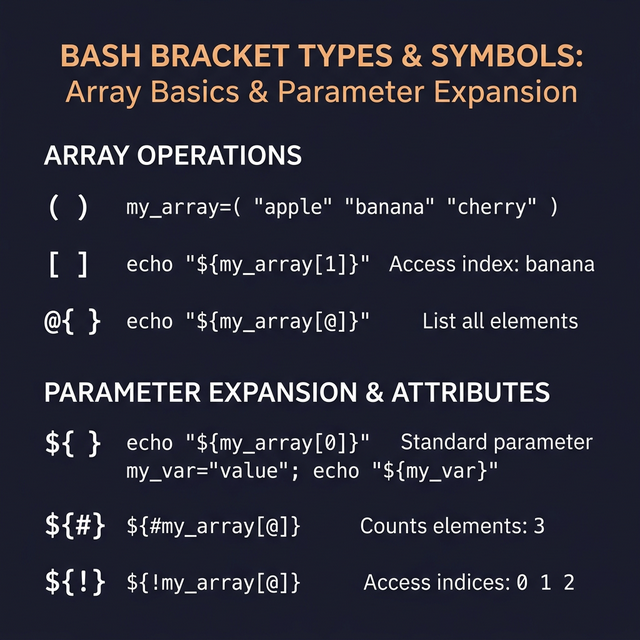

## 11. الـ Arrays العادية (Regular Arrays)

**الـ Array** ببساطة هي عبارة عن Variable واحد بس بيشيل جواه أكتر من قيمة في نفس الوقت (زي صندوق متقسم لرفوف). وببنستخدمها عشان نرتب الداتا بتاعتنا.

### أساسيات التعامل مع الـ Arrays:

- **1. إزاي نعرّف Array جديدة؟**
   بنكتب اسم الـ Array ونحط القيم بين أقواس عادية `()` ونفصل بينهم بمسافات.
   ```bash
   arr_name=(element1 element2 element3)
   ```

- **2. إزاي نوصل لقيمة معينة جوه الـ Array (Access elements)؟**
   كل عنصر بيبقى ليه رقم ترتيب (Index) بيبدأ من صفر. 
   - العنصر الأول (رقم 0): `$arr_name` أو `${arr_name}` أو `${arr_name[0]}` 
   - العنصر التاني (رقم 1): `${arr_name[1]}` وهكذا..

- **3. طباعة كل العناصر مرة واحدة:**
   ببنستخدم علامة `@` عشان نقوله هات كل اللي في الصندوق.
   ```bash
   echo "${arr_name[@]}"
   # النتيجة هتبقى: element1 element2 element3
   ```

- **4. طباعة أرقام الترتيب (Indices) بتاعتهم:**
   ببنستخدم علامة التعجب `!` قبل اسم الـ Array.
   ```bash
   echo "${!arr_name[@]}"
   # النتيجة هتبقى الأرقام: 0 1 2
   ```

- **5. معرفة عدد العناصر (Length):**
   بنحط علامة الشباك `#` قبل اسم الـ Array.
   ```bash
   echo "${#arr_name[@]}"
   # النتيجة: 3 (لإنهم تلات عناصر)
   ```

- **6. إضافة عنصر جديد للمصفوفة:**
   ببنستخدم علامة `+=` عشان نزود على نفس الـ Array القديمة.
   ```bash
   arr_name+=(element4)
   ```

- **7. مسح عنصر معين (مثلاً اللي ترتيبه 3):**
   ببنستخدم أمر `unset`.
   ```bash
   unset arr_name[3]
   echo "${arr_name[@]}"
   # هيطبع: element1 element2 element3 (بدون العنصر الرابع)
   ```

- **8. طباعة جزء معين من الـ Array (Range):**
   لو عايز أطبع من أول الترتيب رقم 1، وأجيب عنصرين بس بتكتب كدا: `${arr[@]:start:count}`
   ```bash
   echo "${arr_name[@]:1:2}"
   # النتيجة: element2 element3
   ```


---

### إزاي متتلخبطش بين الأقواس المختلفة في الباش؟

اللخبطة كلها بتيجي من أشكال الأقواس، ركز في دي:
1. المربع `[]` ببنستخدمه عشان نحدد رقم العنصر جوه الـ Array (Indexing).
2. الشنب أو المعكوف `{}` ببنستخدمه في استدعاء وطباعة الـ Variables المتقدمة (Parameter expansion).
3. العادي `()` ببنستخدمه عشان ننشئ الـ Array نفسها ونحط فيها القيم.


