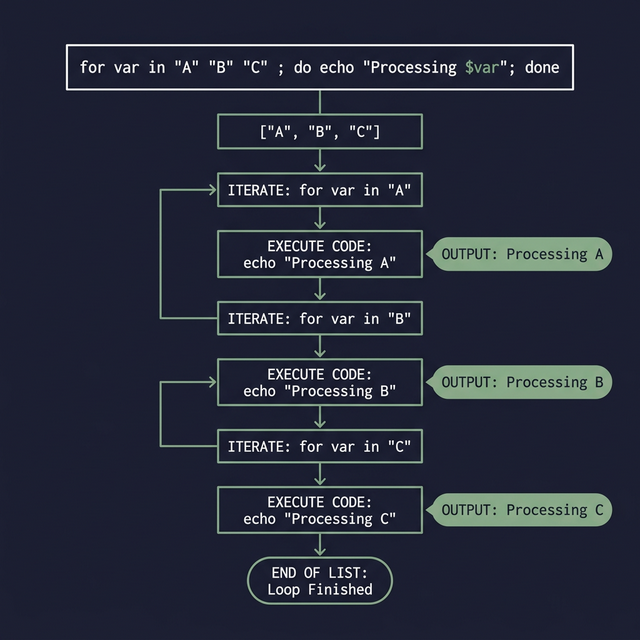

## 12. الـ Loops (For Loops)

لو عندك كود عايز تنفذه كذا مرة ورا بعض، بدل ما تكتبه بإيدك كل شوية ببنستخدم الـ Loops. وأشهر واحدة فيهم هي الـ `for` loop.

### الصيغة العامة (Syntax):
```bash
for var in item1 item2 item3 ... itemN
do
   # الكود اللي هيتنفذ لكل عنصر
done
```

**مثال بسيط على الألوان:**
```bash
for color in red green blue
do
   echo "اللون هو: $color"
done
```
**النتيجة:**
```
اللون هو: red
اللون هو: green
اللون هو: blue
```

> **ملحوظة:** ممكن نكتب الـ for loop كلها على سطر واحد باستخدام الفصلة المنقوطة `;`:
> ```bash
> for color in red green blue; do echo "اللون: $color"; done
> ```

**عشان تعمل عداد أرقام متسلسل (Brace expansion):**
```bash
for i in {1..5}
do
   echo "الرقم: $i"
done
```
*(هيطبع من 1 لـ 5 تحت بعض).*

---

### اللوب مع الـ Arrays (For with Arrays)
دي أكتر حاجة هبتستخدمها، إزاي تلف جوه Array بالـ `for`:

1. **اللف على القيم (Values):** ببنستخدم `${arr[@]}` عشان نجيب كل القيم.
   ```bash
   arr=(apple banana cherry)
   for fruit in "${arr[@]}"
   do
      echo "الفاكهة هي: $fruit"
   done
   ```

2. **اللف على ترتيب العناصر (Indices):** ببنستخدم `${!arr[@]}` اللي بترجع 0، 1، 2..
   ```bash
   arr=(apple banana cherry)
   for i in "${!arr[@]}"
   do
      echo "الرقم $i قيمته: ${arr[$i]}"
   done
   ```

3. **حساب عدد العناصر بس (Length):** ببنستخدم `${#arr[@]}`
   ```bash
   arr=(apple banana cherry)
   for i in "${#arr[@]}"
   do
      echo "عدد العناصر هو: $i"
   done
   ```



---

### اللوب مع الملفات (For with Files)

لو معاك ملف فيه كلمات وعايز تلف عليهم:
```bash
echo "W X Y Z" > file.txt
var=$(cat file.txt)

for i in $var
do
   echo "الحرف: $i"
done
```
**النتيجة:**
```
الحرف: W
الحرف: X
الحرف: Y
الحرف: Z
```

**قراءة الملف سطر بسطر (Line-by-line):**
لو الملف كبير والأفضل ليك تقراه سطر بسطر مش كلمة بكلمة، ببنستخدم معاها حلقة `while` مش `for`، وهتكون بالشكل ده للفضل:
```bash
while read line; do
   echo "السطر: $line"
done < file.txt
```


