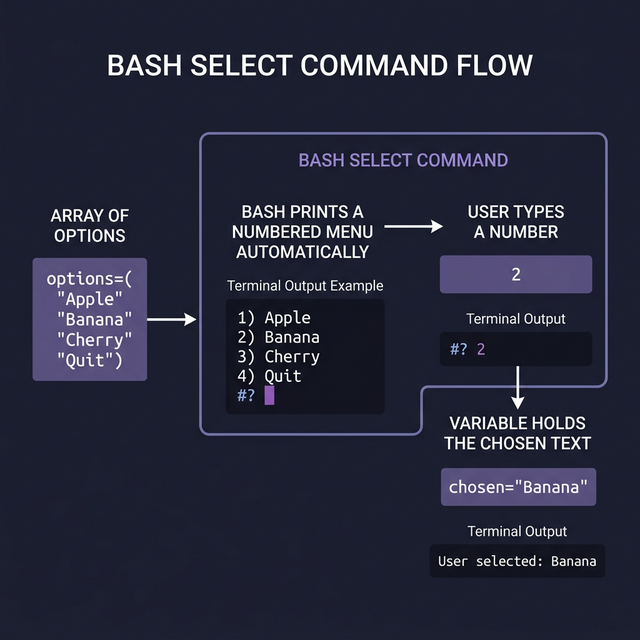
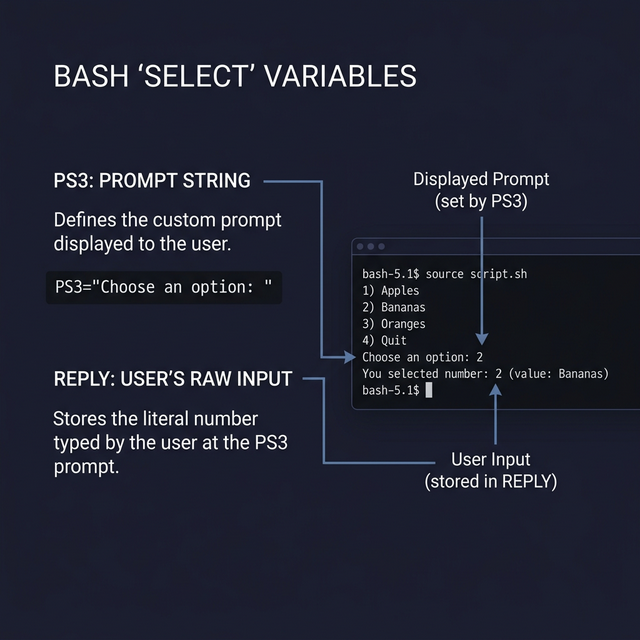

## 14. أمر التشويس وإنشاء القوائم التفاعلية (`select` command)

أمر `select` ده يعتبر كنز في الباش لو عايز تعمل للـ User قائمة تفاعلية يختار منها من غير ما تتعب وتكتب `echo` و `read` لكل خيار وتعمل Validation طويل. الأمر ده بيبني Menu كاملة أوتوماتيك وبيستنى المستخدم يدخل رقم الاختيار.

### الصيغة العامة (Syntax):
```bash
select var in [القايمة بتاعة الخيارات]
do
    # الأوامر اللي هتتنفذ على الـ Variable $var بمجرد ما يختار
done
```

---

### مثال 1: قايمة بسيطة لاختيار الفاكهة
لما بتشغل الأمر ده، الباش بيدي رقم لكل كلمة في القايمة وبيطبعها، وبيطلع محث انتظار اسمه `#?` بيستنى الرقم.

```bash
select fruit in تفاح موز برتقال خروج
do
    case $fruit in
        تفاح|موز|برتقال)
            echo "إنت اخترت: $fruit"
            ;;
        خروج)
            echo "شكراً، جاري الخروج..."
            break
            ;;
        *)
            echo "اختيار مش موجود، ياريت تختار رقم صحيح."
            ;;
    esac
done
```

**شكل نتيجة الإسكربت ده لما بيكلم المستخدم:**
```
1) تفاح
2) موز
3) برتقال
4) خروج
#? 2
إنت اخترت: موز
#? 4
شكراً، جاري الخروج...
```
*(ملاحظة: اللوب بتاعة الـ `select` شغالة للأبد، مش هتقف غير لو كتبت جوه الاحتمالات أمر `break`).*

---

### مثال 2: قايمة بالأرقام
تقدر بتستخدمها عشان تعمل Menu لعمليات سريعة، مثلاً اختيارات سرعة، أرقام معينة، إلخ.

```bash
select num in 10 20 30 Exit
do
    if [[ $num == "Exit" ]]; then
        echo "مع السلامة!"
        break
    elif [[ -n $num ]]; then
        echo "إنت نقيت الرقم $num"
    else
        echo "اختيار غلط!"
    fi
done
```

**شكل التنفيذ:**
```
1) 10
2) 20
3) 30
4) Exit
#? 1
إنت نقيت الرقم 10
#? 4
مع السلامة!
```

> **ملحوظة للمحترفين:** الـ `select` بتمشي إيد بإيد مع الـ `case` لإنهم مكملين لبعض، واحد بيعرض القايمة (Select) والتاني بيتصرف بناءً على الاختيار (Case).



